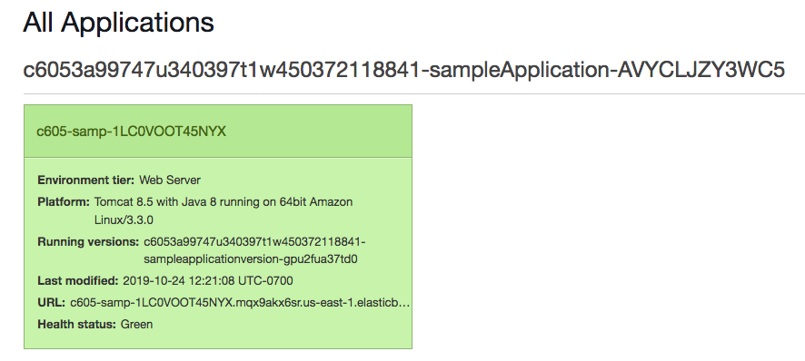

<header>

<link rel="stylesheet" href="https://use.fontawesome.com/releases/v5.5.0/css/all.css" integrity="sha384-B4dIYHKNBt8Bc12p+WXckhzcICo0wtJAoU8YZTY5qE0Id1GSseTk6S+L3BlXeVIU" crossorigin="anonymous">

<!-- Latest compiled and minified CSS -->
<link rel="stylesheet" href="https://maxcdn.bootstrapcdn.com/bootstrap/3.3.7/css/bootstrap.min.css" integrity="sha384-BVYiiSIFeK1dGmJRAkycuHAHRg32OmUcww7on3RYdg4Va+PmSTsz/K68vbdEjh4u" crossorigin="anonymous">

<!-- Optional theme -->
<link rel="stylesheet" href="https://maxcdn.bootstrapcdn.com/bootstrap/3.3.7/css/bootstrap-theme.min.css" integrity="sha384-rHyoN1iRsVXV4nD0JutlnGaslCJuC7uwjduW9SVrLvRYooPp2bWYgmgJQIXwl/Sp" crossorigin="anonymous">

<!-- Latest compiled and minified JavaScript -->

</header>

<!--include:Logo-->

# アクティビティ: AWS Elastic Beanstalk

<!-- Note to translators: This activity is unique to this course. -->

&nbsp;
&nbsp;
## 概要

このアクティビティでは、AWS Elastic Beanstalk 環境が事前に作成された状態で、アマゾン ウェブ サービス (AWS) アカウントが提供されます。コードをデプロイし、Elastic Beanstalk 環境を構成する AWS リソースを確認します。

&nbsp;

### 所要時間

このアクティビティは、完了までにおよそ **30 分**かかります。

&nbsp;
&nbsp;
## AWS マネジメントコンソールにアクセスする

1. この手順の上部にある Start Lab をクリックして、ラボを起動します。

   [**Start Lab**] パネルが開き、ラボのステータスが表示されます。

2. **Lab status: in creation**のメッセージが表示されるまで待ちます。[**Start Lab**] パネルを閉じるには、[**X**] をクリックします。

3. この手順の上に表示されている AWS をクリックします。

   AWS マネジメントコンソールが新しいブラウザタブで開きます。システムによって自動的にログインします。

   **ヒント**: 新しいブラウザタブが開かない場合、通常、ブラウザによってサイトのポップアップウィンドウの表示がブロックされたことを示すバナーまたはアイコンがブラウザの上部に表示されます。バナーまたはアイコンをクリックし、[**ポップアップを許可**] を選択します。

4. **AWS マネジメントコンソール**のタブをこの手順の横に配置します。このアクティビティを実行しやすいように、両方のブラウザタブを同時に表示することをお勧めします。

&nbsp;
&nbsp;
## タスク 1 : Elastic Beanstalk 環境にアクセスする

5. **AWS マネジメントコンソール**の [**サービス**] で [**Elastic Beanstalk**] をクリックします。

   [**すべての環境**] という名称のページが開き、既存の Elastic Beanstalk アプリケーションの詳細を一覧にした表が表示されます。

   **注意**: [**ヘルス**] 列の状態が緑色でない場合は、起動が完了していません。しばらく待つと、緑色に変わります。

6. \[**環境名**] 列で、環境名をクリックします。

   Elastic Beanstalk 環境の **Dashboard** ページが開きます。

7. このページは、アプリケーションの状態が緑色 (OK) であることを示しています。

   Elastic Beanstalk 環境でアプリケーションをホストする準備ができました。ただし、実行中のコードはまだありません。

8. ページの上部近くにある URL をクリックします（URL は *elasticbeanstalk.com* で終わります）。

   URL をクリックすると、新しいブラウザタブが開きます。画面には **HTTP ステータス 404- 見つかりません。**というメッセージが表示されます。このアプリケーションサーバーでまだアプリケーションが実行されていないため、**これは想定内の動作**です。Elastic Beanstalk コンソールに戻ります。

   次のステップで、Elastic Beanstalk 環境にコードをデプロイします。

&nbsp;
&nbsp;
## タスク 2 : サンプルアプリケーションを Elastic Beanstalk にデプロイする

9. 次のリンクをクリックして、サンプルアプリケーションをダウンロードします。
   https://docs.aws.amazon.com/elasticbeanstalk/latest/dg/samples/tomcat.zip

<!--the zip file is linked in this documentation page: https://docs.aws.amazon.com/elasticbeanstalk/latest/dg/java-getstarted.html-->

10. Elastic Beanstalk ダッシュボードに戻り、[**アップロードとデプロイ**] をクリックします。

11. \[**ファイルを選択**] をクリックし、先ほどダウンロードした **java-tomcat-v3.zip** ファイルを開きます。

12. \[**デプロイ**] をクリックします。

   Elastic Beanstalk が環境を更新してアプリケーションをデプロイするまでに 1～2 分かかります。

   **注意**: Elastic Beanstalk のダッシュボードページで、AWS X-Ray サービスと統合するためにインスタンスプロファイルが必要であるという警告が表示された場合は、警告を無視して問題ありません。

13. デプロイが完了したら、画面の上部近くにある URL をクリックします (または、404 ステータスが表示されたブラウザタブをまだ閉じていない場合は、そのページを更新します)。

   デプロイしたウェブアプリケーションが表示されます。

    

   これで、Elastic Beanstalk にアプリケーションを正常にデプロイできました。

14. Elastic Beanstalk コンソールに戻り、左側のペインで [**設定**] をクリックします。

   こちらの詳細をよく確認します。

   たとえば [**インスタンス**] の行には、ウェブアプリケーションをホストしている Amazon Elastic Compute Cloud (Amazon EC2) インスタンスのモニタリングの間隔、EC2 セキュリティグループ、ルートボリュームタイプの詳細が表示されます。

15. ページの下部にある [**データベース**] の行までスクロールします。

   環境にデータベースが含まれていないため、[**データベース**] の行には詳細がありません。

16. \[**データベース**] の行で [**編集**] をクリックします。

   必要に応じて、この環境にデータベースを簡単に追加することができます。いくつかの基本事項を設定し、[**適用**] をクリックするだけで完了します（ただし、このアクティビティではデータベースを追加する必要はありません）。

17. 左側のペインで [**モニタリング**] をクリックします。

   グラフに目を通して、各種の情報を確認します。

&nbsp;
&nbsp;
## タスク 3 : アプリケーションをサポートする AWS リソースを確認する

18. \[**サービス**] で [**EC2**] をクリックします。

19. \[**インスタンス**] をクリックします。

   2 つのインスタンスが実行中であることを確認します（どちらも名前に **samp** が含まれます）。いずれもウェブアプリケーションをサポートするインスタンスです。

20. Elastic Beanstalk によって作成された Amazon EC2 サービスリソースをより深く知るために、閲覧を続けます。次のことがわかります。

   - ポート 80 が開いている**セキュリティグループ**
   - 両方のインスタンスが属する**ロードバランサー**
   - ネットワークの負荷に応じて 2～6 個のインスタンスで実行される **Auto Scaling グループ**

   これらのリソースは Elastic Beanstalk によって作成されましたが、それぞれ個別に閲覧・変更することができます。

&nbsp;
&nbsp;
## アクティビティの完了

<i class="icon-flag-checkered"></i>お疲れ様でした。アクティビティが完了しました。

21. このページの上部にある End Lab をクリックし、アクティビティ終了の確認に対し Yes をクリックします。

   パネルが表示され、**DELETE has initiated...You may close this message box now.** というメッセージが表示されます。

22. パネルを閉じるには、右上隅の [**X**] をクリックします。

フィードバック、ご提案、修正については、**aws-course-feedback@amazon.com** まで E メールにてご連絡ください。

&nbsp;
&nbsp;
