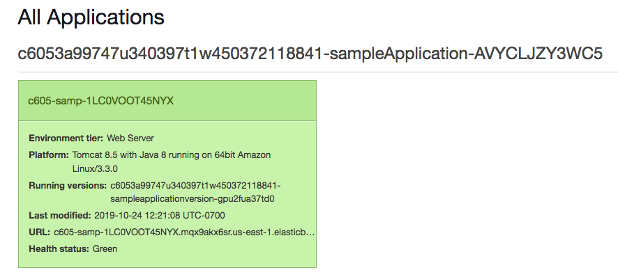

<header>

<link rel="stylesheet" href="https://use.fontawesome.com/releases/v5.5.0/css/all.css" integrity="sha384-B4dIYHKNBt8Bc12p+WXckhzcICo0wtJAoU8YZTY5qE0Id1GSseTk6S+L3BlXeVIU" crossorigin="anonymous">

<!-- Latest compiled and minified CSS -->
<link rel="stylesheet" href="https://maxcdn.bootstrapcdn.com/bootstrap/3.3.7/css/bootstrap.min.css" integrity="sha384-BVYiiSIFeK1dGmJRAkycuHAHRg32OmUcww7on3RYdg4Va+PmSTsz/K68vbdEjh4u" crossorigin="anonymous">

<!-- Optional theme -->
<link rel="stylesheet" href="https://maxcdn.bootstrapcdn.com/bootstrap/3.3.7/css/bootstrap-theme.min.css" integrity="sha384-rHyoN1iRsVXV4nD0JutlnGaslCJuC7uwjduW9SVrLvRYooPp2bWYgmgJQIXwl/Sp" crossorigin="anonymous">

<!-- Latest compiled and minified JavaScript -->

</header>

<!--include:Logo-->

# 활동: AWS Elastic Beanstalk

<!-- Note to translators: This activity is unique to this course. -->

&nbsp;
&nbsp;
## 개요

이 활동에서는 AWS Elastic Beanstalk 환경이 미리 생성되어 있는 Amazon Web Services(AWS) 계정을 제공합니다. 이 활동에서는 환경에 코드를 배포하고 Elastic Beanstalk 환경을 구성하는 AWS 리소스를 관찰합니다.

&nbsp;

### 소요 시간

이 실습은 완료까지 약 **30분**이 소요됩니다.

&nbsp;
&nbsp;
## AWS Management Console 액세스

1. 지침의 맨 위에서 Start Lab을 클릭하여 실습을 시작합니다.

   **Start Lab** 패널이 열리고 실습 상태가 표시됩니다.

2. *Lab status: in creation* 메시지가 표시될 때까지 기다립니다. **Start Lab** 패널을 닫으려면 **X**를 클릭합니다.

3. 지침의 맨 위에서 AWS를 클릭합니다.

   새 브라우저 탭에서 AWS Management Console이 열립니다. 자동으로 로그인됩니다.

   **팁**: 새 브라우저 탭이 열리지 않는 경우 일반적으로 브라우저에서 웹 사이트 팝업 창을 열 수 없음을 나타내는 배너 또는 아이콘이 브라우저 상단에 표시됩니다. 배너 또는 아이콘을 클릭하고 **Allow pop ups**를 선택합니다.

4. 이러한 지침이 나란히 표시되도록 **AWS Management Console** 탭을 정렬합니다. 두 브라우저 탭이 동시에 표시되어 활동 단계를 보다 쉽게 수행할 수 있게 됩니다.

&nbsp;
&nbsp;
## 과제 1: Elastic Beanstalk 환경에 액세스

5. **AWS Management Console**의 **Services** 메뉴에서 **Elastic Beanstalk**를 선택합니다.

   **All environments**라는 제목의 페이지가 열리고 기존 Elastic Beanstalk 애플리케이션의 세부 정보가 나열된 표가 표시됩니다.

   **참고**: **Health** 열의 상태가 녹색이 아닌 경우 아직 시작이 완료되지 않은 것입니다. 잠시 기다리면 녹색으로 변경됩니다.

6. **Environment name** 열에서 환경 이름을 클릭합니다.

   Elastic Beanstalk 환경의 **대시보드** 페이지가 열립니다.

7. 이 페이지에서 애플리케이션의 상태는 녹색(양호)으로 표시됩니다.

   Elastic Beanstalk 환경에서 애플리케이션을 호스팅할 준비가 되었습니다. 그러나 아직 실행 중인 코드가 없습니다.

8. 페이지 상단 근처에서 URL을 클릭합니다(이 URL은 *elasticbeanstalk.com*으로 끝남).

   URL을 클릭하면 새 브라우저 탭이 열립니다. 그러나 *"HTTP Status 404 – Not Found"* 메시지가 표시됩니다. *이 동작은 예상된 동작입니다.* 이 애플리케이션 서버에서 실행 중인 애플리케이션이 아직 없기 때문입니다. Elastic Beanstalk 콘솔로 돌아갑니다.

   다음 단계에서는 Elastic Beanstalk 환경에 코드를 배포합니다.

&nbsp;
&nbsp;
## 과제 2: Elastic Beanstalk에 샘플 애플리케이션 배포

9. 샘플 애플리케이션을 다운로드하려면 다음 링크를 클릭합니다.
   https://docs.aws.amazon.com/elasticbeanstalk/latest/dg/samples/tomcat.zip

<!--the zip file is linked in this documentation page: https://docs.aws.amazon.com/elasticbeanstalk/latest/dg/java-getstarted.html-->

10. Elastic Beanstalk 대시보드로 돌아가서 **Upload and Deploy**를 클릭합니다.

11. **Browse or Choose File**을 클릭한 다음 방금 다운로드한 **java-tomcat-v3.zip** 파일로 이동하여 엽니다.

12. **Deploy**를 클릭합니다.

   1~2분 안에 Elastic Beanstalk가 환경을 업데이트하고 애플리케이션을 배포합니다.

   **참고**: EAWS X-Ray 서비스와 통합하려면 인스턴스 프로파일이 필요하다는 내용의 경고가 Elastic Beanstalk 대시보드 페이지에 표시되는 경우 이 경고를 무시해도 됩니다.

13. 배포가 완료되면 화면 상단 근처에 있는 URL 값을 클릭합니다. 또는 브라우저 탭에 계속해서 404 상태가 표시되어 있는 경우 페이지를 새로 고칩니다.

   배포한 웹 애플리케이션이 표시됩니다.

   축하합니다. Elastic Beanstalk에 애플리케이션을 성공적으로 배포했습니다!

14. Elastic Beanstalk 콘솔로 돌아가서 왼쪽 창의 **Configuration**을 클릭합니다.

   여기에서 세부 정보를 확인합니다.

   예를 들어 **Instances** 행에는 웹 애플리케이션을 호스팅하는 Amazon Elastic Compute Cloud(Amazon EC2) 인스턴스의 인스턴스 유형, 모니터링 간격 및 보안 그룹 세부 정보가 표시됩니다.

15. 페이지 아래로 스크롤하여 **Database** 행으로 이동합니다.

   이 환경에 데이터베이스가 포함되어 있지 않으므로 **Database** 행에는 세부 정보가 없습니다.

16. **Database** 행에서 **Edit**을 클릭합니다.

   원하는 경우 이 환경에 데이터베이스를 쉽게 추가할 수 있다는 것을 알 수 있습니다. 몇 가지 기본 구성을 설정하고 **Apply**를 클릭하기만 하면 됩니다. 하지만 이 활동의 목적상 데이터베이스를 추가할 필요는 없습니다.

17. 왼쪽 창에서 **Monitoring**을 클릭합니다.

   차트를 탐색하여 사용 가능한 정보의 종류를 확인합니다.

&nbsp;
&nbsp;
## 과제 3: 애플리케이션을 지원하는 AWS 리소스 탐색

18. **Services** 메뉴에서 **EC2**를 선택합니다.

19. **Instances**를 클릭합니다.

   인스턴스 2개가 실행되고 있습니다(두 인스턴스 모두 이름에 *samp*가 포함되어 있음). 두 인스턴스 모두 웹 애플리케이션을 지원합니다.

20. Elastic Beanstalk에서 생성한 Amazon EC2 서비스 리소스를 계속 살펴보고 싶다면 언제든지 살펴보십시오. 다음 항목을 찾을 수 있습니다.

   - 포트 80이 열려 있는 *보안 그룹*
   - 두 인스턴스가 모두 속하는 *로드 밸런서*
   - 네트워크 부하에 따라 2~6개의 인스턴스를 실행하는 *Auto Scaling 그룹*

   이러한 리소스는 Elastic Beanstalk에서 생성되었지만 사용자는 이러한 액세스에 액세스할 수 있습니다.

&nbsp;
&nbsp;
## 활동 완료

<i class="icon-flag-checkered"></i> 축하합니다! 활동을 마쳤습니다.

21. 이 페이지의 상단에서 End Lab을 클릭하고 Yes를 클릭하여 활동 종료를 확인합니다.

   다음과 같은 메시지가 포함된 패널이 표시됩니다. *DELETE has been initiated... You may close this message box now*

22. 패널을 닫으려면 오른쪽 위로 이동하고 **X**를 클릭합니다.

피드백 또는 제안 사항이 있거나 수정이 필요한 경우 다음 주소로 이메일을 보내 주십시오. *aws-course-feedback@amazon.com*

&nbsp;
&nbsp;
