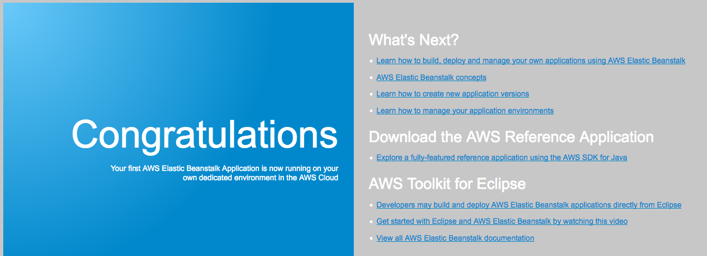

<header>

<link rel="stylesheet" href="https://use.fontawesome.com/releases/v5.5.0/css/all.css" integrity="sha384-B4dIYHKNBt8Bc12p+WXckhzcICo0wtJAoU8YZTY5qE0Id1GSseTk6S+L3BlXeVIU" crossorigin="anonymous">

<!-- Latest compiled and minified CSS -->
<link rel="stylesheet" href="https://maxcdn.bootstrapcdn.com/bootstrap/3.3.7/css/bootstrap.min.css" integrity="sha384-BVYiiSIFeK1dGmJRAkycuHAHRg32OmUcww7on3RYdg4Va+PmSTsz/K68vbdEjh4u" crossorigin="anonymous">

<!-- Optional theme -->
<link rel="stylesheet" href="https://maxcdn.bootstrapcdn.com/bootstrap/3.3.7/css/bootstrap-theme.min.css" integrity="sha384-rHyoN1iRsVXV4nD0JutlnGaslCJuC7uwjduW9SVrLvRYooPp2bWYgmgJQIXwl/Sp" crossorigin="anonymous">

<!-- Latest compiled and minified JavaScript -->

</header>

<!--include:Logo-->

# 活动：AWS Elastic Beanstalk

<!-- Note to translators: This activity is unique to this course. -->

&nbsp;
&nbsp;
## 概览

本活动为您提供一个 Amazon Web Services (AWS) 账户，其中已为您预先创建了 AWS Elastic Beanstalk 环境。您将向其中部署代码并观察构成 Elastic Beanstalk 环境的 AWS 资源。

&nbsp;

### 时长

完成本次活动大约需要 **30 分钟**。

&nbsp;
&nbsp;
## 访问 AWS 管理控制台

1. 在这些说明的顶部，单击 Start Lab（启动实验）来启动您的实验。

   **Start Lab**（启动实验）面板随即会打开，其中显示了实验状态。

2. 请耐心等待，直到您看到 *Lab status: in creation*（实验状态：正在创建）消息。要关闭 **Start Lab**（启动实验）面板，请单击 **X**。

3. 在这些说明顶部，单击 AWS

   AWS 管理控制台会在新的浏览器选项卡中打开。您将自动登录系统。

   **提示**：如果未打开新的浏览器选项卡，则您的浏览器顶部通常会出现一个横幅或图标，指明您的浏览器阻止该网站打开弹出窗口。单击横幅或图标，然后选择 **Allow pop ups**（允许弹出窗口）。

4. 排列 **AWS 管理控制台**选项卡，使其与这些说明一起显示。理想情况下，您将能够同时看到这两个浏览器选项卡，以便更轻松地执行活动步骤。

&nbsp;
&nbsp;
## 任务 1：访问 Elastic Beanstalk 环境

5. 在 **AWS 管理控制台**的 **Services**（服务）菜单上，选择 **Elastic Beanstalk**。

   将打开标题为 **All Applications**（所有应用程序）的页面，它应显示一个绿色框，其中会列出现有 Elastic Beanstalk 应用程序的详细信息。

   **注意**：如果该框不是绿色的，表示它还没有完成启动。等待几分钟后，它应变为 *Health status: Green*（运行状况：绿色）。

6. 在绿色的应用程序详细信息框中，单击显示的 URL 值。

   您的 Elastic Beanstalk 环境的 **Dashboard**（控制面板）页面随即打开。

7. 请注意，该页面显示应用程序的运行状况为绿色（正常）。

   Elastic Beanstalk 环境准备就绪，可以托管应用程序了。但是，它还没有运行代码。

8. 在页面顶部附近，单击 URL（该 URL 以 *elasticbeanstalk.com* 结尾）。

   当您单击该 URL 时，将打开一个新的浏览器选项卡。但是，您应看到它显示 *HTTP Status 404 - Not Found*（HTTP 状态 404 – 未找到）消息。*这种行为是正常的*，因为此应用程序服务器上没有正在运行的应用程序。返回 Elastic Beanstalk 控制台。

   在下个步骤中，您将在您的 Elastic Beanstalk 环境中部署代码。

&nbsp;
&nbsp;
## 任务 2：将示例应用程序部署到 Elastic Beanstalk

9. 要下载示例应用程序，请单击以下链接：
   https://docs.aws.amazon.com/elasticbeanstalk/latest/dg/samples/tomcat.zip

<!--the zip file is linked in this documentation page: https://docs.aws.amazon.com/elasticbeanstalk/latest/dg/java-getstarted.html-->

10. 返回 Elastic Beanstalk 控制台，单击 **Upload and Deploy**（上传和部署）。

11. 单击 **Browse or Choose File**（浏览或选择文件），然后导航到您刚刚下载的 **java-tomcat-v3.zip** 文件并打开。

12. 单击 **Deploy**（部署）。

   可能需要一两分钟 Elastic Beanstalk 才会更新您的环境并部署应用程序。

   **注意**：如果您在 Elastic Beanstalk 控制面板页面中看到警告，要求您将实例配置文件与 AWS X-Ray 服务集成，可以忽略该警告。

13. 在部署完成后，单击屏幕顶部附近的 URL 值（如果您仍然看到显示 404 状态的浏览器选项卡，请刷新该页面）。

   您部署的 Web 应用程序将会显示。

   祝贺您，您已成功在 Elastic Beanstalk 上部署了应用程序！

14. 返回 Elastic Beanstalk 控制台，单击 **Configuration**（配置）。

   注意此处的详细信息。

   例如，在 **Instances**（实例）行中，会指明托管您的 Web 应用程序的 Amazon Elastic Compute Cloud (Amazon EC2) 实例的实例类型、监控间隔和安全组详细信息。

15. 滚动到页面底部的 **Database**（数据库）行。

   **Database**（数据库）行没有任何详细信息，因为该环境中没有数据库。

16. 在 **Database**（数据库）行中，单击 **Modify**（修改）。

   请注意，如果您愿意，可以轻松将数据库添加到此环境中：您只需设置一些基本配置，然后单击 **Apply**（应用）即可。（但是，就此活动而言，您无需添加数据库。）

17. 单击 **Monitoring**（监控）。

   浏览图表以查看可用的信息种类。

&nbsp;
&nbsp;
## 任务 3：探索支持您的应用程序的 AWS 资源

18. 从 **Services**（服务）菜单中选择 **EC2**

19. 单击 **Instances**（实例）。

   请注意，两个实例正在运行（它们的名称中都包含 *samp*）。两个实例都支持您的 Web 应用程序。

20. 如果您想继续探索由 Elastic Beanstalk 创建的 Amazon EC2 服务资源，请随时进行探索。您将找到：

   - 打开了端口 80 的*安全组*
   - 两个实例所属的*负载均衡器*
   - 运行 2 到 6 个实例的 *Auto Scaling 组*，具体取决于网络负载

   尽管这些资源是 Elastic Beanstalk 为您创建的，但您仍然可以访问它们。

&nbsp;
&nbsp;
## 活动完成

<i class="icon-flag-checkered"></i> 祝贺您！您已完成本次活动。

21. 单击此页面顶部的 End Lab（结束实验），然后单击 Yes（是）确认您要结束本次活动。

   此时将显示一个面板，其中显示一条消息指示：*DELETE has been initiated...You may close this message box now.*（删除操作已启动...您现在可以关闭此消息框。）

22. 要关闭该面板，请单击右上角的 **X**。

如有反馈、建议或更正意见，请发送电子邮件至：*aws-course-feedback@amazon.com*

&nbsp;
&nbsp;
