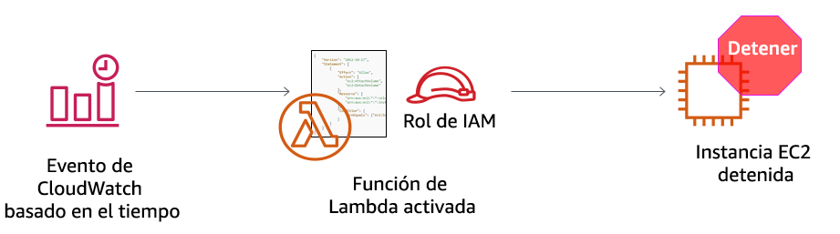

# Actividad: AWS Lambda

<!-- Note to translators: This lab is unique to this course. -->

&nbsp;
&nbsp;
## Información general



&nbsp;
&nbsp;
&nbsp;
En esta actividad práctica, creará una función de AWS Lambda. También creará un evento de Amazon CloudWatch para activar la función cada minuto. La función utiliza un rol de AWS Identity and Access Management (IAM). Este rol de IAM permite que la función detenga una instancia de Amazon Elastic Compute Cloud (Amazon EC2) que se ejecuta en la cuenta de Amazon Web Services (AWS).

&nbsp;
&nbsp;
### Duración

La duración estimada de esta actividad es de **30 minutos** aproximadamente.

&nbsp;
&nbsp;
## Acceso a la consola de administración de AWS

1. En la parte superior de estas instrucciones, haga clic en <span id="ssb_voc_grey">Start Lab</span> (Iniciar laboratorio) para lanzar su laboratorio.

   Se abrirá el panel **Start Lab** (Iniciar laboratorio), donde se muestra el estado del laboratorio.

2. Espere hasta que aparezca el mensaje *Lab status: in creation* (Estado del laboratorio: creándose). Para cerrar el panel **Start Lab** (Iniciar laboratorio), haga clic en **X**.

3. En la parte superior de estas instrucciones, haga clic en <span id="ssb_voc_grey">AWS</span>.

   La consola de administración de AWS se abrirá en una pestaña nueva del navegador. El sistema iniciará su sesión de forma automática.

   **Sugerencia**: si no se abre una pestaña del navegador nueva, debería aparecer un banner o un icono en la parte superior de este, el cual indique que el navegador no permite que se abran ventanas emergentes en el sitio web. Haga clic en el banner o en el icono, y elija **Allow pop ups** (Permitir ventanas emergentes).

4. Ubique la pestaña de la **consola de administración de AWS** en un lugar donde aparezca al lado de estas instrucciones. Idealmente, debería poder ver ambas pestañas del navegador al mismo tiempo para que sea más sencillo seguir los pasos de la actividad.

&nbsp;
&nbsp;
## Tarea 1: crear una función de Lambda

5. En la **consola de administración de AWS**, encontrará el menú **Services** (Servicios), donde debe elegir **Lambda**.

   **Nota**: Si ve un mensaje de advertencia que indica *tags failed to load* (no se pudieron cargar las etiquetas), puede omitirlo.

6. Haga clic en <span id="ssb_lambda_orange">Create function</span> (Crear función).

7. En la pantalla **Create function** (Crear función), configure los siguientes ajustes:

   - Elija **Author from scratch** (Crear desde cero).

   - Function name (Nombre de la función): `myStopinator`

   - Runtime (Tiempo de ejecución):**Python 3.8**

   - Haga clic en <i class="fas fa-caret-right"></i>**Choose or create an execution role** (Seleccionar o crear un rol de ejecución).

   - Execution Role (Rol de ejecución): **Use an existing role** (Utilizar un rol existente)

   - Existing role (Rol existente): en la lista desplegable, elija **myStopinatorRole**.

8. Haga clic en <span id="ssb_lambda_orange">Create function</span> (Crear función).

&nbsp;
&nbsp;
## Tarea 2: configurar el desencadenador
En esta tarea, configurará un evento programado para activar la función de Lambda con un evento de CloudWatch como el origen de eventos (o desencadenador). La función de Lambda se puede configurar para que funcione de forma similar a un trabajo cron en un servidor de Linux o a una tarea programada en un servidor de Microsoft Windows. Sin embargo, no es necesario disponer de un servidor en ejecución para alojarlo.

9. Haga clic en <span id="ssb_lambda_white">+ Add trigger</span> (+ Agregar desencadenador).

10. Haga clic en el menú desplegable **Select a trigger** (Seleccionar un desencadenador) y elija **EventBridge (CloudWatch Events)**.

11. Para la regla, elija **Create a new rule** (Crear una nueva regla) y configure estos ajustes:

   - Rule name (Nombre de la regla): `everyMinute`
   - Rule type (Tipo de regla): **Schedule expression** (Expresión de programación)
   - Schedule expression (Expresión de programación): `rate(1 minute)` (frecuencia [1 minuto])

   **Nota**: Es probable que una función stopinador de Lambda basada en programación más realista se active con una expresión cron en lugar de una expresión rate. Sin embargo, para esta actividad, el uso de una expresión rate garantiza que la función de Lambda se active a tiempo como para poder ver los resultados.

12. Haga clic en <span id="ssb_lambda_orange">Add</span> (Agregar).

&nbsp;
&nbsp;
## Tarea 3: configurar la función de Lambda

En esta tarea, pegará algunas líneas de código para actualizar dos valores en el código de la función. No es necesario escribir código para completar esta tarea.

13. En el cuadro *Diseñador*, haga clic en *MyStopinator* (que es el nombre de su función Lambda) para mostrar y editar el código de la función Lambda.

14. En el cuadro **Function code** (Código de la función), borre el código existente. Copie el siguiente código y péguelo en el cuadro:

```
import boto3
region = '<REPLACE_WITH_REGION>'
instances = ['<REPLACE_WITH_INSTANCE_ID>']
ec2 = boto3.client('ec2', region_name=region)

def lambda_handler(event, context):
    ec2.stop_instances(InstanceIds=instances)
    print('stopped your instances: ' + str(instances))
```

15. Sustituya el marcador de posición `<REPLACE_WITH_REGION>` (Reemplazar con región) con la región real que está utilizando. Para ello, realice lo siguiente:

   Haga clic en la región de la esquina superior derecha y utilice el código de región. Por ejemplo, el código de región para EE. UU. Este (Norte de Virginia) es *us-este--1*.

   **Importante**: En el código, mantenga las comillas simples ('') alrededor de la región. Por ejemplo, para el N. Virginia, sería `“us-este--1”`

16. **Sección de desafío**: compruebe que la instancia EC2 denominada *instance1* se esté ejecutando en su cuenta y copie su **ID de instancia**.
   <details>
         <summary>Lo animamos a averiguar cómo realizar esta tarea sin instrucciones específicas paso a paso. Sin embargo, <b>si necesita orientación detallada, haga clic aquí</b>.</summary>
         <ul>
           <li> Abra otra pestaña del navegador y vaya a <a href="https://console.aws.amazon.com/ec2" target="_blank">https://console.aws.amazon.com/ec2</a></li>
           <li> Haga clic en <b>Instances</b> (Instancias).</li>
           Tenga en cuenta que existe una instancia EC2 denominada <i>instance1</i> y que se encuentra en un estado de <i>ejecución</i> .
           <li> Desde la pestaña <b>Descripción</b> de instance1, copie el <b>ID de instancia</b> (comenzará con <i>i-</i>)</li>
           <b>Nota</b>: Deje abierta esta pestaña del navegador. Volverá a ella en un momento.
         </ul>

</details>

17. Vuelva a la pestaña del navegador de la **consola de AWS Lambda** y sustituya `<REPLACE_WITH_INSTANCE_ID>` (Reemplazar con ID de la instancia) con el ID real de la instancia que acaba de copiar.

   **Importante**: En el código, mantenga las comillas simples ('') alrededor del ID de la instancia.

   El código debería tener ahora un aspecto similar al del siguiente ejemplo. Sin embargo, es posible que tenga un valor diferente para la región y tendrá un valor diferente para el ID de la instancia:


18. En la esquina superior derecha del cuadro **Código de función** , elija <span id="ssb_lambda_orange">Deploy</span> (Desplegar).

   La función de Lambda ya está totalmente configurada. Debería intentar detener la instancia a cada minuto.

19. Haga clic en **Monitoring** (Monitoreo), la pestaña que se encuentra cerca de la parte superior de la página.

   Tenga en cuenta que uno de los gráficos muestra cuántas veces se ha invocado la función. También hay un gráfico que muestra el recuento de errores y la tasa de éxito en forma de porcentaje.

## Tarea 4: verificar que la función de Lambda funcione

20. Vuelva a la pestaña del navegador con la **consola de Amazon EC2** y compruebe si se detuvo la instancia.

   **Sugerencia**: puede hacer clic en el icono de actualización <i class="fas fa-sync-alt"></i> o actualice la página del navegador para ver el cambio de estado más rápidamente.

21. Intente iniciar la instancia de nuevo. ¿Qué cree que va a pasar?

<details>
          <summary>Haga clic <b>aquí</b> para revelar la respuesta.</summary>
          La instancia se volverá a detener dentro de 1 minuto.
    </details>

&nbsp;
&nbsp;

## Fin de la actividad

<i class="icon-flag-checkered"></i> ¡Felicitaciones! Ha completado la actividad.

22. Haga clic en <span id="ssb_voc_grey">End Lab</span> (Finalizar laboratorio) en la parte superior de esta página y, a continuación, en <span id="ssb_blue">Yes</span> (Sí) para confirmar que desea finalizar la actividad.

   Aparecerá un panel con un mensaje que indica: *DELETE has been initiated… You may close this message box now. (Se ha iniciado la ELIMINACIÓN… Ya puede cerrar este cuadro de mensajes).*

23. Para cerrar el panel, vaya a la esquina superior derecha y haga clic en **X**.

Para hacer comentarios, sugerencias o correcciones, envíe un email a *aws-course-feedback@amazon.com*

&nbsp;
&nbsp;
