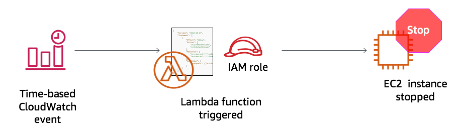

# Aktivitas: AWS Lambda

<!-- Note to translators: This lab is unique to this course. -->

&nbsp;
&nbsp;
## Gambaran Umum



&nbsp;
&nbsp;
&nbsp;
Dalam aktivitas langsung ini, Anda akan membuat fungsi AWS Lambda. Anda juga akan membuat peristiwa Amazon CloudWatch untuk memicu fungsi setiap menit. Fungsi ini menggunakan peran AWS Identity dan Access Management (IAM). IAM role ini memungkinkan fungsi untuk menghentikan instans Amazon Elastic Compute Cloud (Amazon EC2) yang berjalan di akun Amazon Web Services (AWS).

&nbsp;
&nbsp;
### Durasi

Diperlukan sekitar **30 menit** untuk menyelesaikan aktivitas ini.

&nbsp;
&nbsp;
## Mengakses AWS Management Console

1. Di bagian atas instruksi ini, klik <span id="ssb_voc_grey">Start Lab</span> (Mulai Lab) untuk meluncurkan lab Anda.

   Panel **Start Lab** (Mulai Lab) terbuka, dan menampilkan status laboratorium.

2. Tunggu hingga Anda melihat pesan *Lab status: in creation*. Untuk menutup panel **Start Lab** (Mulai Lab), klik **X** .

3. Di bagian atas instruksi ini, klik <span id="ssb_voc_grey">AWS</span>

   AWS Management Console terbuka di tab browser baru. Secara otomatis, sistem ini akan memasukkan Anda.

   **Tips**: Jika tab browser baru tidak terbuka, spanduk atau ikon biasanya berada di bagian atas browser Anda, yang menunjukkan bahwa browser Anda mencegah situs web membuka jendela pop-up. Klik spanduk atau ikon lalu pilih **Allow pop ups.** (Izinkan pop-up).

4. Mengatur tab **AWS Management Console** agar ditampilkan bersama petunjuk ini. Idealnya, Anda akan dapat melihat kedua tab browser pada saat bersamaan, yang membuatnya lebih mudah untuk mengikuti langkah-langkah aktivitas.

&nbsp;
&nbsp;
## Tugas 1: Membuat fungsi Lambda

5. Dalam **AWS Management Console**, dari menu **Services** (Layanan), pilih **Lambda**.

   **Catatan**: Jika Anda melihat pesan peringatan yang mengatakan *tags failed to load* (tag gagal dimuat), Anda dapat mengabaikannya.

6. Klik <span id="ssb_lambda_orange">Create function</span> (Buat fungsi).

7. Di layar **Create function** (Buat fungsi), konfigurasikan pengaturan ini:

   - Pilih **Author from scratch** (Tulis dari awal)

   - Nama fungsi: `myStopinator`

   - Runtime: **Python 3.8**

   - Klik <i class="fas fa-caret-right"></i>**Choose or create an execution role** (Pilih atau buat peran eksekusi)

   - Peran eksekusi:**Use an existing role** (Gunakan peran saat ini)

   - Peran yang ada: Dari daftar menurun, pilih **myStopinatorRole**

8. Klik <span id="ssb_lambda_orange">Create function</span> (Buat fungsi).

&nbsp;
&nbsp;
## Tugas 2: Mengonfigurasi pemicu
Dalam tugas ini, Anda akan mengonfigurasi peristiwa terjadwal untuk memicu fungsi Lambda dengan menetapkan peristiwa CloudWatch sebagai sumber peristiwa (atau pemicu). Fungsi Lambda dapat dikonfigurasi untuk beroperasi seperti pekerjaan cron pada server Linux, atau tugas terjadwal pada server Microsoft Windows. Namun, Anda tidak perlu memiliki server berjalan untuk host itu.

9. Klik <span id="ssb_lambda_white">+ Add trigger</span> (Tambah pemicu).

10. Klik menu menurun **Select a trigger**, lalu pilih **CloudWatch Events**.

11. Untuk aturan, pilih **Create a new rule** (Buat aturan baru) dan konfigurasikan pengaturan berikut:

   - Nama aturan: `everyMinute`
   - Jenis aturan: **Ekspresi jadwal**
   - Ekspresi jadwal: `tingkat (1 menit)`

   **Catatan**: Fungsi stopinator Lambda berbasis jadwal yang lebih realistis mungkin akan dipicu dengan menggunakan ekspresi cron daripada ekspresi rate. Namun, untuk keperluan aktivitas ini, menggunakan ekspresi rate memastikan bahwa fungsi Lambda akan segera terpicu sehingga Anda dapat melihat hasilnya.

12. Klik <span id="ssb_lambda_orange">Add</span> (Tambahkan).

&nbsp;
&nbsp;
## Tugas 3: Mengonfigurasi fungsi Lambda

Dalam tugas ini, Anda akan menempelkan beberapa baris kode untuk memperbarui dua nilai dalam kode fungsi. Anda tidak perlu menulis kode untuk menyelesaikan tugas ini.

13. Di kotak *Designer* (Desainer), klik *myStopinator* (yang merupakan nama fungsi Lambda Anda) untuk menampilkan dan mengedit kode fungsi Lambda.

14. Di kotak **Kode fungsi**, hapus kode yang sudah ada. Salin kode berikut, dan tempel di kotak:

```
import boto3
region = '<REPLACE_WITH_REGION>'
instances = ['<REPLACE_WITH_INSTANCE_ID>']
ec2 = boto3.client('ec2', region_name=region)

def lambda_handler(event, context):
    ec2.stop_instances(InstanceIds=instances)
    print('stopped your instances: ' + str(instances))
```

15. Ganti placeholder `<REPLACE_WITH_REGION>` dengan Wilayah aktual yang Anda gunakan. Cara melakukannya:

   Klik pada wilayah di pojok kanan atas dan gunakan kode wilayah. Sebagai contoh, kode wilayah untuk AS Timur (Virginia U.) adalah *us-east-1*.

   **Penting**: Gunakan tanda kutip tunggal (' ') pada Wilayah dalam kode Anda. Misalnya, untuk Virginia U., yang akan menjadi `'us-east-1'`

16. **Bagian tantangan**: Verifikasi bahwa instans EC2 bernama *instance1* berjalan di akun Anda, dan salin **ID instans** instance1.
   <details>
     <summary>Anda didorong untuk mencari tahu cara melakukan tugas ini tanpa panduan langkah demi langkah yang spesifik. Namun, <b>jika Anda memerlukan panduan terperinci, klik di sini</b>.</summary>

     - Buka tab browser lain dan buka <a href="https://console.aws.amazon.com/ec2" target=_blank> https://console.aws.amazon.com/ec2 </a>
    
     - Klik **Instances** (Instans).
    
     Perhatikan bahwa contoh EC2 bernama * instance1* ada, dan bahwa itu adalah dalam kondisi *running* (berjalan).
    
     - Dari tab **Description** (Deskripsi) instance1, salin **instance ID** (ID Instans) (akan dimulai dengan *i-*)
    
     **Catatan**: Biarkan tab browser ini terbuka. Anda akan kembali ke sana dalam sekejap.
</details>

17. Kembali ke tab browser **konsol AWS Lambda** dan mengganti `<REPLACE_WITH_INSTANCE_ID>` dengan ID instans sebenarnya yang baru saja Anda salin.

   **Penting**: Gunakan tanda kutip tunggal (' ') pada ID instans dalam kode Anda.

   Kode Anda sekarang terlihat mirip dengan contoh berikut. Namun, Anda mungkin memiliki nilai yang berbeda untuk Wilayah, dan Anda akan memiliki nilai yang berbeda untuk ID instans:


18. Di pojok kanan atas, klik <span id="ssb_lambda_orange">Save</span> (Simpan).

   Di bagian atas konsol AWS Lambda, Anda akan melihat pesan *Successfully updated the function myStopinator* (Berhasil memperbarui fungsi myStopinator). Mungkin Anda perlu menggulir ke atas untuk melihatnya.

   Fungsi Lambda Anda sekarang sepenuhnya dikonfigurasi. Fungsi ini akan mencoba untuk menghentikan instans Anda setiap menit.

19. Klik **Monitoring** (Pemantauan) (tab di dekat bagian atas halaman).

   Perhatikan bahwa salah satu grafik menunjukkan berapa kali fungsi Anda telah dipanggil. Ada juga grafik yang menunjukkan jumlah kesalahan dan tingkat keberhasilan sebagai persentase.

## Tugas 4: Memverifikasi bahwa fungsi Lambda bekerja

20. Kembali ke tab browser **konsol Amazon EC2** dan lihat apakah instans Anda dihentikan.

   **Tips**: Anda dapat mengeklik ikon <i class="fas fa-sync-alt"></i> refresh atau refresh halaman browser untuk melihat perubahan kondisi lebih cepat.

21. Coba mulai instans lagi. Apa yang akan terjadi menurut Anda?

<details>
          <summary>Klik <b>di sini</b> untuk mengungkapkan jawabannya.</summary>
          Instans akan berhenti kembali dalam 1 menit.
    </details>

&nbsp;
&nbsp;
## Aktivitas selesai

<i class="icon-flag-checkered"></i> Selamat! Anda telah menyelesaikan lab.

22. Klik <span id="ssb_voc_grey">End Lab</span> (Akhiri Lab) di bagian atas halaman ini, kemudian untuk mengonfirmasi bahwa Anda ingin mengakhiri aktivitas, klik <span id="ssb_blue">Yes</span> (Ya).

   Panel akan muncul dengan pesan yang menunjukkan: *DELETE has been initiated...* (PENGHAPUSAN telah dimulai) *Anda dapat menutup kotak pesan ini sekarang.*

23. Untuk menutup panel, buka sudut kanan atas, lalu klik **X**.

Untuk tanggapan, saran, atau koreksi, silakan kirim email kepada kami di: *aws-course-feedback@amazon.com*

&nbsp;
&nbsp;
