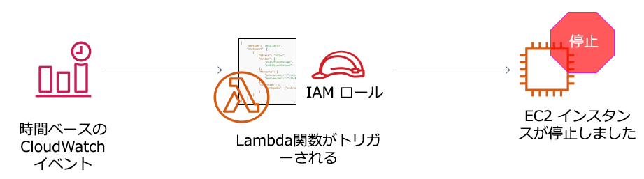

# アクティビティ: AWS Lambda

<!-- Note to translators: This lab is unique to this course. -->

&nbsp;
&nbsp;
## 概要



&nbsp;
&nbsp;
&nbsp;
このハンズオンアクティビティでは、AWS Lambda 関数を作成します。また、1 分ごとに関数をトリガーする Amazon CloudWatch イベントも作成します。関数には AWS Identity and Access Management (IAM) ロールを使用します。この IAM ロールにより、アマゾン ウェブ サービス (AWS) アカウントで実行されている Amazon Elastic Compute Cloud (Amazon EC2) インスタンスを停止することができます。

&nbsp;
&nbsp;
### 所要時間

このアクティビティは、完了までにおよそ **30 分**かかります。

&nbsp;
&nbsp;
## AWS マネジメントコンソールにアクセスする

1. この手順の上部にある <span id="ssb_voc_grey">Start Lab</span> をクリックして、ラボを起動します。

   [**Start Lab**] パネルが開き、ラボのステータスが表示されます。

2. **Lab status: in creation*** のメッセージが表示されるまで待ちます。[**Start Lab**] パネルを閉じるには、[**X**] をクリックします。

3. この手順の上部にある <span id="ssb_voc_grey">AWS</span> をクリックします。

   新しいブラウザタブで AWS マネジメントコンソールが開きます。システムによって自動的にログインします。

   **ヒント**: 新しいブラウザタブが開かない場合、通常、ブラウザによってサイトのポップアップウィンドウの表示がブロックされたことを示すバナーまたはアイコンがブラウザの上部に表示されます。バナーまたはアイコンをクリックし、[**ポップアップを許可**] をクリックします。

4. **AWS マネジメントコンソール**のタブをこの手順の横に表示するように配置します。このアクティビティを実行しやすいように、両方のブラウザタブを同時に表示することをお勧めします。

&nbsp;
&nbsp;
## タスク 1: Lambda 関数を作成する

5. **AWS マネジメントコンソール**の [**サービス**] で [**Lambda**] をクリックします。

   **注意**: **タグのロードに失敗した**ことを示す警告メッセージが表示された場合は、無視して構いません。

6. <span id="ssb_lambda_orange">関数の作成</span> をクリックします。

7. \[**関数の作成**] 画面で、以下のように設定します。

   - [**一から作成**] をクリックします。

   - 関数名: `myStopinator`

   - ランタイム: **Python 3.8**

   - <i class="fas fa-caret-right"></i> **デフォルトの実行ロールの変更** を展開します

   - 実行ロール: **既存のロールを使用する**

   - 既存のロール: ドロップダウンリストから **myStopinatorRole** を選択

8. <span id="ssb_lambda_orange">関数の作成</span> をクリックします。

&nbsp;
&nbsp;
## タスク 2: トリガーを設定する
このタスクでは、CloudWatch イベントをイベントソース（またはトリガー）として設定することで、Lambda 関数をトリガーするスケジュールイベントを設定します。Lambda 関数は、Linux サーバーの cron ジョブや、Microsoft Windows サーバーにスケジュールされたタスクと同じような動作をするように設定できます。ただし、ホスト用にサーバーを実行する必要はありません。

9. <span id="ssb_lambda_white">+ トリガーを追加</span> をクリックします。

10. \[**トリガーを選択**] ドロップダウンの一覧から [**EventBridge (CloudWatch Events)**] を選択します。

11. ルールで [**新規ルールの作成**] を選択し、次のとおり設定します。

   - ルール名: `everyMinute`
   - ルールタイプ: **スケジュール式**
   - スケジュール式: `rate(1 minute)`

   **注意**: より現実的なスケジュールベースの Stopinator Lambda 関数を作成する場合は、トリガーに rate 式よりも cron 式を使用することをお勧めします。このアクティビティでは rate 式を使用することで Lambda 関数が迅速にトリガーされ、すぐに結果を確認できるようにします。

12. <span id="ssb_lambda_orange">追加</span> をクリックします。

&nbsp;
&nbsp;
## タスク 3: Lambda 関数を設定する

このタスクでは、数行のコードを貼り付け、関数コードの中の 2 つの値を書き換えます。タスク完了のためにコードを記述する必要はありません。

13. \[**デザイナー**] ボックスで（Lambda 関数の名前である） [**myStopinator**] をクリックし、Lambda 関数のコードを表示して編集します。

14. \[**関数コード**] ボックスで、既存のコードを削除します。次のコードをコピーし、ボックス内に貼り付けます。

```
import boto3
region = '<REPLACE_WITH_REGION>'
instances = ['<REPLACE_WITH_INSTANCE_ID>']
ec2 = boto3.client('ec2', region_name=region)

def lambda_handler(event, context):
    ec2.stop_instances(InstanceIds=instances)
    print('stopped your instances: ' + str(instances))
```

15. `<REPLACE_WITH_REGION>` プレースホルダーを、実際に使用しているリージョンに置き換えます。手順は次のとおりです。

   右上隅にあるリージョンをクリックし、リージョンコードを使用します。たとえば、米国東部 (バージニア北部) のリージョンコードは **us-east-1** です。

   **重要**: コード内のリージョンの前後に単一引用符 (' ') を付けます。たとえば、バージニア北部では `'us-east-1'` になります。

16. **チャレンジセクション**: **instance1** という名前の EC2 インスタンスがアカウントで実行されていることを確認し、instance1 の**インスタンス ID** をコピーします。
   <details>
         <summary>具体的な手順を見ずに、このタスクの実行方法を見つけることをお勧めします。ただし、<b>詳細な手順が必要な場合は、こちらをクリックします</b>。</summary>
         <ul>
           <li> 別のブラウザタブを開き、<a href="https://console.aws.amazon.com/ec2" target="_blank">https://console.aws.amazon.com/ec2</a> にアクセスします</li>
           <li> [<b>インスタンス</b>] をクリックします。</li>
           <b>instance1</b> という名前の EC2 インスタンスが存在し、<b>実行中</b>のステータスになっていることを確認します。
           <li> instance1 の <b>詳細</b> タブから、<b>インスタンス ID</b> をコピーする (<b> i-</b> で始まる)</li>
           <b>注意</b>: このブラウザタブは開いたままにしておきます。すぐに戻ってきます。
         </ul>

</details>

17. **AWS Lambda コンソール**ブラウザタブに戻り、`<REPLACE_WITH_INSTANCE_ID>` を、コピーした実際のインスタンス ID に置き換えます。

   **重要**: コード内のインスタンス ID の前後に単一引用符 ('') を付けます。

   コードは次の例のようになります。ただし、リージョンの値は例と異なる可能性があり、インスタンス ID も例とは異なります。


18. \[**関数コード**] ボックスの右上隅にある <span id="ssb_lambda_orange">デプロイ</span> をクリックします。

   これで Lambda 関数の全設定が完了しました。1 分おきにインスタンスの停止が試行されます。

19. \[**モニタリング**]（ページの上部付近のタブ）をクリックします。

   グラフの 1 つに、作成した関数が呼び出された回数が表示されます。エラー数とパーセンテージで成功率を表したグラフもあります。

## タスク 4: Lambda 関数が機能したことを確認する

20. \[**Amazon EC2 Console**] ブラウザタブに戻り、インスタンスが停止したことを確認します。

   **ヒント**: <i class="fas fa-sync-alt"></i>**更新** アイコンをクリックするか、ブラウザページを更新すると、状態の変更をより早く確認できます。

21. インスタンスの再起動を試します。どうなるでしょうか。

<details>
          <summary><b>こちら</b>をクリックして、回答を表示します。</summary>
          インスタンスは再起動の 1 分後に再度停止します。
    </details>

&nbsp;
&nbsp;

## アクティビティの完了

<i class="icon-flag-checkered"></i>お疲れ様でした。アクティビティが完了しました。

22. このページの上部にある <span id="ssb_voc_grey">End Lab</span> をクリックし、アクティビティ終了の確認に対し <span id="ssb_blue">Yes</span> をクリックします。

   パネルが表示され、**DELETE has initiated...You may close this message box now** というメッセージが表示されます。

23. パネルを閉じるには、右上隅の [**X**] をクリックします。

フィードバック、ご提案、修正については、*aws-course-feedback@amazon.com* まで E メールでお知らせください。

&nbsp;
&nbsp;
