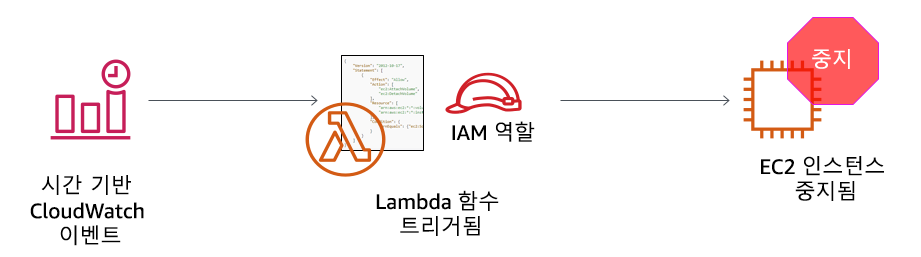

# 활동: AWS Lambda

<!-- Note to translators: This lab is unique to this course. -->

&nbsp;
&nbsp;
## 개요



&nbsp;
&nbsp;
&nbsp;
이 실습 활동에서는 AWS Lambda 함수를 만듭니다. 또한 매분마다 함수를 트리거하는 Amazon CloudWatch 이벤트를 생성합니다. 함수에는 AWS Identity and Access Management(IAM) 역할을 사용합니다. 이 IAM 역할을 사용하면 이 함수가 Amazon Web Services(AWS) 계정에서 실행 중인 Amazon Elastic Compute Cloud(Amazon EC2) 인스턴스를 중지할 수 있습니다.

&nbsp;
&nbsp;
### 소요 시간

이 실습은 완료까지 약 **30분**이 소요됩니다.

&nbsp;
&nbsp;
## AWS Management Console 액세스

1. 지침의 맨 위에서 <span id="ssb_voc_grey">Start Lab</span>을 클릭하여 실습을 시작합니다.

   **Start Lab** 패널이 열리고 실습 상태가 표시됩니다.

2. *Lab status: in creation* 메시지가 표시될 때까지 기다립니다. **Start Lab** 패널을 닫으려면 **X**를 클릭합니다.

3. 지침의 맨 위에서 <span id="ssb_voc_grey">AWS</span>를 클릭합니다.

   새 브라우저 탭에서 AWS Management Console이 열립니다. 자동으로 로그인됩니다.

   **팁**: 새 브라우저 탭이 열리지 않는 경우 일반적으로 브라우저에서 웹 사이트 팝업 창을 열 수 없음을 나타내는 배너 또는 아이콘이 브라우저 상단에 표시됩니다. 배너 또는 아이콘을 클릭하고 **Allow pop ups**를 선택합니다.

4. 이러한 지침이 나란히 표시되도록 **AWS Management Console** 탭을 정렬합니다. 두 브라우저 탭이 동시에 표시되어 활동 단계를 보다 쉽게 수행할 수 있게 됩니다.

&nbsp;
&nbsp;
## 과제 1: Lambda 함수 생성

5. **AWS Management Console**의 **Services** 메뉴에서 **Lambda**를 선택합니다.

   **참고**: *tags failed to load*라는 경고 메시지가 표시되는 경우 이 경고는 무시해도 됩니다.

6. <span id="ssb_lambda_orange">Create function</span>을 클릭합니다.

7. **Create function** 화면에서 다음 설정을 구성합니다.

   - **Author from scratch** 선택

   - Function name: `myStopinator`

   - Runtime: **Python 3.8**

   - <i class="fas fa-caret-right"></i>**Choose or create an execution role** 클릭

   - Execution role: **Use an existing role**

   - Existing role: 드롭다운 목록에서 **myStopinatorRole** 선택

8. <span id="ssb_lambda_orange">Create function</span>을 클릭합니다.

&nbsp;
&nbsp;
## 과제 2: 트리거 구성
이 과제에서는 CloudWatch 이벤트를 이벤트 소스(또는 트리거)로 설정하여 Lambda 함수를 트리거하는 예약된 이벤트를 구성합니다. Linux 서버의 cron 작업 또는 Microsoft Windows 서버의 예약된 작업과 매우 유사한 방식으로 작동하도록 Lambda 함수를 구성할 수 있습니다. 그러나 서버를 실행하지 않고도 함수를 호스팅할 수 있습니다.

9. <span id="ssb_lambda_white">+ Add trigger</span>를 클릭합니다.

10. **Select a trigger** 드롭다운 메뉴를 클릭하고 **EventBridge(CloudWatch Events)**를 선택합니다.

11. 규칙에 대해 **Create a new rule**을 선택하고 다음 설정을 구성합니다.

   - Rule name: `everyMinute`
   - Rule type: **Schedule expression**
   - Schedule expression: `rate(1 minute)`

   **참고**: 예약 기반 stopinator Lambda 함수를 트리거할 때는 rate 식 대신 cron 식을 사용하는 것이 더 현실적입니다. 그러나 이 활동에서는 결과를 빨리 확인하기 위해 rate 식을 사용하여 Lambda 함수를 트리거합니다.

12. <span id="ssb_lambda_orange">Add</span>를 클릭합니다.

&nbsp;
&nbsp;
## 과제 3: Lambda 함수 구성

이 과제에서는 코드 몇 줄을 붙여 넣어 함수 코드의 값 2개를 업데이트합니다. 코드를 작성하지 않고도 이 작업을 완료할 수 있습니다.

13. *Designer* 상자에서 *myStopinator*(Lambda 함수의 이름)를 클릭하여 함수 코드를 표시하고 편집합니다.

14. **Function code** 상자에서 기존 코드를 삭제합니다. 다음 코드를 복사하여 상자에 붙여 넣습니다.

```
import boto3
region = '<REPLACE_WITH_REGION>'
instances = ['<REPLACE_WITH_INSTANCE_ID>']
ec2 = boto3.client('ec2', region_name=region)

def lambda_handler(event, context):
    ec2.stop_instances(InstanceIds=instances)
    print('stopped your instances: ' + str(instances))
```

15. `<REPLACE_WITH_REGION>` 자리 표시자를 현재 사용 중인 실제 리전으로 바꿉니다. 이 작업을 수행하려면:

   오른쪽 상단 모서리의 리전을 클릭하고 리전 코드를 사용합니다. 예를 들어 미국 동부(버지니아 북부)의 리전 코드는 *us-east-1*입니다.

   **중요**: 코드에서 리전 주위에 작은 따옴표(‘)를 사용하십시오. 예를 들어 버지니아 북부의 경우 `'us-east-1'`이 됩니다.

16. **Challenge section**: *instance1*이라는 이름의 EC2 인스턴스가 계정에서 실행 중인지 확인하고 instance1의 **instance ID**를 복사합니다.
   <details>
         <summary>구체적인 단계별 지침 없이 이 과제를 수행하는 방법을 알아보는 것이 좋습니다. 그러나 <b>자세한 지침이 필요한 경우에는 여기를 클릭</b>하십시오.</summary>
         <ul>
           <li> 다른 브라우저 탭을 열고 <a href="https://console.aws.amazon.com/ec2" target="_blank">https://console.aws.amazon.com/ec2</a>로 이동하십시오.</li>
           <li> <b>Instances</b>를 클릭합니다.</li>
           <i>instance1</i>이라는 EC2 인스턴스가 존재하며 <i>running</i> 상태에 있습니다.
           <li> instance1의 <b>Description</b> 탭에서 <b>인스턴스 ID</b>를 복사합니다(<i>i-</i>로 시작합니다).</li>
           <b>참고</b>: 이 브라우저 탭을 열어 둡니다. 잠시 후에 돌아갑니다.
         </ul>

</details>

17. **AWS Lambda 콘솔** 브라우저 탭으로 돌아가서 `<REPLACE_WITH_INSTANCE_ID>`를 방금 복사한 실제 인스턴스 ID로 바꿉니다.

   **중요**: 코드에서 인스턴스 ID 주위에 작은 따옴표(‘)를 사용하십시오.

   이제 코드는 다음 예제와 유사해야 합니다. 그러나 리전 값은 다를 수 있으며 인스턴스 ID의 값도 다를 수 있습니다.


18. **Function Code** 상자의 오른쪽 위에서 <span id="ssb_lambda_orange">Deploy</span>를 선택합니다.

   이제 Lambda 함수가 완벽하게 구성되었습니다. 이 함수는 1분마다 인스턴스 중지를 시도해야 합니다.

19. **Monitoring**(페이지 상단 근처의 탭)을 클릭합니다.

   차트 중 하나에 함수가 호출된 횟수가 표시됩니다. 또한 오류 수와 성공률을 백분율로 보여주는 차트도 있습니다.

## 과제 4: Lambda 함수가 작동하는지 확인

20. **Amazon EC2 콘솔** 브라우저 탭으로 돌아가서 인스턴스가 중지되었는지 확인합니다.

   **팁**: <i class="fas fa-sync-alt"></i> 새로 고침 아이콘을 클릭하거나 브라우저 페이지를 새로 고쳐 상태 변경을 보다 빠르게 확인할 수 있습니다.

21. 인스턴스를 다시 시작해 보십시오. 어떻게 될 것 같습니까?

<details>
          <summary><b>여기</b>를 클릭하여 답을 확인하십시오.</summary>
          인스턴스가 1분 안에 다시 중지됩니다.
    </details>

&nbsp;
&nbsp;

## 활동 완료

<i class="icon-flag-checkered"></i> 축하합니다! 활동을 마쳤습니다.

22. 이 페이지의 상단에서 <span id="ssb_voc_grey">End Lab</span>을 클릭하고 <span id="ssb_blue">Yes</span>를 클릭하여 활동 종료를 확인합니다.

   다음과 같은 메시지가 포함된 패널이 표시됩니다. *DELETE has been initiated... 이제 이 메시지 상자를 닫을 수 있습니다.*

23. 패널을 닫으려면 오른쪽 위로 이동하고 **X**를 클릭합니다.

피드백 또는 제안 사항이 있거나 수정이 필요한 경우 다음 주소로 이메일을 보내 주십시오. *aws-course-feedback@amazon.com*

&nbsp;
&nbsp;
