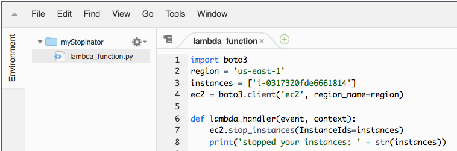

# Atividade: AWS Lambda

<!-- Note to translators: This lab is unique to this course. -->

&nbsp;
&nbsp;
## Visão geral


&nbsp;
&nbsp;
&nbsp;
Nesta atividade prática, você criará uma função do AWS Lambda. Você também criará um evento do Amazon CloudWatch para acionar a função a cada minuto. A função do Lambda usa uma função do AWS Identity and Access Management (IAM). Essa função do IAM permite que a função do Lambda interrompa uma instância do Amazon Elastic Compute Cloud (Amazon EC2) sendo executada na conta da Amazon Web Services (AWS).

&nbsp;
&nbsp;
### Duração

Esta atividade levará aproximadamente **30 minutos** para ser concluída.

&nbsp;
&nbsp;
## Acessar o Console de Gerenciamento da AWS

1. Na parte superior destas instruções, clique em <span id="ssb_voc_grey">Start Lab</span> (Iniciar laboratório) para iniciar o laboratório.

   Um painel **Start Lab** (Iniciar laboratório) é aberto exibindo o status do laboratório.

2. Aguarde até ver a mensagem *Lab status: in creation* (Status do laboratório: em criação). Para fechar o painel **Start Lab** (Iniciar laboratório), clique no **X**.

3. Na parte superior destas instruções, clique em <span id="ssb_voc_grey">AWS</span>

   O Console de Gerenciamento da AWS é aberto em uma nova guia do navegador. O sistema faz o seu login automaticamente.

   **Dica**: se uma nova guia do navegador não abrir, normalmente haverá uma faixa ou um ícone na parte superior da tela indicando que o navegador está impedindo que o site abra janelas pop-up. Clique na faixa ou no ícone e escolha **Allow pop ups** (Permitir pop-ups).

4. Configure a guia do **Console de Gerenciamento da AWS** para que ela seja exibida com estas instruções. O ideal será ver as duas guias do navegador ao mesmo tempo, o que facilitará acompanhar as etapas da atividade.

&nbsp;
&nbsp;
## Tarefa 1: Criar uma função do Lambda

5. No **Console de Gerenciamento da AWS**, no menu **Services** (Serviços), escolha **Lambda**.

   **Observação**: se aparecer uma mensagem de aviso informando *tags failed to load (falha no carregamento de tags)*, você poderá ignorá-la.

6. Clique em <span id="ssb_lambda_orange">Create function</span> (Criar função).

7. Na tela **Create function** (Criar função), defina estas configurações:

   - Escolha **Author from Scratch** (Criar do zero)

   - Function name (Nome da função): `myStopinator`

   - Runtime (Tempo de execução): **Python 3.8.**

   - Clique em <i class="fas fa-caret-right"></i>**Choose or create an execution role** (Escolher ou criar uma função de execução)

   - Execution role (Função de execução): **Use an existing role** (Usar uma função existente)

   - Existing role Função existente: Na lista suspensa, escolha **myStopinatorRole**

8. Clique em <span id="ssb_lambda_orange">Create function</span> (Criar função).

&nbsp;
&nbsp;
## Tarefa 2: Configurar o trigger
Nesta tarefa, você configurará um evento programado para acionar a função do Lambda. Para isso, você definirá um evento do CloudWatch como a fonte (ou trigger) do evento. É possível configurar a função do Lambda para operar de forma muito semelhante a um trabalho cron em um servidor Linux ou a uma tarefa programada em um servidor Microsoft Windows. No entanto, você não precisa ter um servidor em execução para hospedá-la.

9. Clique em <span id="ssb_lambda_white">+Add trigger</span> (Adicionar trigger).

10. Clique no menu suspenso **Select a trigger** (Selecionar um trigger) e escolha **EventBridge**.

11. Para a regra, escolha **Create a new rule** (Criar uma nova regra) e defina estas configurações:

   - Rule name (Nome da regra): `everyMinute (a cada minuto)`
   - Rule type (Tipo de regra): **Schedule expression** (Expressão de programação)
   - Schedule expression (Expressão de programação): `rate(1 minute) (taxa (1 minuto))`

   **Observação**: uma função do Lambda stopinator mais realista e baseada na programação provavelmente seria acionada por meio de uma expressão cron, ao invés de uma expressão rate. No entanto, para a finalidade desta atividade, o uso de uma expressão rate garante que a função do Lambda seja acionada rapidamente para que você possa ver os resultados.

12. Clique em <span id="ssb_lambda_orange">Add</span> (Adicionar).

&nbsp;
&nbsp;
## Tarefa 3: Configurar a função do Lambda

Nesta tarefa, você colará algumas linhas de código para atualizar dois valores no código da função. Você não precisa escrever nenhum código para concluir esta tarefa.

13. Na caixa *Designer* , clique em *myStopinator* (o nome da função do Lambda) para exibir e editar o código da função.

14. Na caixa **Function code** (Código da função), exclua o código existente. Copie o código a seguir e cole-o na caixa:

```
import boto3
region = '<REPLACE_WITH_REGION>'
instances = ['<REPLACE_WITH_INSTANCE_ID>']
ec2 = boto3.client('ec2', region_name=region)

def lambda_handler(event, context):
    ec2.stop_instances(InstanceIds=instances)
    print('stopped your instances: ' + str(instances))
```

15. Substitua o espaço reservado `<REPLACE_WITH_REGION>` pela região real que você usa. Para fazer isso:

   Clique na região no canto superior direito e use o código da região. Por exemplo, o código da região Leste dos EUA (Norte da Virgínia) é *us-east-1*.

   **Importante**: mantenha a região entre aspas simples (' ') no código. Por exemplo, para o Norte da Virgínia, use `'us-east-1'`

16. **Seção de desafio**: confirme se uma instância do EC2 chamada de *instance1* está em execução na sua conta e copie o **ID da instância**.
   <details>
         <summary>Desafiamos você a descobrir como realizar essa tarefa sem uma orientação passo a passo específica. No entanto, <b>se precisar de orientação detalhada, clique aqui</b>.</summary>
         <ul>
           <li> Abra outra guia do navegador e vá para <a href="https://console.aws.amazon.com/ec2" target="_blank">https://console.aws.amazon.com/ec2</a></li>
           <li> Clique em <b>Instances</b> (Instâncias).</li>
           Observe que existe uma instância do EC2 chamada <i>instance1</i> e que está em um estado de <i>running (execução)</i> .
           <li> Na guia <b>Description</b> (Descrição) da instance1, copie o <b>ID da instância</b> (ele começará com <i>i-</i>)</li>
           <b>Observação</b>: deixe esta guia do navegador aberta. Você retornará a ela logo mais.
         </ul>

</details>

17. Retorne à guia do navegador do **console do AWS Lambda** e substitua `<REPLACE_WITH_INSTANCE_ID>` pelo ID da instância real que você acabou de copiar.

   **Importante**: mantenha o ID da instância entre aspas simples (' ') no código.

   Seu código agora deve ser semelhante ao exemplo a seguir. No entanto, você pode ter um valor diferente para a região e terá um valor diferente para o ID da instância:



18. No canto superior direito da caixa **Function Code (Código da função)** , escolha <span id="ssb_lambda_orange">Deploy</span> (Implantar).

   Sua função do Lambda agora está totalmente configurada. Ela deve tentar interromper sua instância a cada minuto.

19. Clique em **Monitoring** (Monitoramento) (a guia próxima à parte superior da página).

   Observe que um dos gráficos mostra quantas vezes a função foi invocada. Há também um gráfico que mostra a contagem de erros e a taxa de sucesso como porcentagem.

## Tarefa 4: Confirmar se a função do Lambda funcionou

20. Retorne à guia do navegador do **console do Amazon EC2** e veja se sua instância foi interrompida.

   **Dica**: você pode clicar no ícone de atualização <i class="fas fa-sync-alt"></i> ou atualizar a página do navegador para ver a alteração no estado mais rapidamente.

21. Tente iniciar a instância novamente. O que você acha que vai acontecer?

<details>
          <summary>Clique <b>aqui</b> para ver a resposta.</summary>
          A instância será interrompida novamente em um minuto.
    </details>

&nbsp;
&nbsp;

## Atividade concluída

<i class="icon-flag-checkered"></i> Parabéns! Você concluiu a atividade.

22. Clique em <span id="ssb_voc_grey">End Lab</span> (Encerrar laboratório) na parte superior desta página e, em seguida, clique em <span id="ssb_blue">Yes</span> (Sim) para confirmar que deseja encerrar a atividade.

   Um painel é exibido com a mensagem: *DELETE has been initiated... You may close this message box now (EXCLUSÃO iniciada... Agora você pode fechar esta caixa de mensagem)*.

23. Clique no **X** no canto superior direito para fechar o painel.

Envie feedback, sugestões ou correções por e-mail para: *aws-course-feedback@amazon.com*

&nbsp;
&nbsp;
