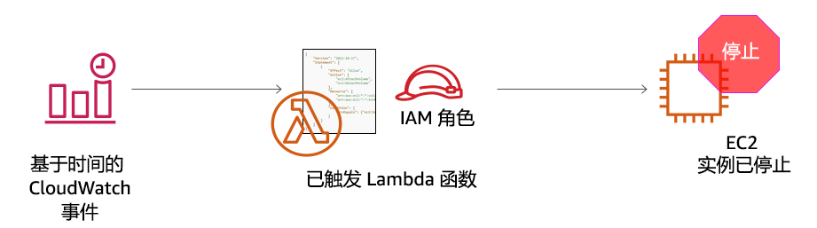
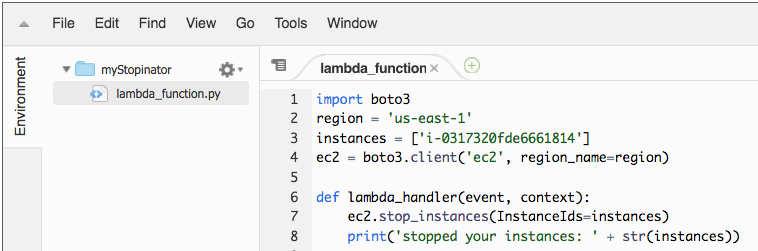

# 活动：AWS Lambda

<!-- Note to translators: This lab is unique to this course. -->

&nbsp;
&nbsp;
## 概览



&nbsp;
&nbsp;
&nbsp;
在此动手实践活动中，您将创建一个 AWS Lambda 函数。您还将创建一个 Amazon CloudWatch 事件以每分钟触发一次该函数。该函数使用 AWS Identity and Access Management (IAM) 角色。通过此 IAM 角色，该函数可以停止在 Amazon Web Services (AWS) 账户中运行的 Amazon Elastic Compute Cloud (Amazon EC2) 实例。

&nbsp;
&nbsp;
### 持续时间

完成本次活动大约需要 **30 分钟**。

&nbsp;
&nbsp;
## 访问 AWS 管理控制台

1. 在这些说明的顶部，单击 <span id="ssb_voc_grey">Start Lab</span>（启动实验）启动您的实验。

   **Start Lab**（启动实验）面板随即会打开，其中显示了实验状态。

2. 请耐心等待，直到您看到 *Lab status: in creation*（实验状态：正在创建）消息。要关闭 **Start Lab**（启动实验）面板，请单击 **X**。

3. 在这些说明的顶部，单击 <span id="ssb_voc_grey">AWS</span>

   AWS 管理控制台会在新的浏览器选项卡中打开。您将自动登录系统。

   **提示**：如果未打开新的浏览器选项卡，则您的浏览器顶部通常会出现一个横幅或图标，指明您的浏览器阻止该网站打开弹出窗口。单击横幅或图标，然后选择 **Allow pop ups**（允许弹出窗口）。

4. 排列 **AWS 管理控制台**选项卡，使其与这些说明一起显示。理想情况下，您将能够同时看到这两个浏览器选项卡，以便更轻松地执行活动步骤。

&nbsp;
&nbsp;
## 任务 1：创建 Lambda 函数

5. 在 **AWS 管理控制台上**中，从 **Services**（服务）菜单中选择 **Lambda**。

   **注意**：如果您看到一条警告消息，提示 *tags failed to load*（标签加载失败），您可以将其忽略。

6. 单击 <span id="ssb_lambda_orange">Create function</span>（创建函数）。

7. 在 **Create function**（创建函数）屏幕上，配置以下设置：

   - 选择 **Author from scratch**（从头开始创作）

   - “Function name”（函数名称）：`myStopinator`

   - “Runtime”（运行时）：**Python 3.8**。

   - 单击 <i class="fas fa-caret-right"></i>**Choose or create an execution role**（选择或创建执行角色）

   - “Execution role”（执行角色）：**Use an existing role**（使用现有角色）

   - “Existing role”（现有角色）：从下拉列表中选择 **myStopinatorRole**

8. 单击 <span id="ssb_lambda_orange">Create function</span>（创建函数）。

&nbsp;
&nbsp;
## 任务 2：配置触发器
在此任务中，您将通过设置 CloudWatch 事件作为事件源（或触发器），配置一个计划事件来触发 Lambda 函数。Lambda 函数经过配置后，能够以与 Linux 服务器上的 cron 作业或 Microsoft Windows 服务器上的计划任务非常相似的方式运行。但是，您不需要运行服务器来托管它。

9. 单击 <span id="ssb_lambda_white">+ Add trigger</span>（+ 添加触发器）。

10. 单击 **Select a trigger**（选择触发器）下拉菜单，然后选择 **EventBridge (CloudWatch Events)**。

11. 在规则部分，请选择 **Create a new rule**（创建新规则），然后配置以下设置：

   - “Rule name”（规则名称）：`everyMinute`
   - “Rule type”（规则类型）：Schedule expression（计划表达式）
   - “Schedule expression”（计划表达式）：`rate(1 minute)`

   **注意**：如果使用 cron 表达式（而非 rate 表达式），则可能会触发更真实的基于计划的 stopinator Lambda 函数。但是，在本次活动中，使用 rate 表达式可确保尽快触发 Lambda 函数，以便您可以看到结果。

12. 单击 <span id="ssb_lambda_orange">Add</span>（添加）。

&nbsp;
&nbsp;
## 任务 3：配置 Lambda 函数

在此任务中，您将粘贴几行代码来更新函数代码中的两个值。您不需要编写代码即可完成此任务。

13. 在 *Designer*（设计师）框中，单击 *myStopinator *（这是 Lambda 函数的名称）以显示和编辑 Lambda 函数代码。

14. 在 **Function code**（函数代码）框中，删除现有的代码。复制以下代码并将其粘贴到函数代码框中：

```
import boto3
region = '<REPLACE_WITH_REGION>'
instances = ['<REPLACE_WITH_INSTANCE_ID>']
ec2 = boto3.client('ec2', region_name=region)

def lambda_handler(event, context):
    ec2.stop_instances(InstanceIds=instances)
    print('stopped your instances: ' + str(instances))
```

15. 将 `<REPLACE_WITH_REGION>` 占位符替换为您实际使用的区域。为此，请执行以下操作：

   单击右上角的区域，然后使用区域代码。例如，美国东部（弗吉尼亚北部）的区域代码为 *us-east-1*。

   **重要提示**：在代码中，请在区域值两侧使用一对单引号 (' ') 将其包含在这对单引号内。例如，对于弗吉尼亚北部，它将为 `us-east-1`

16. **挑战部分**：验证您账户中正在运行的名为 *instance1* 的 EC2 实例，并复制 instance1 **实例 ID**。
   <details>
         <summary>建议您自行确定如何完成该任务，而不要参考具体的分步指南。但是，<b>如果您需要详细指南，请单击此处</b>。</summary>
         <ul>
           <li> 打开另一个浏览器选项卡，然后转到 <a href="https://console.aws.amazon.com/ec2" target="_blank">https://console.aws.amazon.com/ec2</a></li>
           <li> 单击 <b>Instances</b>（实例）。</li>
           请注意，存在一个名为 <i>instance1</i> 的 EC2 实例，并且它处于 <i>running</i>（正在运行）状态。
           <li> 从实例 1 的 <b>Description</b>（描述）选项卡中，复制 <b>instance ID</b>（实例 ID）（以 <i>i-</i> 开头）</li>
           <b>注意</b>：保持此浏览器选项卡处于打开状态。您稍后需要回到这里。
         </ul>

</details>

17. 返回 **AWS Lambda 控制台**浏览器选项卡，将 `<REPLACE_WITH_INSTANCE_ID>` 替换为您刚刚复制的实际实例 ID。

   **重要提示**：在代码中，请使用单引号 ('') 将实例 ID 引起来。

   您的代码应如以下示例所示。但是，您的区域值和实例 ID 的值可能会有所不同：



18. 在 **Function Code**（函数代码）框的右上角，选择 <span id="ssb_lambda_orange">Deploy</span>（部署）。

   您的 Lambda 函数现已完全配置好了。它应该会每分钟尝试停止您的实例一次。

19. 单击靠近页面顶部的选项卡 **Monitoring**（监控）。

   请注意，其中一个图表显示了您的函数的调用次数。此外还有一个图表显示了错误数和成功率（以百分数表示）。

## 任务 4：验证 Lambda 函数是否可正常运行

20. 返回 **Amazon EC2 控制台的**浏览器标签页，看看您的实例是否已停止。

   **提示**：您可以单击 <i class="fas fa-sync-alt"></i> 刷新图标或刷新浏览器页面，更快地查看更改状态。

21. 请尝试再次启动实例。您认为会发生什么？

<details>
          <summary>单击<b>此处</b>查看答案。</summary>
          实例将在 1 分钟内再次停止。
    </details>

&nbsp;
&nbsp;

## 活动完成

<i class="icon-flag-checkered"></i>恭喜！您已完成本次活动。

22. 单击此页面顶部的 <span id="ssb_voc_grey">End Lab</span>（结束实验），然后单击 <span id="ssb_blue">Yes</span>（是）确认您要结束本次活动。

   此时将显示一个面板，其中显示一条消息指示：*DELETE has been initiated...You may close this message box now.*（删除操作已启动...您现在可以关闭此消息框。）

23. 要关闭该面板，请单击右上角的 **X**。

如有反馈、建议或更正意见，请发送电子邮件至：*aws-course-feedback@amazon.com*

&nbsp;
&nbsp;
