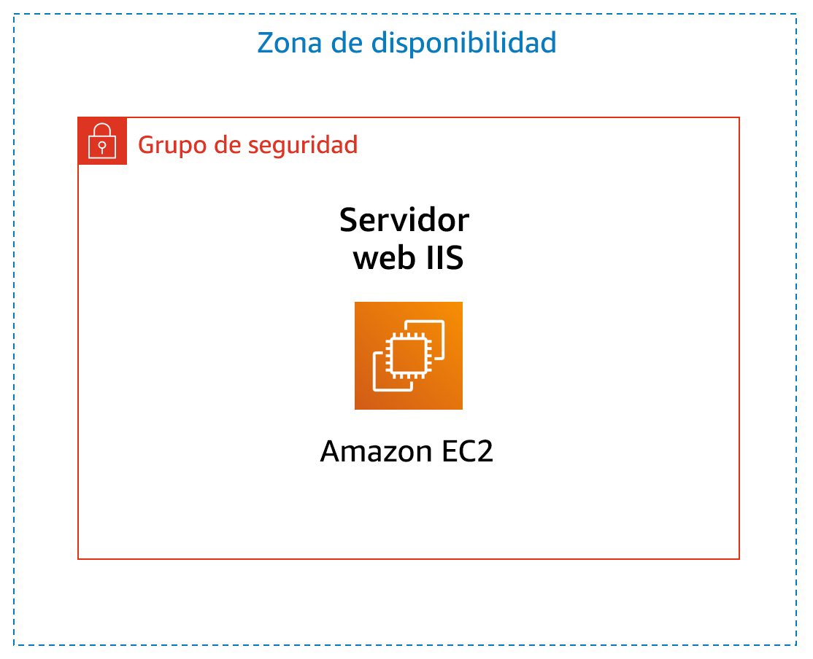

# Laboratorio 3: Introducción a Amazon EC2

<!-- Note to translators: This is based on SPL-200. Copy the translation from there. Do not re-translate the whole document. -->

**Versión 1.1.7 (spl200)**

## Información general



&nbsp;

En este laboratorio, se proporciona información general básica sobre el lanzamiento, la modificación del tamaño, la administración y el monitoreo de una instancia de Amazon EC2.

**Amazon Elastic Compute Cloud (Amazon EC2)** es un servicio web que proporciona capacidad informática con tamaño modificable en la nube. Está diseñado con el fin de simplificar la informática en la nube a escala web para los desarrolladores.

La sencilla interfaz de servicios web de Amazon EC2 permite obtener y configurar capacidad con una fricción mínima. Proporciona un control completo sobre los recursos informáticos y permite ejecutarse en el entorno informático acreditado de Amazon. Amazon EC2 reduce el tiempo necesario para obtener y arrancar nuevas instancias de servidor a solo minutos, lo que permite escalar rápidamente la capacidad, ya sea de forma ascendente o descendente, en función de sus necesidades.

Amazon EC2 cambia el modelo económico de la informática, y permite pagar solo por la capacidad que utiliza realmente. Amazon EC2 proporciona a los desarrolladores las herramientas necesarias para crear aplicaciones resistentes a errores y aislarse de los casos de error más comunes.

&nbsp;
### Temas

Al final de este laboratorio, podrá hacer lo siguiente:

* Lanzar un servidor web con la protección contra terminación habilitada
* Monitorear la instancia EC2
* Modificar el grupo de seguridad que utiliza el servidor web para permitir el acceso HTTP
* Modificar el tamaño de la instancia de Amazon EC2 a la escala necesaria
* Explorar los límites de EC2
* Probar la protección contra terminación
* Terminar la instancia EC2

&nbsp;

### Duración

La duración estimada de este laboratorio es de **35 minutos** aproximadamente.

&nbsp;
&nbsp;
## Acceso a la consola de administración de AWS

1. En la parte superior de estas instrucciones, haga clic en <span id="ssb_voc_grey">Start Lab</span> (Iniciar laboratorio) para lanzar su laboratorio.

   Se abrirá el panel “Start Lab” (Iniciar laboratorio), donde se muestra el estado del laboratorio.

2. Espere hasta que aparezca el mensaje “**Lab status: ready**” (Estado del laboratorio: listo) y, luego, haga clic en la **X** para cerrar el panel “Start Lab (Iniciar laboratorio)”.

3. En la parte superior de estas instrucciones, haga clic en <span id="ssb_voc_grey">AWS</span>.

   La consola de administración de AWS se abrirá en una nueva pestaña del navegador. El sistema iniciará su sesión automáticamente.

   **Sugerencia**: Si no se abre una pestaña nueva del navegador, debería aparecer un banner o un icono en la parte superior de este, el cual indique que el navegador no permite que se abran ventanas emergentes en el sitio. Haga clic en el banner o en el icono, y elija “Allow pop ups” (Permitir ventanas emergentes).

4. Ubique la pestaña de la consola de administración de AWS en un lugar donde aparezca al lado de estas instrucciones. Idealmente, debería poder ver ambas pestañas del navegador al mismo tiempo para que sea más sencillo seguir los pasos del laboratorio.

&nbsp;
&nbsp;
## Tarea 1: Lanzar una instancia de Amazon EC2

En esta tarea, lanzará una instancia de Amazon EC2 con _protección contra terminación_. La protección contra terminación impide terminar una instancia EC2 por accidente. Implementará una instancia con un script de datos de usuario que le permitirá implementar un servidor web sencillo.

5. En el menú **Services** (Servicios) de la **consola de administración de AWS**, haga clic en **EC2**.

6. Elija <span id="ssb_orange">Launch instance<i class="fas fa-caret-down"></i></span>  (Lanzar instancia) y, luego, seleccione <span id="ssb_white">Launch Instance</span> (Lanzar instancia).

### Paso 1: Elegir una imagen de Amazon Machine (AMI)

<i class="fas fa-info-circle"></i> Una **Imagen de Amazon Machine (AMI)** proporciona la información necesaria para lanzar una instancia, que es un servidor virtual en la nube. La AMI incluye lo siguiente:

* Una plantilla para el volumen raíz de la instancia (por ejemplo, un sistema operativo o un servidor de aplicaciones con aplicaciones)
* Permisos de lanzamiento que controlan qué cuentas de AWS pueden utilizar la AMI para lanzar instancias
* Una asignación de dispositivos de bloques que especifica los volúmenes que deben asociarse a la instancia cuando se lanza

En la lista de **Quick Start**, se incluyen las AMI más utilizadas. También puede crear su propia AMI o elegir una de AWS Marketplace, una tienda en línea donde se puede vender o comprar software que se ejecuta en AWS.

7. En la parte superior de la lista, haga clic en <span id="ssb_blue">Select</span> (Seleccionar), junto a **Amazon Linux 2 AMI** (AMI de Amazon Linux 2).

&nbsp;

### Paso 2: Elegir el tipo de instancia

<i class="fas fa-info-circle"></i> Amazon EC2 ofrece una amplia variedad de _tipos de instancias_ optimizados para adaptarse a diferentes casos de uso. Los tipos de instancias abarcan distintas combinaciones de capacidad de CPU, memoria, almacenamiento y redes. Además, le proporcionan flexibilidad a la hora de elegir la combinación de recursos adecuada para sus aplicaciones. En cada tipo de instancia, se incluyen uno o más _tamaños de instancia_, lo que permite adaptar la escala de los recursos a los requisitos de la carga de trabajo de destino.

Utilizará una instancia **t2.micro**, que debería estar seleccionada <i class="fas fa-square" style="color:blue"></i> de forma predeterminada. Este tipo de instancia posee 1 CPU virtual y 1 GiB de memoria. **NOTA**: Es posible que en este laboratorio no pueda usar otros tipos de instancia.

8. Haga clic en <span id="ssb_grey">Next: Configure Instance Details </span> (Siguiente: Configurar detalles de instancia).

&nbsp;
### Paso 3: configurar los detalles de la instancia

Esta página se utiliza para configurar la instancia a fin de que cumpla con sus requisitos. Esto incluye la configuración de redes y de monitoreo.

En **Network** (Red), se define dentro de cuál nube virtual privada (VPC) se quiere lanzar la instancia. Se pueden tener varias redes diferentes para desarrollo, pruebas y producción.

9. En **Network** (Red), seleccione **Lab VPC**.

   Lab VPC se creó con una plantilla de AWS CloudFormation durante el proceso de configuración del laboratorio. Esta VPC contiene dos subredes públicas en dos zonas de disponibilidad diferentes.

10. En **Enable termination protection** (Habilitar la protección de terminación), seleccione <i class="far fa-check-square"></i> **Protect against accidental termination** (Proteger contra la terminación accidental).

<i class="fas fa-info-circle"></i> Cuando una instancia de Amazon EC2 ya no es necesaria, se la puede _terminar_, lo que significa que se la detiene y se liberan sus recursos. No se puede volver a iniciar una instancia terminada. Si quiere evitar que la instancia se termine por accidente, puede habilitar la _protección contra terminación_ para la instancia, que impide su terminación.

11. Desplácese hacia abajo y, a continuación, expanda <i class="fas fa-caret-right"></i> **Advanced Details** (Detalles avanzados).

Aparecerá el campo **User data** (Datos de usuario).

<i class="fas fa-info-circle"></i> Cuando lanza una instancia, puede transmitirle los _datos de usuario_, que se pueden utilizar para realizar tareas de configuración automatizadas comunes e, incluso, para ejecutar scripts después de iniciar la instancia.

Dado que la instancia ejecuta Amazon Linux, tendrá que proporcionar un _script de shell_ que se ejecutará cuando se inicie la instancia.

12. Copie los siguientes comandos y péguelos en el campo **User data** (Datos de usuario):

    ```plain
    #!/bin/bash
    yum -y install httpd
    systemctl enable httpd
    systemctl start httpd
    echo '<html><h1>Hello From Your Web Server!</h1></html>' > /var/www/html/index.html
    ```

    Este script permite hacer lo siguiente:
    
    * Instalar un servidor web Apache (httpd)
    * Configurar el servidor web para que se inicie automáticamente durante el arranque
    * Activar el servidor web
    * Crear una página web sencilla


13. Haga clic en <span id="ssb_grey">Next: Add Storage</span> (Siguiente: Agregar almacenamiento).


&nbsp;
### Paso 4: Agregar almacenamiento

<i class="fas fa-info-circle"></i> Amazon EC2 almacena los datos en un disco virtual asociado a la red que se denomina *Elastic Block Store*.

Se lanzará la instancia de Amazon EC2 con un volumen de disco predeterminado de 8 GiB. Este será el volumen raíz (también conocido como volumen “de arranque”).

14. Haga clic en <span id="ssb_grey">Next: Add Tags</span> (Siguiente: agregar etiquetas).

&nbsp;
### Paso 5: agregar etiquetas

<i class="fas fa-info-circle"></i> Las etiquetas le permiten clasificar los recursos de AWS de maneras diversas, por ejemplo, según su finalidad, propietario o entorno. Esto resulta útil cuando se tienen muchos recursos del mismo tipo; se puede identificar rápidamente un recurso específico con las etiquetas que se le han asignado. Cada etiqueta consta de una clave y un valor, los cuales usted define.

15. Haga clic en <span id="ssb_grey">Add Tag</span> (Agregar etiqueta) y, luego, configure lo siguiente:

   * **Key (Clave):** `Name (Nombre)`
   * **Value (Valor):** `Web Server (Servidor web)`

16. Haga clic en <span id="ssb_grey">Next: Configure Security Group</span> (Siguiente: Configurar grupo de seguridad).

&nbsp;
### Paso 6: Configurar un grupo de seguridad

<i class="fas fa-info-circle"></i> Un _grupo de seguridad_ funciona como un firewall virtual que controla el tráfico de una o más instancias. Cuando se lanza una instancia, uno o más grupos de seguridad se asocian a ella. Se agregan _reglas_ a cada grupo de seguridad que permiten que el tráfico fluya a sus instancias asociadas o desde ellas. Las reglas de un grupo de seguridad se pueden modificar en cualquier momento. Las nuevas reglas se aplican automáticamente a todas las instancias que estén asociadas al grupo de seguridad.

17. En el **Paso 6: Configurar un grupo de seguridad**, establezca los siguientes ajustes:

   * **Security group name (Nombre del grupo de seguridad):** `Web Server security group (Grupo de seguridad del servidor web)`
   * **Description (Descripción):** `Security group for my web server (Grupo de seguridad para mi servidor web)`

   En este laboratorio, no iniciará sesión en la instancia mediante SSH. Al eliminar el acceso mediante SSH, se mejora la seguridad de la instancia.

18. Elimine <i class="fas fa-times-circle"></i> la regla SSH existente.

19. Haga clic en <span id="ssb_blue">Review and Launch</span> (Revisar y lanzar).

&nbsp;
### Paso 7: revisar el lanzamiento de la instancia

En la página “Review” (Revisar), se muestra la configuración de la instancia que está a punto de lanzar.

20. Haga clic en <span id="ssb_blue">Launch</span> (Lanzar).

Aparecerá la ventana **Select an existing key pair or create a new key pair** (Seleccionar un par de claves existente o crear un nuevo par de claves).

<i class="fas fa-info-circle"></i> Amazon EC2 utiliza la criptografía de clave pública para cifrar y descifrar la información de inicio de sesión. Para iniciar sesión en una instancia, deberá crear un par de claves. En el lanzamiento de la instancia, tendrá que especificar el nombre del par de claves y, cuando se conecte a dicha instancia, tendrá que proporcionar la clave privada.

Debido a que en este laboratorio no iniciará sesión en la instancia, no necesita un par de claves.

21. Haga clic en el menú desplegable **Choose an existing key pair** (Elegir un par de claves existente) <i class="fas fa-angle-down"></i> y seleccione *Proceed without a key pair (Continuar sin un par de claves)*.

22. Seleccione <i class="far fa-check-square"></i> **I acknowledge that…** (Acepto que…).

23. Haga clic en <span id="ssb_blue">Launch Instances</span> (Lanzar instancias).

   Ahora se lanzará la instancia.

24. Haga clic en <span id="ssb_blue">View Instances</span> (Ver instancias).

   La instancia aparecerá con estado _pending_ (pendiente), lo que indica que se está lanzando. Después cambiará a _running_ (en ejecución), lo que indica que la instancia está arrancando. Es posible que transcurran unos instantes hasta que pueda acceder a la instancia.

   La instancia recibe un _nombre de DNS público_ que puede utilizar para contactarla desde Internet.

   Su <i class="fas fa-square" style="color:blue"></i> **Web Server** debe estar seleccionado. En la pestaña **Description** (Descripción), se incluye información detallada sobre la instancia.

   <i class="fas fa-comment"></i> Para ver más información en la pestaña “Description” (Descripción), arrastre hacia arriba el divisor de la ventana.

   Revise la información que aparece en la pestaña **Description** (Descripción). Esta contiene información sobre el tipo de instancia, así como configuraciones de seguridad y de red.

25. Espere a que en la instancia aparezca lo siguiente:

* **Instance State (Estado de la instancia):** <span style="color:green"><i class="fas fa-circle"></i></span> running (en ejecución)
* **Status Checks (Comprobaciones de estado):** <span style="color:green"><i class="fas fa-check-circle"></i></span> 2/2 checks passed (2/2 comprobaciones aprobadas)

<span style="color:blue"><i class="far fa-thumbs-up"></i></span> **¡Enhorabuena!** Ha lanzado correctamente su primera instancia de Amazon EC2.

&nbsp;
&nbsp;
## Tarea 2: Monitorear la instancia

El monitoreo es un factor importante a la hora de mantener el rendimiento, la disponibilidad y la fiabilidad de las instancias de Amazon Elastic Compute Cloud (Amazon EC2) y las soluciones de AWS.

26. Haga clic en la pestaña **Status Checks** (Comprobaciones de estado).

   <i class="fas fa-info-circle"></i> Con el monitoreo del estado de las instancias, puede determinar rápidamente si Amazon EC2 ha detectado algún problema que pudiera impedir que las instancias ejecuten aplicaciones. Amazon EC2 realiza comprobaciones automatizadas en cada instancia EC2 en ejecución para identificar problemas de hardware y software.

   Observe que se ha aprobado tanto la comprobación de **Accesibilidad del sistema** como la de **Accesibilidad de la instancia**.

27. Haga clic en la pestaña **Monitoring** (Monitoreo).

   En esta pestaña, se muestran las métricas de Amazon CloudWatch sobre la instancia. En este momento, no aparecen muchas métricas debido a que la instancia se acaba de lanzar.

   Puede hacer clic en un gráfico para ver una vista expandida.

   <i class="fas fa-info-circle"></i> Amazon EC2 envía métricas sobre sus instancias EC2 a Amazon CloudWatch. El monitoreo básico (cinco minutos) está habilitado de forma predeterminada. Se puede habilitar el monitoreo detallado (un minuto).

28. En el menú <span id="ssb_grey_square">Actions<i class="fas fa-caret-down"></i></span> (Acciones), seleccione **Monitor and troubleshoot** (Monitorear y solucionar problemas) <i class="fas fa-caret-right"></i> **Obtener registro del sistema**.

   En el registro del sistema, se muestra el resultado de la consola de la instancia, que constituye una herramienta valiosa para el diagnóstico de problemas. Resulta especialmente útil para solucionar problemas de kernel y de configuración de servicios que podrían causar la terminación de una instancia o hacer que esta se torne inalcanzable antes de poder iniciar su demonio de SSH. Si no ve un registro del sistema, espere unos minutos e inténtelo de nuevo.

29. Desplácese por el resultado. Observe que se instaló el paquete HTTP a partir de los **datos de usuario** que agregó cuando creó la instancia.


30. Elija **Cancel** (Cancelar).

31. En el menú <span id="ssb_grey_square">Actions<i class="fas fa-caret-down"></i></span> (Acciones), seleccione **Monitor and troubleshoot** (Monitorear y solucionar problemas) <i class="fas fa-caret-right"></i> **Obtener captura de pantalla de la instancia**.

   Así se vería la consola de la instancia de Amazon EC2 si estuviera asociada a una pantalla.


   <i class="fas fa-info-circle"></i> Si no puede alcanzar la instancia a través de SSH o RDP, puede hacer una captura de pantalla de la instancia y verla como una imagen. Esto permite ver el estado de la instancia y solucionar los problemas más rápidamente.

32. Elija **Cancel** (Cancelar).

   <span style="color:blue"><i class="far fa-thumbs-up"></i></span> **¡Enhorabuena!** Ha analizado varias formas de monitorear la instancia.

&nbsp;
&nbsp;
## Tarea 3: Actualizar el grupo de seguridad y acceder al servidor web

Cuando lanzó la instancia EC2, proporcionó un script que instaló un servidor web y creó una página web sencilla. En esta tarea, accederá al contenido del servidor web.


33. Haga clic en la pestaña **Details** (Detalles).

34. Copie la **IPv4 Public IP** (dirección IP pública IPv4) de la instancia en el portapapeles.

35. Abra una nueva pestaña del navegador web, pegue la dirección IP que acaba de copiar y presione **Enter** (Intro).

   **Pregunta:** ¿Puede acceder al servidor web? ¿Por qué no?

   En este momento, **no** puede acceder al servidor web porque el _grupo de seguridad_ no permite tráfico entrante en el puerto 80, que se usa para solicitudes web HTTP. Esto es un ejemplo del uso de un grupo de seguridad como firewall para restringir el tráfico de red entrante y saliente en una instancia.

   Para corregir esta situación, debe actualizar el grupo de seguridad, de manera que permita el tráfico web en el puerto 80.

36. Deje abierta la pestaña del navegador, pero vuelva a la pestaña de la **consola de administración de EC2**.

37. En el panel de navegación izquierdo, haga clic en **Security Groups** (Grupos de seguridad).

38. Seleccione <i class="fas fa-square" style="color:blue"></i> **Web Server security group** (Grupo de seguridad del servidor web).

39. Haga clic en la pestaña **Inbound** (Entrante).

   Actualmente, el grupo de seguridad no tiene reglas.

40. Haga clic en <span id="ssb_grey_square">Edit inbound rules</span> (Editar reglas de entrada) y, luego, establezca los siguientes ajustes:

   * **Type (Tipo):** _HTTP_
   * **Source (Origen):** _Anywhere (Cualquiera)_
   * Haga clic en <span id="ssb_orange">Save rules</span> (Guardar reglas).

41. Vuelva a la pestaña del servidor web que abrió antes y actualice <i class="fas fa-sync"></i> la página.

   Debería ver este mensaje: _Hello From Your Web Server! (¡Saludos de parte de su servidor web!)_

   <span style="color:blue"><i class="far fa-thumbs-up"></i></span> **¡Enhorabuena!** Ha modificado correctamente su grupo de seguridad para permitir el tráfico HTTP en su instancia de Amazon EC2.

&nbsp;
&nbsp;
## Tarea 4: Modificar el tamaño de la instancia (tipo de instancia y volumen de EBS)

A medida que sus necesidades cambien, es posible que descubra que su instancia se utiliza en exceso (es demasiado pequeña) o no se utiliza lo suficiente (es demasiado grande). En ese caso, puede cambiar el _tipo de instancia_. Por ejemplo, si una instancia _t2.micro_ es demasiado pequeña para su carga de trabajo, puede cambiarla a una _m5.medium_. Del mismo modo, puede cambiar el tamaño de un disco.


### Detener la instancia

Para poder cambiar el tamaño de una instancia, antes debe _detenerla_.

<i class="fas fa-info-circle"></i> Cuando se detiene una instancia, se apaga. Una instancia EC2 detenida no genera cargos, pero sí se mantienen los cargos de almacenamiento por los volúmenes de Amazon EBS que están asociados a ella.

42. En la **consola de administración de EC2**, en el panel de navegación izquierdo, haga clic en **Instances** (Instancias).

   <i class="fas fa-square" style="color:blue"></i> **Web Server** (Servidor web) ya debería estar seleccionado.

43. En el menú <span id="ssb_grey_square">Instance State<i class="fas fa-caret-down"></i></span> (Estado de la instancia), seleccione **Stop instance** (Detener instancia).

44. Elija <span id="ssb_orange">Stop</span> (Detener).

   La instancia se apagará de forma normal y, a continuación, dejará de ejecutarse.

45. Espere a que **Instance State** (Estado de la instancia) se muestre como <span style="color:red"><i class="fas fa-circle"></i></span>stopped (detenida)

### Cambiar el tipo de instancia

46. En el menú <span id="ssb_grey_square">Actions<i class="fas fa-caret-down"></i></span> (Acciones), seleccione **Instance Settings** (Configuración de la instancia) <i class="fas fa-caret-right"></i> **Change Instance Type** (Cambiar el tipo de instancia) y, a continuación, configure lo siguiente:

   * **Instance type (Tipo de instancia):** *t2.small*
   * Elija <span id="ssb_orange">Apply</span> (Aplicar).

   Cuando la instancia se inicie de nuevo, será del tipo _t2.small_, que tiene el doble de memoria que una instancia _t2.micro_. **NOTA**: Es posible que en este laboratorio no pueda usar otros tipos de instancia.

### Modificar el tamaño del volumen de EBS

47. En el menú de navegación izquierdo, haga clic en **Volumes** (Volúmenes).

48. En el menú <span id="ssb_grey">Actions<i class="fas fa-caret-down"></i></span> (Acciones), seleccione **Modify Volume** (Modificar volumen).

   El tamaño actual del disco es de 8 GiB. A continuación, aumentará el tamaño del disco.

49. Cambie el tamaño a `10`. **NOTA**: Es posible que en este laboratorio no se puedan crear volúmenes grandes de Amazon EBS.

50. Elija <span id="ssb_grey">Modify</span> (Modificar).

51. Elija <span id="ssb_blue">Yes</span> (Sí) para confirmar y aumentar el tamaño del volumen.

52. Elija <span id="ssb_blue">Close</span> (Cerrar).

### Iniciar la instancia con tamaño nuevo

A continuación, iniciará nuevamente la instancia, pero ahora con más memoria y más espacio en disco.

53. En el panel de navegación izquierdo, haga clic en **Instances** (Instancias).

54. En el menú <span id="ssb_grey_square">Instance State<i class="fas fa-caret-down"></i></span> (Estado de la instancia), seleccione **Start instance** (Iniciar instancia).

55. Elija <span id="ssb_orange">Start</span> (Iniciar).

   <span style="color:blue"><i class="far fa-thumbs-up"></i></span> **¡Enhorabuena!** Ha modificado el tamaño de su instancia de Amazon EC2 correctamente. En esta tarea, cambió el tipo de instancia de _t2.micro_ a _t2.small_. También modificó el volumen del disco raíz de 8 GiB a 10 GiB.

&nbsp;
&nbsp;
## Tarea 5: Explorar los límites de EC2

Amazon EC2 permite utilizar diferentes recursos. Entre estos recursos, se incluyen imágenes, instancias, volúmenes e instantáneas. Cuando se crea una cuenta de AWS, estos recursos tienen límites predeterminados que dependen de la región.

56. En el panel de navegación izquierdo, haga clic en **Limits** (Límites).

57. En la lista desplegable, elija **Running instances** (Instancias en ejecución).

   Observe que hay un límite sobre la cantidad de instancias que puede lanzar en esta región. Cuando se lanza una instancia, la solicitud no puede hacer que el uso supere el límite de instancias para esa región en ese momento.

   Puede solicitar un aumento para muchos de estos límites.

&nbsp;
&nbsp;
## Tarea 6: Probar la protección de la terminación

Puede eliminar la instancia cuando ya no la necesite. Esto se denomina _terminar_ la instancia. Una vez que se ha terminado una instancia, no es posible conectarse a ella ni reiniciarla.

En esta tarea, aprenderá a utilizar la _protección de terminación_.

58. En el panel de navegación izquierdo, haga clic en **Instances** (Instancias).

59. En el menú <span id="ssb_grey_square">Instance State<i class="fas fa-caret-down"></i></span> (Estado de la instancia), seleccione **Terminate instance** (Terminar instancia).

60. A continuación, elija <span id="ssb_orange">Terminate</span> (Terminar).

   Tenga en cuenta que hay un mensaje que dice: *Error al finalizar la instancia i-1234567xxx. Es posible que la instancia 'i-1234567xxx' no se termine. Modifique su atributo de instancia 'DisableApiTermination' e inténtelo de nuevo.*

   Esta es una protección para impedir que se termine una instancia por accidente. Si realmente quiere terminar la instancia, tendrá que deshabilitar la protección contra terminación.

61. En el menú <span id="ssb_grey_square">Actions<i class="fas fa-caret-down"></i></span> (Acciones), seleccione **Instance Settings** (Configuración de la instancia) <i class="fas fa-caret-right"></i> **Change Termination Protection** (Cambiar protección de terminación).

62. Elimine la comprobación situada junto a <i class="far fa-square"></i> **Enable** (Habilitar).

63. Elija <span id="ssb_orange">Save</span> (Guardar).

   Ahora ya puede terminar la instancia.

64. En el menú <span id="ssb_grey_square">Instance State<i class="fas fa-caret-down"></i></span> (Estado de la instancia), seleccione **Terminate** (Terminar).

65. Elija <span id="ssb_orange">Terminate</span> (Terminar).

   <span style="color:blue"><i class="far fa-thumbs-up"></i></span> **¡Enhorabuena!** Ha probado la protección contra terminación y ha terminado la instancia correctamente.

&nbsp;
&nbsp;

## Fin del laboratorio

<i class="icon-flag-checkered"></i> ¡Felicitaciones! Ha completado el laboratorio.

66. Haga clic en <span id="ssb_voc_grey">End Lab</span> (Finalizar laboratorio) en la parte superior de esta página y, a continuación, en <span id="ssb_blue">Yes</span> (Sí) para confirmar que desea finalizar el laboratorio.  

   Aparecerá un panel en el que se indica: “DELETE has been initiated… You may close this message box now”. (Se ha iniciado la ELIMINACIÓN… Ya puede cerrar este cuadro de mensajes).

67. Haga clic en la **X** de la esquina superior derecha para cerrar el panel.

Envíenos sus comentarios, sugerencias o correcciones por email a *aws-course-feedback@amazon.com*

&nbsp;
&nbsp;
## Recursos adicionales

* <a href="https://docs.aws.amazon.com/AWSEC2/latest/UserGuide/LaunchingAndUsingInstances.html" target="_blank">Lanzar la instancia</a>
* <a href="https://aws.amazon.com/ec2/instance-types" target="_blank">Tipos de instancias de Amazon EC2</a>
* <a href="https://docs.aws.amazon.com/AWSEC2/latest/UserGuide/AMIs.html" target="_blank">Imágenes de Amazon Machine (AMI)</a>
* <a href="https://docs.aws.amazon.com/AWSEC2/latest/UserGuide/user-data.html" target="_blank">Amazon EC2: datos de usuario y scripts de shell</a>
* <a href="https://docs.aws.amazon.com/AWSEC2/latest/UserGuide/RootDeviceStorage.html" target="_blank">Volumen de dispositivo raíz de Amazon EC2</a>
* <a href="https://docs.aws.amazon.com/AWSEC2/latest/UserGuide/Using_Tags.html" target="_blank">Etiquetado de los recursos de Amazon EC2</a>
* <a href="https://docs.aws.amazon.com/AWSEC2/latest/UserGuide/using-network-security.html" target="_blank">Grupos de seguridad</a>
* <a href="https://docs.aws.amazon.com/AWSEC2/latest/UserGuide/ec2-key-pairs.html" target="_blank">Pares de claves de Amazon EC2</a>
* <a href="https://docs.aws.amazon.com/AWSEC2/latest/UserGuide/monitoring-system-instance-status-check.html?icmpid=docs_ec2_console" target="_blank">Comprobaciones de estado para sus instancias</a>
* <a href="https://docs.aws.amazon.com/AWSEC2/latest/UserGuide/instance-console.html" target="_blank">Cómo conseguir el resultado de la consola y reiniciar las instancias</a>
* <a href="https://docs.aws.amazon.com/AmazonCloudWatch/latest/monitoring/ec2-metricscollected.html" target="_blank">Dimensiones y métricas de Amazon EC2</a>
* <a href="https://docs.aws.amazon.com/AWSEC2/latest/UserGuide/ec2-instance-resize.html" target="_blank">Cambiar el tamaño de la instancia</a>
* <a href="https://docs.aws.amazon.com/AWSEC2/latest/UserGuide/Stop_Start.html" target="_blank">Detener e iniciar la instancia</a>
* <a href="https://docs.aws.amazon.com/AWSEC2/latest/UserGuide/ec2-resource-limits.html" target="_blank">Service Limits de Amazon EC2</a>
* <a href="https://docs.aws.amazon.com/AWSEC2/latest/UserGuide/terminating-instances.html" target="_blank">Terminar una instancia</a>
* <a href="https://docs.aws.amazon.com/AWSEC2/latest/UserGuide/terminating-instances.html" target="_blank">Protección contra terminación de instancias</a>
