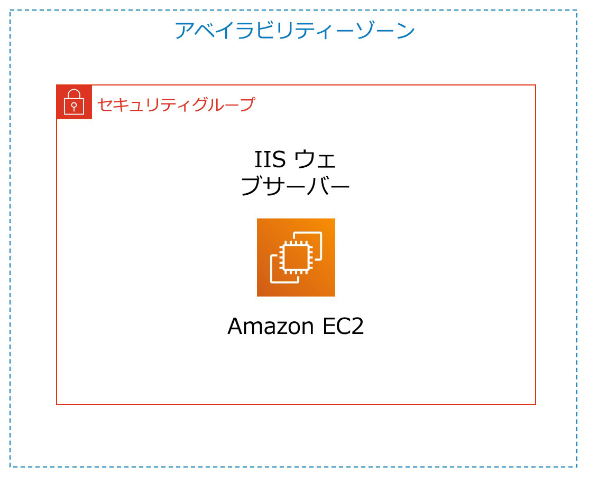

# ラボ 3: Amazon EC2 の紹介

<!-- Note to translators: This is based on SPL-200. Copy the translation from there. Do not re-translate the whole document. -->

**バージョン 1.1.7 (spl200)**

## 概要



&nbsp;

このラボでは、Amazon EC2 インスタンスの作成、サイズ変更、管理、モニタリングの概要が扱われます。

**Amazon Elastic Compute Cloud (Amazon EC2)** は、クラウド内で規模を変更できるコンピューティング性能を提供するウェブサービスです。デベロッパーがウェブスケールのクラウドコンピューティングを簡単に利用できるよう作られています。

Amazon EC2 のシンプルなウェブサービスインターフェイスを通して必要なキャパシティーを取得し、簡単に設定することができます。使用するコンピューティングリソースは、お客様自身が完全にコントロールでき、Amazon の実績あるコンピューティング環境で実行できます。Amazon EC2 では、新しいサーバーインスタンスの取得と起動に要する時間は分単位にまで短縮されるため、キャパシティーの拡張も縮小も、コンピューティング要件の変化に合わせてすばやく実行できます。

また、Amazon EC2 はコンピューティングの経済性をも変革します。お支払いいただく料金は、実際に使用したキャパシティーの分のみです。デベロッパーは、Amazon EC2 のツールを利用して、耐障害性のあるアプリケーションを構築し、よくある障害シナリオの影響を受けないように設計できます。

&nbsp;
### 取り上げるトピック

このラボを修了すると、次のことができるようになります。

* 削除保護を有効にしてウェブサーバーを作成する
* EC2 インスタンスをモニタリングする
* ウェブサーバーで使用するセキュリティグループを変更し、HTTP アクセスを許可する
* Amazon EC2 インスタンスのサイズを変更してスケールする
* EC2 の制限について調べる
* 削除保護をテストする
* EC2 インスタンスを削除する

&nbsp;

### 所要時間

このラボは、完了までにおよそ **35 分** かかります。

&nbsp;
&nbsp;
## AWS マネジメントコンソールにアクセスする

1. この手順の上部にある <span id="ssb_voc_grey">Start Lab</span> をクリックして、ラボを起動します。

   [**Start Lab**] パネルが開き、ラボのステータスが表示されます。

2. **Lab status: ready** というメッセージが表示されるまで待ち、[**X**] をクリックして [**Start Lab**] パネルを閉じます。

3. この手順の上部にある <span id="ssb_voc_grey">AWS</span> をクリックします。

   新しいブラウザタブで AWS マネジメントコンソールが開きます。システムによって自動的にログインします。

   **ヒント**: 新しいブラウザタブが開かない場合、通常、ブラウザによってサイトのポップアップウィンドウの表示がブロックされたことを示すバナーまたはアイコンがブラウザの上部に表示されます。バナーまたはアイコンをクリックし、[**ポップアップを許可**] をクリックします。

4. AWS マネジメントコンソールのタブをこの手順の横に配置します。ラボのステップを簡単に参照できるように、両方のブラウザタブを同時に表示することをお勧めします。

&nbsp;
&nbsp;
## タスク 1: Amazon EC2 インスタンスを作成する

このタスクでは、**削除保護**を有効にした Amazon EC2 インスタンスを作成します。削除保護は、EC2 インスタンスが意図せずに削除されてしまうのを防止する機能です。ユーザーデータスクリプトを使用してインスタンスをデプロイします。これにより、シンプルなウェブサーバーをデプロイできます。

5. **AWS マネジメントコンソール**の [**サービス**] で [**EC2**] をクリックします。

6. <span id="ssb_orange">インスタンスを起動 <i class="fas fa-caret-down"></i></span>、<span id="ssb_white">インスタンスを起動</span> の順に選択します

### ステップ 1: Amazon マシンイメージ (AMI) を選択する

<i class="fas fa-info-circle"></i> **Amazon マシンイメージ (AMI)** は、クラウドの仮想サーバーであるインスタンスの作成に必要な情報を提供します。AMI には以下のものが含まれます。

* インスタンスのルートボリュームのテンプレート（オペレーティングシステム、アプリケーションサーバー、アプリケーションなど）
* どの AWS アカウントが AMI を使用してインスタンスを作成できるかを管理する起動許可
* インスタンスの作成時にインスタンスにアタッチするボリュームを指定するブロックデバイスマッピング

**クイックスタート**リストには、最もよく使用される AMI が掲載されています。独自の AMI を作成することも、AWS Marketplace で AMI を選ぶこともできます。Marketplace は、AWS で実行できるソフトウェアを売買するためのオンラインストアです。

7. **Amazon Linux 2 AMI** (リストの一番上) の横にある <span id="ssb_blue">選択</span> をクリックします。

&nbsp;

### ステップ 2: インスタンスタイプを選択する

<i class="fas fa-info-circle"></i>Amazon EC2 には、多様なユースケースに合わせて最適化されたさまざまな**インスタンスタイプ**が用意されています。インスタンスタイプは CPU、メモリ、ストレージ、ネットワークキャパシティーのさまざまな組み合わせによって構成されているため、アプリケーションに合わせて適切なリソースの組み合わせを柔軟に選択できます。各インスタンスタイプの**インスタンスサイズ**には 1 つ以上の選択肢があり、対象のワークロードの要件に応じてリソースをスケールできます。

ここでは **t2.micro** インスタンスを使用します。デフォルトでチェックボックスがオン <i class="fas fa-square" style="color:blue"></i> になっています。このインスタンスタイプには、1 つの仮想 CPU と 1 GiB のメモリが搭載されています。**注意**: このラボでは、他のインスタンスタイプの使用が制限されている場合があります。

8. <span id="ssb_grey">次のステップ: インスタンスの詳細の設定</span> をクリックします

&nbsp;
### ステップ 3: インスタンスの詳細を設定する

このページでは、要件に合わせてインスタンスを設定します。これにはネットワークとモニタリングの設定が含まれます。

[**ネットワーク**] は、インスタンスをどの Virtual Private Cloud (VPC) に作成するかを示します。開発用、テスト用、本番用などの複数のネットワークを設定できます。

9. \[**ネットワーク**] で [**Lab VPC**] を選択します。

   Lab VPC は、ラボのセットアッププロセス中に AWS CloudFormation テンプレートを使用して作成されました。この VPC では、2 つの異なるアベイラビリティーゾーンにパブリックサブネットが 2 つ設定されています。

10. \[**終了保護の有効化**] で、<i class="far fa-check-square"></i> **誤った終了を防止します** チェックボックスをオンにします。

<i class="fas fa-info-circle"></i>不要になった Amazon EC2 インスタンスは**削除**することができます。削除すると、そのインスタンスは停止され、そのリソースが解放されます。削除されたインスタンスを再起動することはできません。インスタンスが意図せずに削除されてしまうことを防ぐには、そのインスタンスの**削除保護**を有効化します。これにより、インスタンスの削除を防止できます。

11. 下にスクロールし、<i class="fas fa-caret-right"></i> **高度な詳細** を展開します。

[**ユーザーデータ**] フィールドが表示されます。

<i class="fas fa-info-circle"></i>インスタンスの作成時には、**ユーザーデータ**をインスタンスに渡すことができます。ユーザーデータを利用して、自動化された一般的な設定作業を実行することや、インスタンスの開始後にスクリプトを実行させることができます。

このインスタンスでは Amazon Linux が実行されているので、インスタンスの開始時に実行される**シェルスクリプト**を用意します。

12. 以下のコマンドをコピーして [**ユーザーデータ**] フィールドに貼り付けます。

    ```plain
    #!/bin/bash
    yum -y install httpd
    systemctl enable httpd
    systemctl start httpd
    echo '<html><h1>Hello From Your Web Server!</h1></html>' > /var/www/html/index.html
    ```

    スクリプトによって以下が行われます。
    
    * Apache ウェブサーバー（httpd）をインストールする
    * ブート時に自動的に開始されるようウェブサーバーを設定する
    * ウェブサーバーをアクティベートする
    * シンプルなウェブページを作成する


13. <span id="ssb_grey">次のステップ: ストレージの追加</span> をクリックします。


&nbsp;
### ステップ 4: ストレージを追加する

<i class="fas fa-info-circle"></i>Amazon EC2 では **Elastic Block Store** と呼ばれる、ネットワークに接続された仮想ディスクにデータが保存されます。

ここでは、デフォルトの 8 GiB ディスクボリュームを使用して Amazon EC2 インスタンスを作成します。これがルートボリューム（**ブート**ボリュームとも呼ばれる）になります。

14. <span id="ssb_grey">次のステップ: タグの追加</span> をクリックします。

&nbsp;
### ステップ 5: タグを追加する

<i class="fas fa-info-circle"></i>タグを使用することで、目的別、オーナー別、環境別など、さまざまな方法で AWS リソースを分類できます。タグは同タイプのリソースが多数ある場合に便利です。割り当てておいたタグに基づいて特定のリソースをすばやく判別できます。それぞれのタグは、ユーザーが定義するキーと値で構成されています。

15. <span id="ssb_grey">タグの追加</span> をクリックし、次の内容を設定します。

   * **キー:** `Name`
   * **値:** `Web Server`

16. <span id="ssb_grey">次のステップ: セキュリティグループの設定</span> をクリックします

&nbsp;
### ステップ 6: セキュリティグループを設定する

<i class="fas fa-info-circle"></i>**セキュリティグループ**は、1 つ以上のインスタンスのトラフィックを制御する仮想ファイアウォールとして機能します。インスタンスを作成する際、1 つ以上のセキュリティグループをインスタンスに関連付け、各セキュリティグループに**ルール**を追加し、関連付けられたインスタンスに対するトラフィックを許可します。セキュリティグループのルールはいつでも変更できます。新しいルールは、セキュリティグループに関連付けられているインスタンスすべてに自動的に適用されます。

17. \[**ステップ 6: セキュリティグループの設定**] で次の内容を設定します。

   * **セキュリティグループ名:** `Web Server security group`
   * **説明: ** `Security group for my web server`

   このラボでは、インスタンスへのログインに SSH を使用しません。SSH によるアクセスを禁止することにより、インスタンスのセキュリティを強化できます。

18. 既存の SSH ルールを <i class="fas fa-times-circle"></i> **削除** します。

19. <span id="ssb_blue">確認と作成</span> をクリックします

&nbsp;
### ステップ 7: インスタンス作成を確認する

確認ページに、作成するインスタンスの設定内容が表示されます。

20. <span id="ssb_blue">起動</span> をクリックします

[**既存のキーペアを選択するか、新しいキーペアを作成します**] ウィンドウが表示されます。

<i class="fas fa-info-circle"></i>Amazon EC2 では公開鍵暗号を使用し、ログイン情報の暗号化と復号を行います。インスタンスにログインするには、まずキーペアを作成します。インスタンスの作成時にキーペアの名前を指定し、インスタンスに接続するときにプライベートキーを指定する必要があります。

このラボではインスタンスにログインしないため、キーペアは不要です。

21. \[**既存のキーペアの選択** <i class="fas fa-angle-down"></i>] ドロップダウンをクリックし、[**キーペアなしで続行**] を選択します。

22. <i class="far fa-check-square"></i> [**この AMI に組み込まれたパスワードがわからないと、このインスタンスに接続できないことを認識しています。**] チェックボックスをオンにします。

23. <span id="ssb_blue">インスタンスの作成</span> をクリックします

   これでインスタンスが作成されます。

24. <span id="ssb_blue">インスタンスの表示</span> をクリックします

   作成中のインスタンスは [**保留中**] 状態と表示されます。その後、表示が [**実行中**] に変わり、インスタンスの起動が開始したことが示されます。インスタンスにアクセスできるようになるまで少し時間がかかります。

   インスタンスには、インターネットからのアクセスに必要な**パブリック DNS 名**が付与されます。

   使用する<i class="fas fa-square" style="color:blue"></i> **Web Server** が選択されているはずです。[**Description (説明)**] タブにはインスタンスの詳細情報が表示されます。

   <i class="fas fa-comment"></i>[**詳細**] タブの表示項目を多くするには、ウィンドウの分割線を上にドラッグします。

   [**詳細**] タブに表示された情報を確認します。インスタンスタイプ、セキュリティ設定、ネットワーク設定についての情報を確認できます。

25. インスタンスに以下が表示されるまで待ちます。

* **インスタンスの状態:** <span style="color:green"><i class="fas fa-circle"></i></span> 実行中
* **ステータスチェック:** <span style="color:green"><i class="fas fa-check-circle"></i></span> 2/2 のチェックに合格しました

<span style="color:blue"><i class="far fa-thumbs-up"></i></span> **お疲れ様でした。**初めての Amazon EC2 インスタンスの作成が完了しました。

&nbsp;
&nbsp;
## タスク 2: インスタンスをモニタリングする

モニタリングは、Amazon Elastic Compute Cloud (Amazon EC2) インスタンスと AWS ソリューションの信頼性、可用性、パフォーマンスを維持するうえで重要です。

26. \[**ステータスチェック**] タブをクリックします。

   <i class="fas fa-info-circle"></i>インスタンスステータスをモニタリングすることで、アプリケーションの実行を妨げる何らかの問題が Amazon EC2 で検出されているかどうかをすばやく判別できます。Amazon EC2 では、実行中の EC2 インスタンスすべてが自動的にチェックされ、ハードウェアとソフトウェアの問題が特定されます。

   **システムの接続性**と**インスタンスの接続性**の両方のチェックに合格していることを確認します。

27. \[**モニタリング**] タブをクリックします。

   このタブには、インスタンスの Amazon CloudWatch メトリクスが表示されます。現時点では、インスタンスが作成されたばかりであるため、表示されるメトリクスの数は多くありません。

   表示を拡大するには、グラフをクリックします。

   <i class="fas fa-info-circle"></i>Amazon EC2 によって、使用している EC2 インスタンスのメトリクスが Amazon CloudWatch に送られます。デフォルトでは、基本モニタリング (5 分) が有効になっています。詳細モニタリング (1 分) を有効にすることもできます。

28. <span id="ssb_grey_square">アクション<i class="fas fa-caret-down"></i></span> ドロップダウンメニューから [**モニタリングとトラブルシューティング**] <i class="fas fa-caret-right"></i> [**システムログを取得**] の順に選択します。

   システムログにインスタンスのコンソール出力が表示されます。このツールは問題の診断に役立ちます。特に、SSH デーモンが起動されるまでにインスタンスが削除されたり到達不能になったりする可能性のある、カーネルの問題やサービス設定の問題のトラブルシューティングに便利です。システムログが表示されない場合は、数分待ってから再度試してください。

29. 出力内容を最後までスクロールします。HTTP パッケージがインスタンス作成時に追加した**ユーザーデータ**からインストールされたことを確認できます。


30. \[**キャンセル**] をクリックします。

31. <span id="ssb_grey_square">アクション<i class="fas fa-caret-down"></i></span> ドロップダウンメニューから [**モニタリングとトラブルシューティング**] <i class="fas fa-caret-right"></i> [**インスタンスのスクリーンショットを取得**] の順に選択します。

   これにより、スクリーンが接続されているとしたら Amazon EC2 インスタンスコンソールにはどのような内容が表示されるか見ることができます。


   <i class="fas fa-info-circle"></i>SSH や RDP を介してインスタンスに到達できない場合、インスタンスのスクリーンショットをキャプチャし、画像として確認できます。こうしてインスタンスの状態を可視化することで、トラブルシューティングを迅速に行うことができます。

32. \[**キャンセル**] をクリックします。

   <span style="color:blue"><i class="far fa-thumbs-up"></i></span> **お疲れ様でした。**インスタンスをモニタリングするいくつかの方法を確認することができました。

&nbsp;
&nbsp;
## タスク 3: セキュリティグループを更新してウェブサーバーにアクセスする

EC2 インスタンスを作成したときに、スクリプトによってウェブサーバーのインストールとシンプルなウェブページの作成を行いました。このタスクでは、ウェブサーバーからのコンテンツにアクセスします。


33. \[**詳細**] タブをクリックします。

34. インスタンスの [**パブリック IPv4 アドレス**] をクリップボードにコピーします。

35. ウェブブラウザで新しいタブを開き、コピーした IP アドレスを貼り付けて **Enter** キーを押します。

   **質問**: ウェブサーバーにアクセスできましたか?なぜ接続できないか考えてみましょう。

   今ウェブサーバーにアクセス**できない**のは、HTTP ウェブリクエストに使用されるポート 80 でインバウンドトラフィックが**セキュリティグループ**によって許可されていないためです。これはセキュリティグループをファイアウォールとして使用し、インスタンスに出入りするネットワークトラフィックを制限する実例です。

   この状態を修正するために、ポート 80 でウェブトラフィックを許可するようセキュリティグループを更新します。

36. ブラウザのそのタブは開いたままにし、[**EC2 Management Console**] タブに戻ります。

37. 左側のナビゲーションペインで [**セキュリティグループ**] をクリックします。

38. <i class="fas fa-square" style="color:blue"></i> **Web Servedr security group** を選択します。

39. \[**インバウンドルール**] タブをクリックします。

   現在、このセキュリティグループにはルールがありません。

40. <span id="ssb_grey_square">インバウンドルールを編集</span> をクリックして [**ルールを追加**] をクリッしてから次のように設定します。

   * **タイプ**: **HTTP**
   * **リソースタイプ**: **任意の場所**
   * <span id="ssb_orange">ルールを保存</span> をクリックします

41. 先ほど開いたウェブサーバーのタブに戻り、ページを <i class="fas fa-sync"></i> 更新します。

   **Hello From Your Web Server! ** というメッセージが表示されます。

   <span style="color:blue"><i class="far fa-thumbs-up"></i></span> **お疲れ様でした。**Amazon EC2 インスタンスへの HTTP トラフィックを許可するようセキュリティグループを変更することができました。

&nbsp;
&nbsp;
## タスク 4: インスタンスのサイズを変更する: インスタンスタイプと EBS ボリューム

ニーズが変化するにつれて、インスタンスの使用率が高すぎたり（インスタンスタイプが小さすぎる）、低すぎたりする（インスタンスタイプが大きすぎる）ことに気付く場合があります。この場合は、**インスタンスタイプ**を変更できます。例えば、**t2.micro** インスタンスが現在のワークロードには小さすぎる場合、**m5.medium** インスタンスに変更できます。同様に、ディスクのサイズも変更できます。


### インスタンスを停止する

サイズを変更する場合、インスタンスを事前に**停止する**必要があります。

<i class="fas fa-info-circle"></i> 停止したインスタンスはシャットダウンされます。停止した EC2 インスタンスには料金が発生しませんが、アタッチされた Amazon EBS ボリュームのストレージには引き続き料金が発生します。

42. **EC2 マネジメントコンソール**の左側のナビゲーションペインで [**インスタンス**] をクリックします。

   <i class="fas fa-square" style="color:blue"></i> **Web Server** が選択されているはずです。

43. <span id="ssb_grey_square">インスタンスの状態 <i class="fas fa-caret-down"></i></span> ドロップダウンメニューから [**インスタンスの停止**] を選択します。

44. <span id="ssb_orange">停止</span> をクリックします。

   インスタンスは、通常のシャットダウンが実行された後に停止します。

45. \[**インスタンスの状態**] に <span style="color:red"><i class="fas fa-circle"></i></span> **停止済み** と表示されるまで待ちます。

### インスタンスタイプを変更する

46. <span id="ssb_grey_square">アクション <i class="fas fa-caret-down"></i></span> ドロップダウンメニューから [**インスタンスの設定**] <i class="fas fa-caret-right"></i> [**インスタンスタイプを変更**] の順に選択して、以下のように設定します。

   * **インスタンスタイプ:** **t2.small**
   * <span id="ssb_orange">適用</span> をクリック

   再起動されたインスタンスは **t2.small** になります。このタイプはメモリが **t2.micro** インスタンスの 2 倍あります。**注意**: このラボでは、他のインスタンスタイプの使用が制限されている場合があります。

### EBS ボリュームのサイズを変更する

47. 左側のナビゲーションペインで [**ボリューム**] をクリックします。

48. <span id="ssb_grey">アクション <i class="fas fa-caret-down"> </i></span>ドロップダウンメニューから [**ボリュームの変更**] を選択します。

   現在のディスクボリュームのサイズは 8 GiB です。このディスクサイズを増やします。

49. サイズを `10` に変更します。**注意**: このラボでは、大きい Amazon EBS ボリュームの作成が制限される場合があります。

50. <span id="ssb_grey">変更</span> を選択します。

51. <span id="ssb_blue">はい</span> を選択して確定し、ボリュームのサイズを増やします。

52. <span id="ssb_blue">閉じる</span> を選択します

### サイズが変更されたインスタンスを起動する

ここでインスタンスを再起動します。インスタンスはメモリとディスク容量が増加しています。

53. 左側のナビゲーションペインで [**インスタンス**] をクリックします。

54. <span id="ssb_grey_square">インスタンスの状態 <i class="fas fa-caret-down"></i></span> ドロップダウンメニューから [**インスタンスを開始**] を選択します。

55. インスタンスが開始します。

   <span style="color:blue"><i class="far fa-thumbs-up"></i></span> **お疲れ様でした。**Amazon EC2 インスタンスのサイズ変更が完了しました。このタスクでは、インスタンスタイプを **t2.micro** から **t2.small** に変更しました。また、ルートディスクボリュームも 8 GiB から 10 GiB に変更しました。

&nbsp;
&nbsp;
## タスク 5: EC2 の制限について調べる

Amazon EC2 には、利用可能なさまざまなリソースが用意されています。これらのリソースにはイメージ、インスタンス、ボリューム、スナップショットなどがあります。AWS アカウントを作成すると、これらのリソースにはデフォルトでリージョンごとの制限が設定されています。

56. 左側のナビゲーションペインで [**制限**] をクリックします。

57. ドロップダウンリストで [**実行中のインスタンス**] を選択します。

   このリージョンでは、起動できるインスタンスの数に制限があることに注意してください。リクエストによって使用量がそのリージョンにおけるその時点でのインスタンス制限を超えてしまう場合、インスタンスを起動できません。

   これらの制限はリクエストによって引き上げることができます。

&nbsp;
&nbsp;
## タスク 6: 終了保護機能をテストする

不要になったインスタンスは消去できます。つまりインスタンスを**削除**できます。削除されたインスタンスは再接続したり再起動したりすることはできません。

このタスクでは、**終了保護**の使用方法を学習します。

58. 左側のナビゲーションペインで [**インスタンス**] をクリックします。

59. <span id="ssb_grey_square">インスタンスの状態 <i class="fas fa-caret-down"></i></span> ドロップダウンメニューから [**インスタンスを終了**] を選択します。

60. 次に <span id="ssb_orange">終了</span> をクリックします。

   **インスタンス i-1234567xxx の修了に失敗しました**というメッセージが表示されていることを確認します。インスタンス i-1234567xxx は削除できません。**disableApiTermination** インスタンスの属性を変更して、もう一度お試しください。

   これは、意図しないインスタンスの削除を防止する安全策です。インスタンスを削除する場合は、削除保護を無効にする必要があります。

61. <span id="ssb_grey_square">アクション <i class="fas fa-caret-down"></i></span> ドロップダウンメニューから [**インスタンスの設定**] <i class="fas fa-caret-right"></i> [**終了保護を変更**] の順に選択します。

62. <i class="far fa-square"></i> [**有効化**] の横のチェックをオフにします。

63. <span id="ssb_orange">保存</span> を選択します

   これでインスタンスを削除できます。

64. <span id="ssb_grey_square">インスタンスの状態 <i class="fas fa-caret-down"></i></span> ドロップダウンメニューから [**インスタンスを終了**] を選択します。

65. <span id="ssb_orange">終了</span> をクリックします

   <span style="color:blue"><i class="far fa-thumbs-up"></i></span> **お疲れ様でした。**削除保護機能をテストし、インスタンスを削除することができました。

&nbsp;
&nbsp;

## ラボの終了

<i class="icon-flag-checkered"></i>お疲れ様でした。これでラボが完了しました。

66. ラボの終了を確認するには、このページの上部にある <span id="ssb_voc_grey">End Lab</span> をクリックし、<span id="ssb_blue">Yes</span> をクリックします。  

   パネルが表示され、「DELETE has initiated...You may close this message box now.」というメッセージが表示されます。

67. 右上隅の [**X**] をクリックしてパネルを閉じます。

フィードバック、ご提案、修正については、*aws-course-feedback@amazon.com* まで E メールにてご連絡ください。

&nbsp;
&nbsp;
## その他のリソース

* <a href="https://docs.aws.amazon.com/AWSEC2/latest/UserGuide/LaunchingAndUsingInstances.html" target="_blank">インスタンスの作成</a>
* <a href="https://aws.amazon.com/ec2/instance-types" target="_blank">Amazon EC2 インスタンスタイプ</a>
* <a href="https://docs.aws.amazon.com/AWSEC2/latest/UserGuide/AMIs.html" target="_blank">Amazon Machine Image (AMI)</a>
* <a href="https://docs.aws.amazon.com/AWSEC2/latest/UserGuide/user-data.html" target="_blank">Amazon EC2 - ユーザーデータとシェルスクリプト</a>
* <a href="https://docs.aws.amazon.com/AWSEC2/latest/UserGuide/RootDeviceStorage.html" target="_blank">Amazon EC2 ルートデバイスボリューム</a>
* <a href="https://docs.aws.amazon.com/AWSEC2/latest/UserGuide/Using_Tags.html" target="_blank">Amazon EC2 リソースにタグを付ける</a>
* <a href="https://docs.aws.amazon.com/AWSEC2/latest/UserGuide/using-network-security.html" target="_blank">セキュリティグループ</a>
* <a href="https://docs.aws.amazon.com/AWSEC2/latest/UserGuide/ec2-key-pairs.html" target="_blank">Amazon EC2 のキーペア</a>
* <a href="https://docs.aws.amazon.com/AWSEC2/latest/UserGuide/monitoring-system-instance-status-check.html?icmpid=docs_ec2_console" target="_blank">インスタンスのステータスチェック</a>
* <a href="https://docs.aws.amazon.com/AWSEC2/latest/UserGuide/instance-console.html" target="_blank">コンソール出力の取得とインスタンスの再起動</a>
* <a href="https://docs.aws.amazon.com/AmazonCloudWatch/latest/monitoring/ec2-metricscollected.html" target="_blank">Amazon EC2 のメトリクスとディメンション</a>
* <a href="https://docs.aws.amazon.com/AWSEC2/latest/UserGuide/ec2-instance-resize.html" target="_blank">インスタンスのサイズ変更</a>
* <a href="https://docs.aws.amazon.com/AWSEC2/latest/UserGuide/Stop_Start.html" target="_blank">インスタンスの停止と起動</a>
* <a href="https://docs.aws.amazon.com/AWSEC2/latest/UserGuide/ec2-resource-limits.html" target="_blank">Amazon EC2 サービスの制限</a>
* <a href="https://docs.aws.amazon.com/AWSEC2/latest/UserGuide/terminating-instances.html" target="_blank">インスタンスの削除</a>
* <a href="https://docs.aws.amazon.com/AWSEC2/latest/UserGuide/terminating-instances.html" target="_blank">インスタンスの削除保護の有効化</a>
