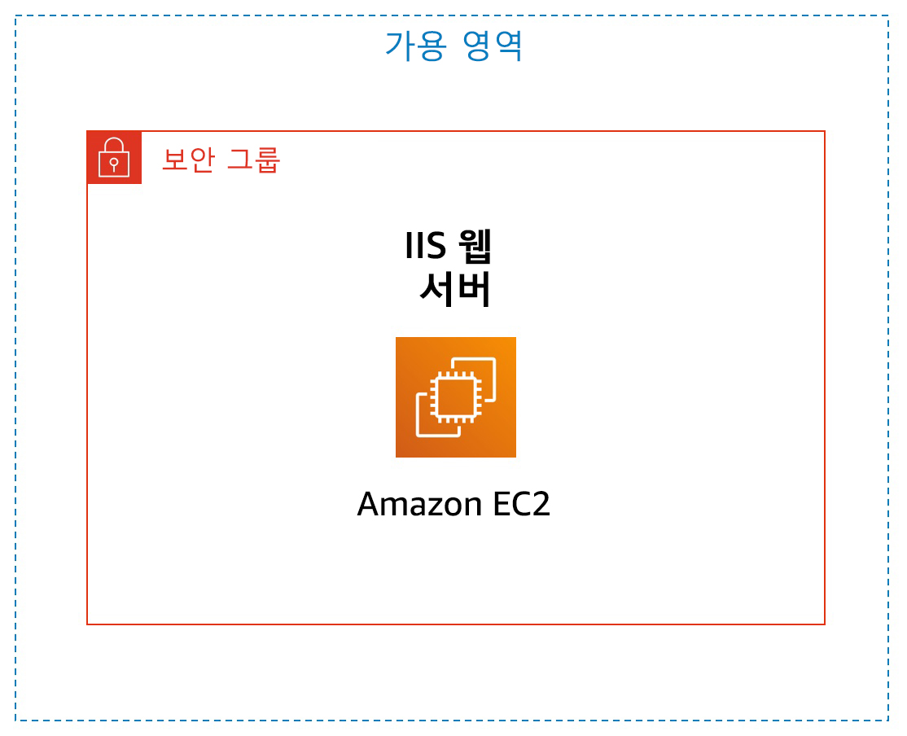

# 실습 3: Amazon EC2 소개

<!-- Note to translators: This is based on SPL-200. Copy the translation from there. Do not re-translate the whole document. -->

**버전 1.1.7(spl200)**

## 개요



&nbsp;

이 실습에서는 Amazon EC2 인스턴스의 시작, 크기 조정, 관리 및 모니터링에 대한 기본 개요를 제공합니다.

**Amazon Elastic Compute Cloud(Amazon EC2)**는 클라우드에서 크기 조정 가능한 컴퓨팅 파워를 제공하는 웹 서비스입니다. 이 서비스는 개발자가 보다 쉽게 웹 규모의 클라우드 컴퓨팅을 수행할 수 있도록 설계되었습니다.

Amazon EC2의 간단한 웹 서비스 인터페이스를 통해 간편하게 필요한 용량을 얻고 구성할 수 있습니다. 컴퓨팅 리소스를 완전히 제어하고 Amazon의 입증된 컴퓨팅 환경에서 실행할 수 있습니다. Amazon EC2에서는 몇 분이면 새로운 서버 인스턴스를 확보하고 시작할 수 있으므로, 컴퓨팅 요구 사항의 변경에 따라 컴퓨팅 파워를 신속하게 확장 및 축소할 수 있습니다.

Amazon EC2를 사용하면 실제 사용한 만큼만 요금을 지불하면 되므로, 컴퓨팅 비용이 절약됩니다. Amazon EC2는 장애에 대한 복원력이 뛰어난 애플리케이션을 구축하고 일반적인 장애 시나리오에서 애플리케이션을 격리하는 데 도움이 되는 개발자용 도구를 제공합니다.

&nbsp;
### 이 실습에서 다루는 주제

이 실습을 마치면 다음을 수행할 수 있습니다.

* 종료 방지 기능이 활성화된 웹 서버 시작
* EC2 인스턴스 모니터링
* 웹 서버에서 HTTP 액세스를 허용할 때 사용하는 보안 그룹 수정
* 규모에 맞게 Amazon EC2 인스턴스 크기 조정
* EC2 제한 탐색
* 종료 방지 테스트
* EC2 인스턴스 종료

&nbsp;

### 소요 시간

이 실습은 완료까지 약 **35분**이 소요됩니다.

&nbsp;
&nbsp;
## AWS Management Console 액세스

1. 지침의 맨 위에서 <span id="ssb_voc_grey">Start Lab</span>을 클릭하여 실습을 시작합니다.

   Start Lab 패널이 열리고 실습 상태가 표시됩니다.

2. “**Lab status: ready**” 메시지가 표시되면 **X**를 클릭하여 Start Lab 패널을 닫습니다.

3. 지침의 맨 위에서 <span id="ssb_voc_grey">AWS</span>를 클릭합니다.

   그러면 새 브라우저 탭에서 AWS Management Console이 열립니다. 시스템에서 자동으로 로그인합니다.

   **팁**: 새 브라우저 탭이 열리지 않는 경우 일반적으로 브라우저에서 팝업 창을 열 수 없음을 나타내는 배너 또는 아이콘이 브라우저 상단에 표시됩니다. 배너 또는 아이콘을 클릭하고 Allow pop ups를 선택합니다.

4. 이러한 지침이 나란히 표시되도록 AWS Management Console 탭을 정렬합니다. 두 브라우저 탭이 동시에 표시되어 실습 단계를 보다 쉽게 수행할 수 있게 됩니다.

&nbsp;
&nbsp;
## 과제 1: Amazon EC2 인스턴스 시작

이 과제에서는 _종료 방지 기능_을 갖춘 Amazon EC2 인스턴스를 시작합니다. 종료 방지 기능은 EC2 인스턴스가 실수로 종료되는 것을 방지합니다. 이 과제에서는 간단한 웹 서버를 배포할 수 있는 사용자 데이터 스크립트를 사용하여 인스턴스를 배포합니다.

5. **AWS Management Console**의 **Services** 메뉴에서 **EC2**를 클릭합니다.

6. <span id="ssb_orange">Launch Instance<i class="fas fa-caret-down"></i></span>을 선택한 다음 <span id="ssb_white">Launch Instance</span>을 선택합니다.

### 1단계: Amazon Machine Image(AMI) 선택

<i class="fas fa-info-circle"></i>**Amazon Machine Image(AMI)**는 클라우드의 가상 서버인 인스턴스를 시작하는 데 필요한 정보를 제공합니다. AMI에는 다음 항목이 포함됩니다.

* 인스턴스 루트 볼륨에 대한 템플릿(예: 운영 체제 또는 애플리케이션이 있는 애플리케이션 서버)
* AMI를 사용하여 인스턴스를 시작할 수 있는 AWS 계정을 제어하는 시작 권한
* 시작 시 인스턴스에 연결할 볼륨을 지정하는 블록 디바이스 매핑

**Quick Start** 목록에는 가장 자주 사용되는 AMI가 포함됩니다. 자체 AMI를 생성하거나 AWS에서 실행되는 소프트웨어를 판매 또는 구매할 수 있는 온라인 스토어인 AWS Marketplace에서 AMI를 선택할 수도 있습니다.

7. 목록 맨 위에 있는 **Amazon Linux 2 AMI** 옆의 <span id="ssb_blue">Select</span>를 선택합니다.

&nbsp;

### 2단계: 인스턴스 유형 선택

<i class="fas fa-info-circle"></i> Amazon EC2는 각 사용 사례에 맞게 최적화된 다양한 _인스턴스 유형_을 제공합니다. 인스턴스 유형은 CPU, 메모리, 스토리지, 네트워킹 용량의 다양한 조합으로 구성되며, 애플리케이션에 따라 적합한 리소스 조합을 유연하게 선택할 수 있습니다. 각 인스턴스 유형에는 하나 이상의 _인스턴스 크기_가 포함되므로 사용자가 목표로 하는 워크로드의 요구 사항에 따라 리소스의 규모를 조정할 수 있습니다.

기본적으로 <i class="fas fa-square" style="color:blue"></i>선택되어야 하는 **t2.micro** 인스턴스를 사용합니다. 이 인스턴스 유형에는 가상 CPU 1개와 1GiB 메모리가 있습니다. **참고**: 이 실습에서는 다른 인스턴스 유형을 사용하는 것이 제한될 수 있습니다.

8. <span id="ssb_grey">Next: Configure Instance Details</span>을 클릭합니다.

&nbsp;
### 3단계: 인스턴스 세부 정보 구성

이 페이지는 요구 사항에 적합하게 인스턴스를 구성하는 데 사용됩니다. 여기에는 네트워킹 및 모니터링 설정이 포함됩니다.

**Network**는 인스턴스를 시작할 VPC(가상 프라이빗 클라우드)를 나타냅니다. 개발, 테스트 및 프로덕션 등 다양한 용도의 여러 네트워크를 사용할 수 있습니다.

9. **Network**에서 **Lab VPC**를 선택합니다.

   Lab VPC는 실습 설정 프로세스에서 AWS CloudFormation 템플릿을 사용하여 생성된 VPC입니다. 이 VPC에는 서로 다른 가용 영역 2개에 있는 퍼블릭 서브넷 2개가 포함되어 있습니다.

10. **Enable termination protection**에서 <i class="far fa-check-square"></i> **Protect against accidental termination**를 선택합니다.

<i class="fas fa-info-circle"></i> Amazon EC2 인스턴스가 더 이상 필요하지 않은 경우 인스턴스를 _종료_하여 인스턴스를 중지하고 인스턴스의 리소스를 해제할 수 있습니다. 종료된 인스턴스를 다시 시작할 수는 없습니다. 인스턴스가 실수로 종료되는 것을 방지하려면 해당 인스턴스에 대해 _종료 방지_ 기능을 활성화하여 인스턴스가 종료되지 않도록 할 수 있습니다.

11. 아래로 스크롤한 다음 <i class="fas fa-caret-right"></i> **Advanced Details**를 확장합니다.

**User data** 필드가 나타납니다.

<i class="fas fa-info-circle"></i>  인스턴스를 시작할 때 인스턴스에 _사용자 데이터_를 전달하여 일반적인 구성 작업을 자동으로 수행하는 데 사용할 수 있고, 인스턴스가 시작된 후에 스크립트를 실행하는 데 사용할 수도 있습니다.

이 인스턴스에서는 Amazon Linux를 실행하므로 인스턴스를 시작할 때 실행되는 _셸 스크립트_를 제공합니다.

12. 다음 명령을 복사하여 **User data** 필드에 붙여 넣습니다.

    ```plain
    #!/bin/bash
    yum -y install httpd
    systemctl enable httpd
    systemctl start httpd
    echo '<html><h1>Hello From Your Web Server!</h1></html>' > /var/www/html/index.html
    ```

    이 스크립트는 다음 작업을 수행합니다.
    
    * Apache 웹 서버 설치(httpd)
    * 부팅 시 자동으로 시작하도록 웹 서버 구성
    * 웹 서버 활성화
    * 간단한 웹 페이지 생성


13. <span id="ssb_grey">Next: Add Storage</span>를 클릭합니다.


&nbsp;
### 4단계: 스토리지 추가

<i class="fas fa-info-circle"></i> Amazon EC2는 *Elastic Block Store*라고 하는 네트워크 연결 가상 디스크에 데이터를 저장합니다.

이 실습에서는 기본 8GiB 디스크 볼륨을 사용하여 Amazon EC2 인스턴스를 시작합니다. 이 볼륨이 루트 볼륨('부트' 볼륨이라고도 함)입니다.

14. <span id="ssb_grey">Next: Add Tags</span>를 클릭합니다.

&nbsp;
### 5단계: 태그 추가

<i class="fas fa-info-circle"></i> 태그를 사용하면 용도, 소유자 또는 환경 등을 기준으로 사용하여 AWS 리소스를 다양한 방법으로 분류할 수 있습니다. 태그는 동일한 유형의 리소스가 많은 경우 유용하며 할당된 태그를 기반으로 특정 리소스를 신속하게 식별할 수 있습니다. 각 태그는 키와 값으로 구성되는데, 모두 사용자가 정의합니다.

15. <span id="ssb_grey">Add Tag</span>를 클릭하고 다음을 구성합니다.

   * **Key**: `Name`
   * **Value**: `Web Server`

16. <span id="ssb_grey">Next: Configure Security Group</span>을 클릭합니다.

&nbsp;
### 6단계: 보안 그룹 구성

<i class="fas fa-info-circle"></i>_보안 그룹_은 하나 이상의 인스턴스에 대한 트래픽을 제어하는 가상 방화벽 역할을 합니다. 인스턴스를 시작할 때 하나 이상의 보안 그룹을 인스턴스와 연결합니다. 연결된 인스턴스의 수신 또는 발신 트래픽을 허용하는 _규칙_을 각 보안 그룹에 추가합니다. 언제든지 보안 그룹에 대한 규칙을 수정할 수 있습니다. 새 규칙은 보안 그룹과 연결된 모든 인스턴스에 자동으로 적용됩니다.

17. **6단계: 보안 그룹 구성**에서 다음을 구성합니다.

   * **Security group name**: `Web Server security group`
   * **Description**: `웹 서버를 위한 보안 그룹`

   이 실습에서는 SSH를 사용하여 인스턴스에 로그인할 수 없습니다. SSH 액세스를 제거하면 인스턴스의 보안이 향상됩니다.

18. 기존 SSH 규칙을 <i class="fas fa-times-circle"></i> 삭제합니다.

19. <span id="ssb_blue">Review and Launch</span>를 클릭합니다.

&nbsp;
### 7단계: 인스턴스 시작 검토

Review 페이지에 시작할 인스턴스에 대한 구성이 표시됩니다.

20. <span id="ssb_blue">Launch</span>을 클릭합니다.

**Select an existing key pair or create a new key pair** 창이 나타납니다.

<i class="fas fa-info-circle"></i> Amazon EC2는 퍼블릭 키 암호화 기법을 사용하여 로그인 정보를 암호화하고 해독합니다. 인스턴스에 로그인하려면 키 페어를 생성하고, 인스턴스를 시작할 때 키 페어의 이름을 지정하고, 인스턴스에 연결할 때 프라이빗 키를 제공해야 합니다.

이 실습에서는 인스턴스에 로그인하지 않으므로 키 페어가 필요하지 않습니다.

21. **Choose an existing key pair** <i class="fas fa-angle-down"></i> 드롭 다운을 클릭하고 *Proceed without a key pair*을 선택합니다.

22. Select an existing security group을 <i class="far fa-check-square"></i> 선택합니다. **I acknowledge that...**를 선택합니다.

23. <span id="ssb_blue">Launch Instances</span>을 클릭합니다.

   이제 인스턴스가 시작됩니다.

24. <span id="ssb_blue">View Instances</span>를 클릭합니다.

   인스턴스가 _pending_ 상태로 표시됩니다. 이 상태는 인스턴스가 시작되는 중임을 나타냅니다. 이후 _running_으로 바뀌는데 이 상태는 인스턴스 부팅이 시작되었음을 나타냅니다. 인스턴스 액세스가 가능해질 때까지 약간의 시간이 걸릴 수 있습니다.

   인스턴스가 받는 _퍼블릭 DNS 이름_은 사용자가 인터넷에서 해당 인스턴스에 접속할 때 사용됩니다.

   <i class="fas fa-square" style="color:blue"></i> **웹 서버**를 선택해야 합니다. **Description** 탭에 인스턴스의 상세 정보가 표시됩니다.

   <i class="fas fa-comment"></i> Description 탭에서 추가 정보를 보려면 창 구분선을 위로 끕니다.

   **Description** 탭에 표시되는 정보를 검토합니다. 여기에는 인스턴스 유형, 보안 설정 및 네트워크 설정에 관한 정보가 포함되어 있습니다.

25. 인스턴스에 다음이 표시될 때까지 기다립니다.

* **Instance State**: <span style="color:green"><i class="fas fa-circle"></i></span> running
* **Status Checks**:  <span style="color:green"><i class="fas fa-check-circle"></i></span> 2/2 checks passed

<span style="color:blue"><i class="far fa-thumbs-up"></i></span> **축하합니다!** 첫 번째 Amazon EC2 인스턴스가 성공적으로 시작되었습니다.

&nbsp;
&nbsp;
## 과제 2: 인스턴스 모니터링

모니터링은 Amazon EC2(Amazon Elastic Compute Cloud) 인스턴스 및 AWS 솔루션의 안정성, 가용성 및 성능을 유지하는 데 있어서 중요한 부분입니다.

26. **Status Checks** 탭을 클릭합니다.

   <i class="fas fa-info-circle"></i> 인스턴스 상태를 모니터링하면 Amazon EC2에서 애플리케이션 실행에 지장을 주는 인스턴스 문제가 감지되었는지 여부를 빠르게 확인할 수 있습니다. Amazon EC2는 실행 중인 모든 EC2 인스턴스에 대해 자동 검사를 수행하여 하드웨어 및 소프트웨어 문제를 식별합니다.

   **System reachability** 및 **Instance reachability** 확인이 모두 통과되었습니다.

27. **Monitoring** 탭을 클릭합니다.

   이 탭에는 인스턴스에 대한 Amazon CloudWatch 지표가 표시됩니다. 현재 인스턴스가 최근에 시작되었으므로 표시할 지표가 많지 않습니다.

   그래프를 클릭하여 확장된 보기를 볼 수 있습니다.

   <i class="fas fa-info-circle"></i> Amazon EC2는 EC2 인스턴스에 대한 Amazon CloudWatch로 지표를 전송합니다. 기본(5분) 모니터링 기능이 기본적으로 활성화되어 있습니다. 세부(1분) 모니터링도 활성화할 수 있습니다.

28. <span id="ssb_grey_square">Actions <i class="fas fa-caret-down"></i></span> 메뉴에서 **Monitor and troubleshoot** <i class="fas fa-caret-right"></i> **Get System Log**를 선택합니다.

   시스템 로그에는 문제 진단에 유용한 도구인 인스턴스의 콘솔 출력을 표시됩니다. 인스턴스가 종료되거나 SSH 데몬을 시작하기 전에 연결할 수 없게 되는 서비스 구성 문제 또는 커널 문제를 해결하는 데 특히 유용합니다. 시스템 로그를 볼 수 없는 경우 나중에 다시 시도하십시오.

29. 출력을 스크롤하여 인스턴스를 생성할 때 추가한 **User data**에서 HTTP 패키지가 설치되었음을 확인합니다.


30. **Cancel**를 선택합니다.

31. <span id="ssb_grey_square">Actions <i class="fas fa-caret-down"></i></span> 메뉴에서 **Monitor and troubleshoot** <i class="fas fa-caret-right"></i> **Get Instance Screenshot**를 선택합니다.

   여기에는 화면이 연결된 경우 Amazon EC2 인스턴스 콘솔의 모양이 표시됩니다.


   <i class="fas fa-info-circle"></i> SSH 또는 RDP를 통해 인스턴스에 연결할 수 없는 경우 인스턴스의 스크린샷을 캡처하여 이미지로 볼 수 있습니다. 이렇게 하면 인스턴스 상태에 관한 가시성이 제공되므로 더 빠르게 문제를 해결할 수 있습니다.

32. **Cancel**를 선택합니다.

   <span style="color:blue"><i class="far fa-thumbs-up"></i></span> **축하합니다!** 인스턴스를 모니터링하는 몇 가지 방법을 살펴봤습니다.

&nbsp;
&nbsp;
## 과제 3: 보안 그룹 업데이트 및 웹 서버 액세스

EC2 인스턴스를 시작할 때 웹 서버를 설치하고 간단한 웹 페이지를 생성한 스트립트를 제공했습니다. 이 과제에서는 웹 서버의 콘텐츠에 액세스합니다.


33. **Details** 탭을 클릭합니다.

34. 인스턴스의 **IPv4 Public IP**를 클립보드에 복사합니다.

35. 웹 브라우저에서 새 탭을 열고 방금 복사한 IP 주소를 붙여 넣은 다음 **Enter** 키를 누릅니다.

   **질문:** 웹 서버에 액세스할 수 있습니까? 액세스할 수 없는 이유는 무엇입니까?

   _보안 그룹_이 HTTP 웹 요청에 사용되는 포트 80에서 인바운드 트래픽을 허용하지 않기 때문에 현재 웹 서버에 액세스할 수 **없습니다**. 이 데모에서는 보안 그룹을 방화벽으로 사용하여 인스턴스에서 허용되거나 허용되지 않는 네트워크 트래픽을 제한합니다.

   이 문제를 해결하기 위해 이제 포트 80에서 웹 트래픽을 허용하도록 보안 그룹을 업데이트하겠습니다.

36. 브라우저 탭이 열려 있는 상태에서 **EC2 Management Console** 탭으로 돌아갑니다.

37. 왼쪽 탐색 창에서 **Security Groups**을 클릭합니다.

38. Select an existing security group을 <i class="fas fa-square" style="color:blue"></i> 선택합니다. **Web Server Security Group**을 선택합니다.

39. **Inbound** 탭을 클릭합니다.

   현재 보안 그룹에는 규칙이 없습니다.

40. <span id="ssb_grey_square">Edit inboud rules</span>을 클릭하고 다음을 구성합니다.

   * **Type**: _HTTP_
   * **Source**: _Anywhere_
   * <span id="ssb_orange">Save rules</span>을 클릭합니다.

41. 이전에 열었던 웹 서버 탭으로 돌아가서 페이지를 <i class="fas fa-sync"></i> 새로 고칩니다.

   _Hello From Your Web Server!_ 메시지가 표시됩니다.

   <span style="color:blue"><i class="far fa-thumbs-up"></i></span> **축하합니다!** Amazon EC2 인스턴스로 전송되는 HTTP 트래픽을 허용하도록 보안 그룹을 수정했습니다.

&nbsp;
&nbsp;
## 과제 4: 인스턴스 크기 조정: 인스턴스 유형 및 EBS 볼륨

요구 사항이 변경됨에 따라 인스턴스가 과도하게 사용되거나(인스턴스가 너무 작음) 사용률이 낮아질 수 있습니다(인스턴스가 너무 큼). 이런 경우 _인스턴스 유형_을 변경할 수 있습니다. 예를 들어 _t2.micro_ 인스턴스가 워크로드에 비해 너무 작은 경우 _m5.medium_ 인스턴스로 변경할 수 있습니다. 마찬가지로, 디스크 크기를 변경할 수 있습니다.


### 인스턴스 중지

인스턴스 크기를 조정하려면 먼저 인스턴스를 _중지_해야 합니다.

<i class="fas fa-info-circle"></i> 인스턴스를 중지하면 인스턴스가 종료됩니다. 중지된 EC2 인스턴스에는 요금이 부과되지 않지만 Amazon EBS 볼륨에 연결된 스토리지 비용은 그대로 청구됩니다.

42. **EC2 Management Console**의 왼쪽 탐색 창에서 **Instances**를 클릭합니다.

   <i class="fas fa-square" style="color:blue"></i> **Web Server**가 이미 선택되어 있어야 합니다.

43. <span id="ssb_grey_square">Instance State<i class="fas fa-caret-down"></i></span> 메뉴에서 **Stop instance**를 선택합니다.

44. <span id="ssb_orange">Stop</span>를 선택합니다.

   인스턴스가정상 종료를 수행한 다음 실행을 중지합니다.

45. **Instance State**에 <span style="color:red"><i class="fas fa-circle"></i></span> stopped이 표시될 때까지 기다립니다.

### 인스턴스 유형 변경

46. <span id="ssb_grey_square">Actions <i class="fas fa-caret-down"></i></span> 메뉴에서 **Instance Settings** <i class="fas fa-caret-right"></i>을 선택합니다. **Change Instance Type**을 선택하고 다음을 구성합니다.

   * **Instance Type**: *t2.small*
   * <span id="ssb_orange">Apply</span>를 선택합니다.

   인스턴스가 다시 시작되면 _t2.micro_보다 메모리가 2배 큰 _t2.small_ 인스턴스로 변경됩니다. **참고**: 이 실습에서는 다른 인스턴스 유형을 사용하는 것이 제한될 수 있습니다.

### EBS 볼륨 크기 조정

47. 왼쪽 탐색 메뉴에서 **Volumes**을 클릭합니다.

48. <span id="ssb_grey">Actions <i class="fas fa-caret-down"></i></span> 메뉴에서 **Modify Volume**을 선택합니다.

   현재 디스크 볼륨의 크기는 8GiB입니다. 이제 이 디스크 크기를 늘리겠습니다.

49. 크기를 `10`으로 변경합니다. **참고**: 이 실습에서는 대용량 Amazon EBS 볼륨의 생성이 제한될 수 있습니다.

50. <span id="ssb_grey">Modify</span>을 선택합니다.

51. <span id="ssb_blue">Yes</span>를 클릭하여 확인하고 볼륨 크기를 늘립니다.

52. <span id="ssb_blue">Close</span>를 선택합니다.

### 크기가 조정된 인스턴스 시작

이제 인스턴스를 다시 시작하면 더 많은 메모리와 디스크 공간이 생깁니다.

53. 왼쪽 탐색 창에서 **Instances**를 클릭합니다.

54. <span id="ssb_grey_square">Instance State<i class="fas fa-caret-down"></i></span> 메뉴에서 **Start instance**을 선택합니다.

55. <span id="ssb_orange">Start</span>을 선택합니다.

   <span style="color:blue"><i class="far fa-thumbs-up"></i></span> **축하합니다!** Amazon EC2 인스턴스의 크기가 조정되었습니다. 이 과제에서는 인스턴스 유형을 _t2.micro_에서 _t2.small_로 변경했습니다. 또한 루트 디스크 볼륨을 8GiB에서 10GiB로 수정했습니다.

&nbsp;
&nbsp;
## 과제 5: EC2 제한 탐색

Amazon EC2에서는 다양한 리소스를 사용할 수 있습니다. 이러한 리소스로는 이미지, 인스턴스, 볼륨 및 스냅샷이 있습니다. AWS 계정을 생성할 때 이러한 리소스에 대한 기본 제한은 리전별로 설정되어 있습니다.

56. 왼쪽 탐색 창에서 **Limits**을 클릭합니다.

57. 드롭 다운 목록에서 **Running instances**를 선택합니다.

   현재 리전에서 시작할 수 있는 인스턴스 수에는 제한이 있습니다. 인스턴스를 시작할 때 해당 리전에서 현재 인스턴스 제한을 초과하여 요청하지 않아야 합니다.

   사용자는 이러한 제한을 높이도록 요청할 수 있습니다.

&nbsp;
&nbsp;
## 과제 6: 종료 방지 테스트

더 이상 필요하지 않은 인스턴스는 삭제할 수 있습니다. 이것을 인스턴스를 _종료_한다고 합니다. 인스턴스가 종료된 후에는 인스턴스에 다시 연결하거나 인스턴스를 재시작할 수 없습니다.

이 과제에서는 _종료 방지_ 기능을 사용하는 방법을 배웁니다.

58. 왼쪽 탐색 창에서 **Instances**를 클릭합니다.

59. <span id="ssb_grey_square">Instance State<i class="fas fa-caret-down"></i></span> 메뉴에서 **Terminate instance**를 선택합니다.

60. 그런 다음 <span id="ssb_orange">Terminate</span>를 선택합니다.

   다음 메시지가 나타납니다. *Failed to terminate the instance i-1234567xxx. The instance 'i-1234567xxx' may not be terminated. Modify its 'disableApiTermination' instance attribute and try again.*

   이는 인스턴스가 우발적으로 종료되는 것을 방지하는 보호 장치입니다. 인스턴스를 종료하려면 종료 방지 기능을 비활성화해야 합니다.

61. <span id="ssb_grey_square">Actions <i class="fas fa-caret-down"></i></span> 메뉴에서 **Instance Settings** <i class="fas fa-caret-right"></i>을 선택합니다. **Change Termination Protection**을 선택합니다.

62. <i class="far fa-square"></i> **Enable** 옆의 체크 표시를 제거합니다.

63. <span id="ssb_orange">Save</span>을 선택합니다.

   이제 인스턴스를 종료할 수 있습니다.

64. <span id="ssb_grey_square">Instance State<i class="fas fa-caret-down"></i></span> 메뉴에서 **Terminate**를 선택합니다.

65. <span id="ssb_orange">Terminate</span>를 선택합니다.

   <span style="color:blue"><i class="far fa-thumbs-up"></i></span> **축하합니다!** 종료 방지 기능을 성공적으로 테스트하고 인스턴스를 종료했습니다.

&nbsp;
&nbsp;

## 실습 완료

<i class="icon-flag-checkered"></i> 축하합니다! 실습을 마쳤습니다.

66. 이 페이지의 상단에서 <span id="ssb_voc_grey">End Lab</span>을 클릭하고 <span id="ssb_blue">Yes</span>를 클릭하여 실습 종료를 확인합니다.  

   "DELETE has been initiated... You may close this message box now"라는 내용의 패널이 표시됩니다.

67. 오른쪽 상단 모서리에 있는 **X**를 클릭하여 패널을 닫습니다.

피드백 또는 제안 사항이 있거나 수정이 필요한 내용이 있는 경우 *aws-course-feedback@amazon.com*으로 이메일을 보내 주십시오.

&nbsp;
&nbsp;
## 추가 리소스

* <a href="https://docs.aws.amazon.com/AWSEC2/latest/UserGuide/LaunchingAndUsingInstances.html" target="_blank">인스턴스 시작</a>
* <a href="https://aws.amazon.com/ec2/instance-types" target="_blank">Amazon EC2 인스턴스 유형</a>
* <a href="https://docs.aws.amazon.com/AWSEC2/latest/UserGuide/AMIs.html" target="_blank">Amazon Machine Image(AMI)</a>
* <a href="https://docs.aws.amazon.com/AWSEC2/latest/UserGuide/user-data.html" target="_blank">Amazon EC2 – 사용자 데이터 및 셸 스크립트</a>
* <a href="https://docs.aws.amazon.com/AWSEC2/latest/UserGuide/RootDeviceStorage.html" target="_blank">Amazon EC2 루트 디바이스 볼륨</a>
* <a href="https://docs.aws.amazon.com/AWSEC2/latest/UserGuide/Using_Tags.html" target="_blank">Amazon EC2 리소스 태깅</a>
* <a href="https://docs.aws.amazon.com/AWSEC2/latest/UserGuide/using-network-security.html" target="_blank">보안 그룹</a>
* <a href="https://docs.aws.amazon.com/AWSEC2/latest/UserGuide/ec2-key-pairs.html" target="_blank">Amazon EC2 키 페어</a>
* <a href="https://docs.aws.amazon.com/AWSEC2/latest/UserGuide/monitoring-system-instance-status-check.html?icmpid=docs_ec2_console" target="_blank">인스턴스 상태 확인</a>
* <a href="https://docs.aws.amazon.com/AWSEC2/latest/UserGuide/instance-console.html" target="_blank">콘솔 출력 가져오기 및 인스턴스 재부팅</a>
* <a href="https://docs.aws.amazon.com/AmazonCloudWatch/latest/monitoring/ec2-metricscollected.html" target="_blank">Amazon EC2 지표 및 차원</a>
* <a href="https://docs.aws.amazon.com/AWSEC2/latest/UserGuide/ec2-instance-resize.html" target="_blank">인스턴스 크기 조정</a>
* <a href="https://docs.aws.amazon.com/AWSEC2/latest/UserGuide/Stop_Start.html" target="_blank">인스턴스 중지 및 시작</a>
* <a href="https://docs.aws.amazon.com/AWSEC2/latest/UserGuide/ec2-resource-limits.html" target="_blank">Amazon EC2 서비스 제한</a>
* <a href="https://docs.aws.amazon.com/AWSEC2/latest/UserGuide/terminating-instances.html" target="_blank">인스턴스 종료</a>
* <a href="https://docs.aws.amazon.com/AWSEC2/latest/UserGuide/terminating-instances.html" target="_blank">인스턴스에 대한 종료 방지 기능</a>
