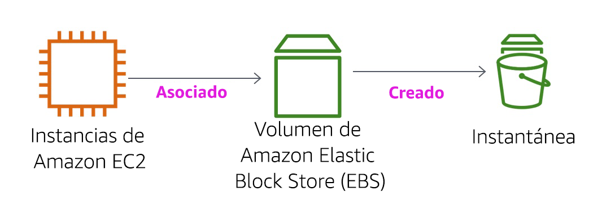

<header>

<link rel="stylesheet" href="https://use.fontawesome.com/releases/v5.5.0/css/all.css" integrity="sha384-B4dIYHKNBt8Bc12p+WXckhzcICo0wtJAoU8YZTY5qE0Id1GSseTk6S+L3BlXeVIU" crossorigin="anonymous">

<!-- Latest compiled and minified CSS -->
<link rel="stylesheet" href="https://maxcdn.bootstrapcdn.com/bootstrap/3.3.7/css/bootstrap.min.css" integrity="sha384-BVYiiSIFeK1dGmJRAkycuHAHRg32OmUcww7on3RYdg4Va+PmSTsz/K68vbdEjh4u" crossorigin="anonymous">

<!-- Optional theme -->
<link rel="stylesheet" href="https://maxcdn.bootstrapcdn.com/bootstrap/3.3.7/css/bootstrap-theme.min.css" integrity="sha384-rHyoN1iRsVXV4nD0JutlnGaslCJuC7uwjduW9SVrLvRYooPp2bWYgmgJQIXwl/Sp" crossorigin="anonymous">

<!-- Latest compiled and minified JavaScript -->
<script src="https://maxcdn.bootstrapcdn.com/bootstrap/3.3.7/js/bootstrap.min.js" integrity="sha384-Tc5IQib027qvyjSMfHjOMaLkfuWVxZxUPnCJA7l2mCWNIpG9mGCD8wGNIcPD7Txa" crossorigin="anonymous"></script>

</header>

<!--include:Logo-->

<style type="text/css">
  body {
      font-family:  "Roboto", "Helvetica", sans-serif;
      font-size: 12pt;
      font-color: Gray;
      line-height: 1.6;
      margin: 50px;
  }
  p {
      list-style-position: inside;
  }
  #ssb_blue {
    background-color: #257ACF;
    font-weight: bold;
    font-size: 90%;
    color: white;
    border-radius: 5px;
    padding-top: 3px;
    padding-bottom: 3px;
    padding-left: 10px;
    padding-right: 10px;
    white-space: nowrap;
  }
  #ssb_voc_grey {
    background-color: #F2F3F4;
    font-weight: normal;
    font-size: 90%;
    color: black;
    border-radius: 3px;
    border: 1px solid gray;
    padding-top: 5px;
    padding-bottom: 5px;
    padding-left: 6px;
    padding-right: 6px;
    white-space: nowrap;
  }
  #ssb_grey {
    background-color: #DEDEDE;
    font-weight: bold;
    font-size: 90%;
    color: #444;
    position: relative;
    top:-1px;
    border-radius: 5px;
    border-width: 1px;
    border-style: solid;
    border-color: #444;
    padding-top: 3px;
    padding-bottom: 3px;
    padding-left: 10px;
    padding-right: 10px;
    white-space: nowrap;
  }
  #ssl_alexa_ocean {
    color: #00a0d2;
    font-weight: bold;
  }
</style>

# Laboratorio 4: Uso de EBS

<!-- Note to translators: This is based on SPL-02. Copy the translation from there. Do not re-translate the whole document. -->

**Versión 5.1.3 (spl2)**

## Información general sobre el laboratorio



El laboratorio se enfoca en Amazon Elastic Block Store (Amazon EBS), un mecanismo de almacenamiento subyacente clave para las instancias de Amazon EC2. En este laboratorio, aprenderá a crear un volumen de Amazon EBS, asociarlo a una instancia, implementar un sistema de archivos en el volumen y, a continuación, tomar una instantánea como copia de seguridad.

## Temas

Al final de este laboratorio, podrá hacer lo siguiente:

- Crear un volumen de Amazon EBS
- Asociar el volumen a una instancia EC2 y montarlo en ella
- Crear una instantánea del volumen
- Crear un volumen nuevo a partir de la instantánea
- Asociar el volumen nuevo a la instancia EC2 y montarlo en ella

## Requisitos previos del laboratorio

Para completar este laboratorio correctamente, debe estar familiarizado con el uso básico de Amazon EC2 y con la administración de servidores básica de Linux. Debe saber usar las herramientas de línea de comandos de Linux.

### Otros servicios de AWS

La política de IAM deshabilita otros servicios de AWS diferentes a los requeridos para este laboratorio durante su tiempo de acceso al laboratorio. Además, las capacidades de los servicios utilizados para este laboratorio están limitadas según los requisitos de este e incluso, en algunos casos, de forma deliberada como parte del diseño del laboratorio. Espere recibir mensajes de error cuando acceda a otros servicios o cuando lleve a cabo acciones que no consten en la guía de este laboratorio.

### ¿Qué es Amazon Elastic Block Store?

**Amazon Elastic Block Store (Amazon EBS)** ofrece almacenamiento persistente para las instancias de Amazon EC2. Los volúmenes de Amazon EBS están asociados a la red, y su duración es independiente a la vida de una instancia. Los volúmenes de Amazon EBS tienen un alto nivel de disponibilidad y de confianza, y pueden aprovecharse como particiones de arranque de instancias de Amazon EC2 o asociarse a una instancia de Amazon EC2 en ejecución como dispositivos de bloques estándar.

Cuando se utilizan como particiones de arranque, las instancias de Amazon EC2 pueden detenerse y, posteriormente, reiniciarse, lo que le permite pagar solo por los recursos de almacenamiento utilizados al mismo tiempo que conserva el estado de la instancia. Los volúmenes de Amazon EBS tienen durabilidad mucho mayor que los almacenes de instancias de Amazon EC2 locales porque los volúmenes de Amazon EBS se replican automáticamente en el backend (en una única zona de disponibilidad).

Sin embargo, para los que quieran aún más durabilidad, con Amazon EBS es posible crear instantáneas uniformes puntuales de los volúmenes, que luego se almacenan en Amazon Simple Storage Service (Amazon S3) y se replican automáticamente en varias zonas de disponibilidad. Estas instantáneas se pueden utilizar como punto de partida para nuevos volúmenes de Amazon EBS y permiten proteger la durabilidad de sus datos a largo plazo. También puede compartirlas fácilmente con colegas y otros desarrolladores de AWS.

En esta guía de laboratorio, se explican los conceptos básicos de Amazon EBS paso a paso. Sin embargo, solo se presenta un poco de información general sobre los conceptos de Amazon EBS. Para obtener más información, consulte la <a href="http://aws.amazon.com/ebs/" target="_blank">documentación de Amazon EBS</a>.

### Características de los volúmenes de Amazon EBS

Los volúmenes de Amazon EBS ofrecen las siguientes características:

- **Almacenamiento persistente:** el tiempo de vida de los volúmenes es independiente de cualquier instancia de Amazon EC2.
- **De uso general:** los volúmenes de Amazon EBS son dispositivos de bloques sin formato que se pueden utilizar en cualquier sistema operativo.
- **Alto rendimiento:** los volúmenes de Amazon EBS son iguales que las unidades de Amazon EC2 locales o mejores que ellas.
- **Nivel de fiabilidad alto:** los volúmenes de Amazon EBS tienen redundancia integrada dentro de una zona de disponibilidad.
- **Diseñados para ofrecer resiliencia:** la AFR (tasa anual de errores) de Amazon EBS oscila entre 0,1 % y 1 %.
- **Tamaño variable:** los tamaños de los volúmenes varían entre 1 GB y 16 TB.
- **Fáciles de usar:** los volúmenes de Amazon EBS se pueden crear, asociar, almacenar en copias de seguridad, restaurar y eliminar fácilmente.

**Duración**
El tiempo estimado de este laboratorio es de **30 minutos** aproximadamente.

## Acceso a la consola de administración de AWS

1. En la parte superior de estas instrucciones, haga clic en <span id="ssb_voc_grey">Start Lab</span> (Iniciar laboratorio) para lanzarlo.

   Se abrirá el panel “Start Lab” (Iniciar laboratorio), donde se muestra el estado del laboratorio.

2. Espere hasta que aparezca el mensaje “**Lab status: ready**” (Estado del laboratorio: listo) y, a continuación, haga clic en **X** para cerrar el panel “Start Lab” (Iniciar laboratorio).

3. En la parte superior de estas instrucciones, haga clic en <span id="ssb_voc_grey">AWS</span>.

   La consola de administración de AWS se abrirá en una nueva pestaña del navegador. El sistema iniciará su sesión automáticamente.

   **Sugerencia**: si no se abre una pestaña del navegador nueva, debería aparecer un banner o un icono en la parte superior de este, el cual indique que el navegador no permite que se abran ventanas emergentes en el sitio. Haga clic en el banner o en el icono, y elija “Allow pop ups” (Permitir ventanas emergentes).

4. Ubique la pestaña de la consola de administración de AWS en un lugar donde aparezca al lado de estas instrucciones. Idealmente, debería poder ver ambas pestañas del navegador al mismo tiempo para que sea más sencillo seguir los pasos del laboratorio.

&nbsp;
&nbsp;
## Tarea 1: crear un volumen de EBS nuevo

En esta tarea, creará y asociará un volumen de Amazon EBS a una nueva instancia de Amazon EC2.

5. En la **consola de administración de AWS**, encontrará el menú **Services** (Servicios), donde debe hacer clic en **EC2**.

6. En el panel de navegación izquierdo, haga clic en **Instances** (Instancias).

   Ya se lanzó una instancia de Amazon EC2 denominada **Lab** (Laboratorio) para el laboratorio.

7. Observe la **zona de disponibilidad** de la instancia. Tendrá un aspecto similar a *us-west-2a*.

8. En el panel de navegación izquierdo, haga clic en **Volumes** (Volúmenes).

   Verá un volumen existente que utiliza la instancia de Amazon EC2. Dicho volumen tiene un tamaño de 8 GiB, lo que permite distinguirlo con facilidad del volumen que creará a continuación, el cual será de 1 GiB.

9. Haga clic en <span id="ssb_blue">Create Volume</span> (Crear volumen) y luego configure lo siguiente:

   * **Volume Type** (Tipo de volumen): *General Purpose SSD (gp2)* (SSD de uso general [gp2])
   * **Size (GiB)** (Tamaño [GiB]): `1`. **NOTA**: Es posible que no pueda crear volúmenes grandes.
   * **Availability Zone** (Zona de disponibilidad): seleccione la misma zona que la de la instancia EC2.
   * Haga clic en <span id="ssb_grey">Add Tag</span> (Agregar etiqueta).
   * En el editor de etiquetas, escriba lo siguiente:
      * **Key** (Clave): `Name` (Nombre)
      * **Value** (Valor): `My Volume` (Mi volumen)

10. Haga clic en <span id="ssb_blue">Create Volume</span> (Crear volumen) y, a continuación, en <span id="ssb_blue">Close</span> (Cerrar).

   El volumen nuevo aparecerá en la lista, y su estado cambiará de *creating* (creándose) a *available* (disponible). Es posible que tenga que hacer clic en **refresh** (actualizar) <span class="fas fa-sync"></span> para ver el volumen nuevo.

&nbsp;
&nbsp;
## Tarea 2: asociar el volumen a una instancia

Ahora puede asociar el volumen nuevo a la instancia de Amazon EC2.

11. Seleccione <i class="fas fa-square" style="color:blue"></i> **My Volume** (Mi volumen).

12. En el menú **Actions** (Acciones), haga clic en **Attach Volume** (Asociar volumen).

13. Haga clic en el campo **Instance** (Instancia) y, a continuación, seleccione la instancia que aparece (Lab [Laboratorio]).

    Observe que el campo **Device** (Dispositivo) está definido como */dev/sdf*. Utilizará este identificador de dispositivo en una tarea posterior.

14. Haga clic en <span id="ssb_blue">Attach</span> (Asociar).
    El estado del volumen pasará a *in-use* (en uso).

&nbsp;
&nbsp;
## Tarea 3: conectarse a la instancia de Amazon EC2

### <i class="fab fa-windows"></i> Usuarios de Windows: uso de SSH para conectarse

<i class="fas fa-comment"></i> Estas instrucciones son solo para usuarios de Windows.

Si utiliza macOS o Linux, <a href="#ssh-MACLinux">vaya a la siguiente sección</a>.

15. Lea los tres puntos de este paso antes de comenzar, ya que no podrá consultar estas instrucciones cuando el panel “Details” (Detalles) esté abierto.

    * Haga clic en el menú desplegable <span id="ssb_voc_grey">Details</span> (Detalles) situado por encima de estas instrucciones que está leyendo actualmente y, a continuación, haga clic en <span id="ssb_voc_grey">Show</span> (Mostrar). Se abrirá la ventana “Credentials” (Credenciales).

    * Haga clic en **Download PPK** (Descargar PPK) y guarde el archivo **labsuser.ppk**. Por lo general, el navegador lo guarda en el directorio “Downloads” (Descargas).

    * A continuación, haga clic en **X** para salir del panel “Details” (Detalles).

16. Descargue el software necesario.

    * Utilizará **PuTTY** para conectarse mediante SSH a las instancias de Amazon EC2. Si no tiene instalado PuTTY en su equipo, <a href="https://the.earth.li/~sgtatham/putty/latest/w64/putty.exe">descárguelo aquí</a>.

17. Abra **putty.exe**.

18. Configure PuTTY para que no tenga tiempo de espera:

    * Haga clic en **Connection** (Conexión).
    * Defina el valor de **Seconds between keepalives** (Segundos entre keepalives) en `30` segundos.

    Esto le permite mantener la sesión de PuTTY abierta durante un periodo más prolongado.

19. Configure la sesión de PuTTY de la siguiente manera:

    * Haga clic en **Session** (Sesión).

    * **Host Name (or IP address)** (Nombre del host [o dirección IP]): copie y pegue el valor de **IPv4 Public IP address** (Dirección IP pública IPv4) de la instancia. Para obtenerla, vuelva a la consola de EC2 y haga clic en **Instances** (Instancias). Marque la casilla que se encuentra junto a la instancia y, en la pestaña *Description* (Descripción), copie el valor de **IPv4 Public IP** (Dirección IP pública IPv4).

    * En PuTTY, en la lista **Connection** (Conexión), expanda <i class="far fa-plus-square"></i> **SSH**

    * Haga clic en **Auth** (Autenticación) (no lo amplíe).

    * Haga clic en **Browse** (Buscar).

    * Busque y seleccione el archivo labsuser.ppk que descargó.

    * Haga clic en **Open** (Abrir) para seleccionarlo.

    * Haga clic en **Open** (Abrir).

20. Haga clic en **Yes** (Sí) para validar el host y conectarse a él.

21. Cuando aparezca **Login as** (Iniciar sesión como), escriba `ec2-user`.

    Esto lo conectará a la instancia EC2.

22. <a href="#ssh-after">Usuario de Windows: haga clic aquí para pasar a la siguiente tarea.</a>

<a id='ssh-MACLinux'></a>
### Usuarios de macOS <i class="fab fa-apple"></i> y Linux <i class="fab fa-linux"></i>

Estas instrucciones están dirigidas únicamente a los usuarios de Mac o Linux. Si es un usuario de Windows, <a href="#ssh-after">pase a la siguiente tarea.</a>

23. Lea todas las instrucciones de este paso antes de comenzar, ya que no las podrá consultar cuando el panel “Details” (Detalles) esté abierto.

    * Haga clic en el menú desplegable <span id="ssb_voc_grey">Details</span> (Detalles) situado por encima de estas instrucciones que está leyendo actualmente y, a continuación, haga clic en <span id="ssb_voc_grey">Show</span> (Mostrar). Se abrirá la ventana “Credentials” (Credenciales).

    * Haga clic en **Download** (Descargar) y guarde el archivo **labsuser.pem**.

    * A continuación, haga clic en **X** para salir del panel “Details” (Detalles).

24. Abra una ventana de terminal y cambie el `cd` del directorio a aquel donde se descargó el archivo labsuser.pem.

    Por ejemplo, ejecute este comando si se guardó en el directorio “Downloads” (Descargas):

    ```plain
    cd ~/Downloads
    ```

25. Ejecute este comando para cambiar los permisos de la clave a fin de que sean de solo lectura:

    ```plain
    chmod 400 labsuser.pem
    ```

26. Vuelva a la consola de administración de AWS y, en el servicio EC2, haga clic en **Instances** (Instancias).

    Debe seleccionarse la instancia **Lab** (Laboratorio).

27. En la pestaña *Description* (Descripción), copie el valor de **IPv4 Public IP** (Dirección IP pública IPv4).

28. Vuelva a la ventana de terminal y ejecute este comando (sustituya **<public-ip\>** con la dirección IP pública real que haya copiado):

    ```plain
    ssh -i labsuser.pem ec2-user@<public-ip>
    ```

29. Escriba `yes` (sí) cuando se le pregunte si desea permitir una primera conexión a este servidor SSH remoto.

    Como está usando un par de claves para la autenticación, no se le pedirá una contraseña.

    <a id='ssh-after'></a>


&nbsp;
&nbsp;
## Tarea 4: crear y configurar el sistema de archivos

En esta tarea, agregará el volumen nuevo a la instancia de Linux como un sistema de archivos ext3 en el punto de montaje /mnt/data-store.

<i class="fas fa-info-circle"></i> Si utiliza PuTTY, puede pegar texto mediante un clic con el botón derecho en la ventana de PuTTY.

30. Consulte el almacenamiento disponible de la instancia:

    ```plain
    df -h
    ```

    Debería ver un resultado similar al siguiente:

    ```plain
    Filesystem      Size  Used Avail Use% Mounted on
    devtmpfs        488M   60K  488M   1% /dev
    tmpfs           497M     0  497M   0% /dev/shm
    /dev/xvda1      7.8G  982M  6.7G  13% /
    ```

    Se muestra el volumen de disco original de 8 GB. El volumen nuevo todavía no se muestra.

31. Cree un sistema de archivos ext3 en el volumen nuevo:

    ```plain
    sudo mkfs -t ext3 /dev/sdf
    ```

32. Cree un directorio para montar el volumen de almacenamiento nuevo:

    ```plain
    sudo mkdir /mnt/data-store
    ```

33. Monte el volumen nuevo:

    ```plain
    sudo mount /dev/sdf /mnt/data-store
    ```

    Para configurar la instancia de Linux y poder montar este volumen siempre que se inicie la instancia, deberá agregar una línea a */etc/fstab*.

    ```plain
    echo "/dev/sdf   /mnt/data-store ext3 defaults,noatime 1 2" | sudo tee -a /etc/fstab
    ```

34. Consulte el archivo de configuración para ver el parámetro de la última línea:

    ```plain
    cat /etc/fstab
    ```

35. Consulte nuevamente el espacio de almacenamiento disponible:

    ```plain
    df -h
    ```

    El resultado ahora incluirá una línea adicional - */dev/xvdf*:

    ```plain
    Filesystem      Size  Used Avail Use% Mounted on
    devtmpfs        488M   60K  488M   1% /dev
    tmpfs           497M     0  497M   0% /dev/shm
    /dev/xvda1      7.8G  982M  6.7G  13% /
    /dev/xvdf       976M  1.3M  924M   1% /mnt/data-store
    ```

36. Cree un archivo en el volumen montado y agréguele algo de texto.

    ```plain
    sudo sh -c "echo some text has been written > /mnt/data-store/file.txt"
    ```

37. Compruebe que se haya escrito el texto en el volumen.

    ```plain
    cat /mnt/data-store/file.txt
    ```

&nbsp;
&nbsp;
## Tarea 5: crear una instantánea de Amazon EBS

En esta tarea, creará una instantánea del volumen de EBS.

Cuando lo desee, podrá crear una cantidad ilimitada de instantáneas uniformes de un momento específico de los volúmenes de Amazon EBS. Las instantáneas de Amazon EBS se almacenan en Amazon S3 con un alto nivel de durabilidad. Se pueden crear volúmenes de Amazon EBS nuevos a partir de instantáneas para clonar o restaurar copias de seguridad. Las instantáneas de Amazon EBS también pueden compartirse fácilmente entre usuarios de AWS o copiarse entre regiones de AWS.

38. En la consola de administración de **AWS**, haga clic en **Volumes** (Volúmenes) y seleccione <i class="fas fa-square" style="color:blue"></i> **My Volume** (Mi volumen).

39. En el menú **Actions** (Acciones), haga clic en **Create Snapshot** (Crear instantánea).

40. Haga clic en <span id="ssb_grey">Add Tag</span> (Agregar etiqueta) y, luego, configure lo siguiente:

    * **Key** (Clave): `Name` (Nombre)
    * **Value** (Valor): `My Snapshot` (Mi instantánea)
    * Haga clic en <span id="ssb_blue">Create Snapshot</span> (Crear instantánea) y luego en <span id="ssb_blue">Close</span> (Cerrar).

    La instantánea se incluirá en la lista de la consola **Snapshots** (Instantáneas).

41. En el panel de navegación izquierdo, haga clic en **Snapshots** (Instantáneas).

    Se muestra la instantánea. En un principio, el estado será *pending* (pendiente), lo que significa que se está creando la instantánea. Luego será *completed* (completado). Solo se copian los bloques de almacenamiento en uso en las instantáneas, por lo que los bloques vacíos no ocupan espacio de almacenamiento en la instantánea.

42. En su sesión de SSH remota, elimine el archivo que creó en el volumen.

    ```plain
    sudo rm /mnt/data-store/file.txt
    ```

43. Compruebe que el archivo se haya eliminado.

    ```plain
    ls /mnt/data-store/
    ```

    Se ha eliminado el archivo.

&nbsp;
&nbsp;
## Tarea 6: restaurar la instantánea de Amazon EBS

Si alguna vez desea recuperar datos almacenados en una instantánea, puede **restaurar** la instantánea en un volumen de EBS nuevo.

### Crear un volumen a partir de la instantánea

44. En la **consola de administración de AWS**, seleccione <i class="fas fa-square" style="color:blue"></i> **My Snapshot** (Mi instantánea).

45. En el menú **Actions** (Acciones), haga clic en **Create Volume** (Crear volumen).

46. En **Availability Zone** (Zona de disponibilidad), seleccione la misma zona de disponibilidad que utilizó antes.

47. Haga clic en <span id="ssb_grey">Add Tag</span> (Agregar etiqueta) y, luego, configure lo siguiente:

    * **Key** (Clave): `Name` (Nombre)
    * **Value** (Valor): `Restored Volume` (Volumen restaurado)
    * Haga clic en <span id="ssb_blue">Create Volume</span> (Crear volumen).
    * Haga clic en <span id="ssb_blue">Close</span> (Cerrar).

    Cuando se restaura una instantánea en un volumen nuevo, también puede modificar la configuración, como el tipo de volumen, el tamaño o la zona de disponibilidad.

### Asociar el volumen restaurado a la instancia EC2

48. En el panel de navegación izquierdo, haga clic en **Volumes** (Volúmenes).

49. Seleccione <i class="fas fa-square" style="color:blue"></i> **Restored Volume** (Volumen restaurado).

50. En el menú **Actions** (Acciones), haga clic en **Attach Volume** (Asociar volumen).

51. Haga clic en el campo **Instance** (Instancia) y, a continuación, seleccione la instancia que aparece (Lab [Laboratorio]).

    Observe que el campo **Device** (Dispositivo) esté definido como */dev/sdg*. Utilizará este identificador de dispositivo en una tarea posterior.

52. Haga clic en <span id="ssb_blue">Asociar</span>.

    El estado del volumen pasará a *in-use* (en uso).

### Montar el volumen restaurado

53. Cree un directorio para montar el volumen de almacenamiento nuevo:

    ```plain
    sudo mkdir /mnt/data-store2
    ```

54. Monte el volumen nuevo:

    ```plain
    sudo mount /dev/sdg /mnt/data-store2
    ```

55. Compruebe que el volumen montado contenga el archivo que creó en los pasos anteriores.

    ```plain
    ls /mnt/data-store2/
    ```

    Debería ver file.txt.

&nbsp;
&nbsp;
## Conclusión

<i class="far fa-thumbs-up" style="color:blue"></i> ¡Felicitaciones! Aprendió a realizar correctamente lo siguiente:

- Crear un volumen de Amazon EBS
- Asociar el volumen a una instancia EC2
- Crear un sistema de archivos en el volumen
- Agregar un archivo al volumen
- Crear una instantánea del volumen
- Crear un volumen nuevo a partir de la instantánea
- Asociar el volumen nuevo a la instancia EC2 y montarlo en ella
- Revisar que el archivo que creó antes se encuentre en el volumen generado recientemente

## Fin del laboratorio

<i class="icon-flag-checkered"></i> ¡Felicitaciones! Ha completado el laboratorio.

56. Haga clic en <span id="ssb_voc_grey">End Lab</span> (Finalizar laboratorio) en la parte superior de esta página y, a continuación, en <span id="ssb_blue">Yes</span> (Sí) para confirmar que desea finalizar el laboratorio.  

    Aparecerá un panel en el que se indica: “DELETE has been initiated… You may close this message box now”. (Se ha iniciado la ELIMINACIÓN… Ya puede cerrar este cuadro de mensajes).

57. Para cerrar el panel, haga clic en **X** en la esquina superior derecha.

## Recursos adicionales

<a href="http://aws.amazon.com/ebs/" target="_blank">Características, funciones y precios de Amazon Elastic Block Store</a>

<a href="http://aws.amazon.com/training/" target="_blank">AWS Training and Certification</a>

Para hacer comentarios, sugerencias o correcciones, envíe un email a <aws-course-feedback@amazon.com>
