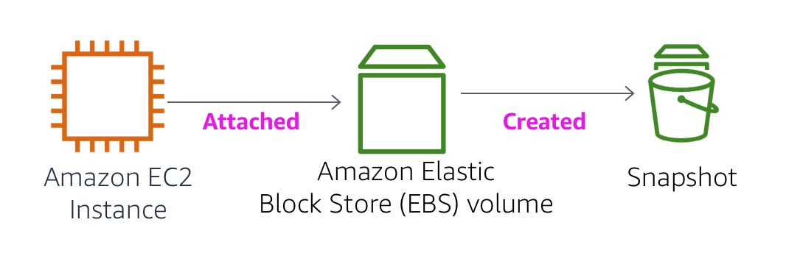

<header>

<link rel="stylesheet" href="https://use.fontawesome.com/releases/v5.5.0/css/all.css" integrity="sha384-B4dIYHKNBt8Bc12p+WXckhzcICo0wtJAoU8YZTY5qE0Id1GSseTk6S+L3BlXeVIU" crossorigin="anonymous">

<!-- Latest compiled and minified CSS -->
<link rel="stylesheet" href="https://maxcdn.bootstrapcdn.com/bootstrap/3.3.7/css/bootstrap.min.css" integrity="sha384-BVYiiSIFeK1dGmJRAkycuHAHRg32OmUcww7on3RYdg4Va+PmSTsz/K68vbdEjh4u" crossorigin="anonymous">

<!-- Optional theme -->
<link rel="stylesheet" href="https://maxcdn.bootstrapcdn.com/bootstrap/3.3.7/css/bootstrap-theme.min.css" integrity="sha384-rHyoN1iRsVXV4nD0JutlnGaslCJuC7uwjduW9SVrLvRYooPp2bWYgmgJQIXwl/Sp" crossorigin="anonymous">

<!-- Latest compiled and minified JavaScript -->
<script src="https://maxcdn.bootstrapcdn.com/bootstrap/3.3.7/js/bootstrap.min.js" integrity="sha384-Tc5IQib027qvyjSMfHjOMaLkfuWVxZxUPnCJA7l2mCWNIpG9mGCD8wGNIcPD7Txa" crossorigin="anonymous"></script>

</header>

<!--include:Logo-->

<style type="text/css">
  body {
      font-family:  "Roboto", "Helvetica", sans-serif;
      font-size: 12pt;
      font-color: Gray;
      line-height: 1.6;
      margin: 50px;
  }
  p {
      list-style-position: inside;
  }
  #ssb_blue {
    background-color: #257ACF;
    font-weight: bold;
    font-size: 90%;
    color: white;
    border-radius: 5px;
    padding-top: 3px;
    padding-bottom: 3px;
    padding-left: 10px;
    padding-right: 10px;
    white-space: nowrap;
  }
  #ssb_voc_grey {
    background-color: #F2F3F4;
    font-weight: normal;
    font-size: 90%;
    color: black;
    border-radius: 3px;
    border: 1px solid gray;
    padding-top: 5px;
    padding-bottom: 5px;
    padding-left: 6px;
    padding-right: 6px;
    white-space: nowrap;
  }
  #ssb_grey {
    background-color: #DEDEDE;
    font-weight: bold;
    font-size: 90%;
    color: #444;
    position: relative;
    top:-1px;
    border-radius: 5px;
    border-width: 1px;
    border-style: solid;
    border-color: #444;
    padding-top: 3px;
    padding-bottom: 3px;
    padding-left: 10px;
    padding-right: 10px;
    white-space: nowrap;
  }
  #ssl_alexa_ocean {
    color: #00a0d2;
    font-weight: bold;
  }
</style>

# Lab 4: Bekerja dengan EBS

<!-- Note to translators: This is based on SPL-02. Copy the translation from there. Do not re-translate the whole document. -->

<!--Copied from Version 5.1.3 (spl2)-->

## Ikhtisar Lab



Lab ini berfokus pada Amazon Elastic Block Store (Amazon EBS), mekanisme penyimpanan mendasar kunci untuk instans Amazon EC2. Di lab ini, Anda akan belajar cara membuat volume Amazon EBS, melampirkannya ke instans, menerapkan sistem file ke volume, lalu melakukan cadangan snapshot.

## Topik yang dibahas

Pada akhir lab ini, Anda akan mampu:

- Membuat volume Amazon EBS
- Melampirkan dan memasang volume Anda ke instans EC2
- Membuat snapshot volume Anda
- Membuat volume baru dari snapshot Anda
- Melampirkan dan memasang volume baru ke instans EC2 Anda

## Prasyarat Lab

Agar berhasil menyelesaikan lab ini, Anda harus terbiasa dengan penggunaan dasar Amazon EC2 dan dengan administrasi server Linux dasar. Anda harus merasa nyaman menggunakan alat baris perintah Linux.

### Layanan AWS lainnya

Layanan AWS lain selain yang diperlukan untuk lab ini dinonaktifkan oleh kebijakan IAM selama waktu akses Anda di lab ini. Selain itu, kemampuan layanan yang digunakan di lab ini dibatasi pada apa yang dibutuhkan oleh lab dan dalam beberapa kasus bahkan lebih dibatasi sebagai aspek yang disengaja dari desain lab. Saat mengakses layanan lain atau melakukan tindakan selain yang diberikan dalam panduan lab ini, Anda akan menerima pesan kesalahan.

### Apa itu Amazon Elastic Block Store?

**Amazon Elastic Block Store (Amazon EBS)** menawarkan penyimpanan persisten untuk instans Amazon EC2. Volume Amazon EBS terpasang di jaringan dan tetap ada secara independen dari masa aktif instans. Volume Amazon EBS adalah volume yang sangat tersedia dan sangat dapat diandalkan yang bisa dimanfaatkan sebagai partisi boot instans Amazon EC2 atau dilampirkan ke instans Amazon EC2 yang berjalan sebagai perangkat blok standar.

Ketika digunakan sebagai partisi boot, instans Amazon EC2 dapat dihentikan dan kemudian dimulai lagi, memungkinkan Anda hanya membayar sumber daya penyimpanan yang digunakan sambil mempertahankan status instans Anda. Volume Amazon EBS menawarkan peningkatan daya tahan yang sangat besar dibanding penyimpanan instans Amazon EC2 lokal karena volume Amazon EBS secara otomatis direplikasi pada backend (di satu Availability Zone).

Bagi mereka yang menginginkan daya tahan yang lebih besar, Amazon EBS menyediakan kemampuan untuk membuat snapshot yang konsisten dengan waktu tertentu dari volume Anda yang kemudian disimpan di Amazon Simple Storage Service (Amazon S3) dan secara otomatis direplikasi di beberapa Availability Zone. Snapshot ini dapat digunakan sebagai titik awal untuk volume Amazon EBS baru dan dapat melindungi data Anda dengan daya tahan jangka panjang. Anda juga dapat dengan mudah berbagi snapshot ini dengan rekan kerja dan developer AWS lainnya.

Panduan lab ini menjelaskan konsep dasar Amazon EBS langkah-demi-langkah. Namun, panduan ini hanya dapat memberikan ikhtisar tentang konsep Amazon EBS. Untuk informasi lebih lanjut, lihat <a href="http://aws.amazon.com/ebs/" target="_blank">Dokumentasi Amazon EBS</a>.

### Fitur Volume Amazon EBS

Volume Amazon EBS memberikan fitur berikut:

- **Penyimpanan persisten:** Masa aktif volume terpisah dari instans Amazon EC2 tertentu.
- **Tujuan umum:** Volume Amazon EBS adalah perangkat blok dasar yang tidak diformat yang dapat digunakan dari sistem operasi apa pun.
- **Kinerja tinggi:** Volume Amazon EBS sama dengan atau lebih baik dari drive Amazon EC2 lokal.
- **Daya tahan tinggi:** Volume Amazon EBS memiliki redundansi bawaan dalam suatu Availability Zone.
- **Dirancang untuk ketahanan:** AFR (Tingkat Kegagalan Tahunan) Amazon EBS adalah antara 0,1% dan 1%.
- **Ukuran variabel:** Ukuran volume berkisar dari 1 GB hingga 16 TB.
- **Mudah digunakan:** Volume Amazon EBS dapat dibuat, dilampirkan, didukung, dipulihkan, dan dihapus dengan mudah.

**Durasi**
Diperlukan sekitar **30 menit** untuk menyelesaikan lab ini.

## Mengakses AWS Management Console

1. Di bagian atas instruksi ini, klik <span id="ssb_voc_grey">Start Lab</span> (Mulai Lab) untuk meluncurkan lab Anda.

   Panel Mulai Lab terbuka dan menampilkan status lab.

2. Tunggu hingga Anda melihat pesar "**Lab status: ready**" ("Status lab: siap"), lalu klik **X** untuk menutup panel Mulai Lab.

3. Di bagian atas instruksi ini, klik <span id="ssb_voc_grey">AWS</span>

   Tindakan ini akan membuka AWS Management Console di tab browser baru. Anda akan masuk ke sistem secara otomatis.

   **Tips**: Jika tab browser baru tidak terbuka, biasanya akan ada banner atau ikon di bagian atas browser Anda yang menunjukkan bahwa browser Anda mencegah situs membuka jendela pop-up. Klik banner atau ikon, lalu pilih "Allow pop ups" ("Izinkan pop up").

4. Mengatur tab AWS Management Console agar ditampilkan bersama instruksi ini. Idealnya, Anda akan dapat melihat kedua tab browser ini sekaligus, untuk mempermudah mengikuti langkah-langkah lab.

&nbsp;
&nbsp;
## Tugas 1: Membuat Volume EBS Baru

Dalam tugas ini, Anda akan membuat dan melampirkan volume Amazon EBS ke instans Amazon EC2 baru.

5. Dalam **AWS Management Console**, pada menu **Services** (Layanan), klik **EC2**.

6. Di panel navigasi kiri, klik **Instances** (Instans).

   Instans Amazon EC2 bernama **Lab** telah dliluncurkan untuk lab Anda.

7. Catat **Availability Zone** instans. Ini akan terlihat mirip dengan *us-west-2a*.

8. Di panel navigasi kiri, klik **Volumes** (Volume).

   Anda akan melihat volume yang ada yang sedang digunakan oleh instans Amazon EC2. Volume ini berukuran 8 GiB, yang membuatnya mudah dibedakan dari volume yang akan Anda buat selanjutnya, yang akan berukuran 1 GiB.

9. Klik <span id="ssb_blue">Create Volume</span> (Buat Volume), lalu konfigurasikan:

   * **Volume Type:** (Jenis Volume:) *General Purpose SSD (gp2)*
   * **Size (GiB):** (Ukuran (GiB):)`1`. **CATATAN**: Anda mungkin dibatasi untuk membuat volume besar.
   * **Availability Zone:** Pilih availability zone yang sama dengan instans EC2 Anda.
   * Klik <span id="ssb_grey">Add Tag</span> (Tambahkan Tag)
   * Dalam Tag Editor, masukkan:
      * **Key:** (Kunci:) `Name` (Nama)
      * **Value:** (Nilai:) `My Volume` (Volume Saya)

10. Klik <span id="ssb_blue">Create Volume</span> (Buat Volume), lalu klik <span id="ssb_blue">Close</span> (Tutup)

   Volume baru Anda akan muncul dalam daftar, dan statusnya akan berubah dari *creating* (sedang membuat) ke *available* (tersedia). Anda mungkin perlu mengklik **refresh** (segarkan) <span class="fas fa-sync"></span> untuk melihat volume baru Anda.

&nbsp;
&nbsp;
## Tugas 2: Melampirkan Volume ke Instans

Anda sekarang dapat melampirkan volume baru Anda ke instans Amazon EC2.

11. Pilih <i class="fas fa-square" style="color:blue"></i> **My Volume** (Volume Saya).

12. Di menu **Actions** (Tindakan), klik **Attach Volume** (Lampirkan Volume).

13. Klik bidang **Instance** (Instans), lalu pilih instans yang muncul (Lab).

   Pastikan bidang **Device** (Perangkat) diatur ke */dev/sdf*. Anda akan menggunakan pengidentifikasi perangkat ini dalam tugas selanjutnya.

14. Klik <span id="ssb_blue">Attach</span> (Lampirkan)
   Status volume saat ini adalah *in-use* (sedang digunakan).

&nbsp;
&nbsp;
## Tugas 3: Menghubungkan ke Instans Amazon EC2 Anda

### <i class="fab fa-windows"></i> Pengguna Windows: Menggunakan SSH untuk Menghubungkan

<i class="fas fa-comment"></i> Instruksi ini hanya untuk pengguna Windows.

Jika Anda menggunakan macOS atau Linux, <a href="#ssh-MACLinux">lompat ke ke bagian selanjutnya</a>.

15. Baca ketiga poin di langkah ini sebelum Anda mulai menyelesaikan tindakan, karena Anda tidak akan dapat melihat instruksi ini saat panel Details (Detail) terbuka.

   * Klik menu drop down <span id="ssb_voc_grey">Details</span> (Detail) di atas instruksi yang sedang Anda baca, lalu klik <span id="ssb_voc_grey">Show</span> (Tampilkan). Jendela Credentials (Kredensial) akan terbuka.

   * Klik tombol **Download PPK** (Unduh PPK), lalu simpan file **labsuser.ppk**. Biasanya browser Anda akan menyimpannya ke direktori Downloads (Unduhan).

   * Kemudian keluar dari panel Details (Detail) dengan mengklik **X**.

16. Unduh perangkat lunak yang dibutuhkan.

   * Anda akan menggunakan **PuTTY** pada SSH untuk instans Amazon EC2. Jika Anda belum menginstal PuTTY di komputer Anda, <a href="https://the.earth.li/~sgtatham/putty/latest/w64/putty.exe">undh di sini</a>.

17. Buka **putty.exe**

18. Konfigurasikan PuTTY ke tidak berbatas waktu:

   * Klik **Connection** (Koneksi)
   * Atur **Seconds between keepalives** (Detik di antara keepalive) ke `30`

   Hal ini memungkinkan Anda tetap membuka sesi PuTTY untuk jangka waktu yang lebih lama.

19. Konfigurasikan sesi PuTTY Anda:

   * Klik **Session** (Sesi)

   * **Host Name (or IP address):** (Nama Host (atau alamat IP):) Salin dan tempel **IPv4 Public IP address** (Alamat IP Publik IPv4) untuk instans. Untuk menemukannya, kembali ke Konsol EC2 dan klik **Instances** (Instans). Centang kotak di sebelah instans dan di tab *Description* (Deskripsi), salin nilai **IPv4 Public IP** (IP Publik IPv4).

   * Kembali ke PuTTy, dalam daftar **Connection** (Koneksi), perluas <i class="far fa-plus-square"></i> **SSH**

   * Klik **Auth** (jangan diperluas)

   * Klik **Browse** (Telusuri)

   * Telusuri, lalu pilih file labsuser.ppk yang Anda unduh

   * Klik **Open** (Buka) untuk memilihnya

   * Klik **Open** (Buka)

20. Klik **Yes** (Ya), untuk memercayai hosy dan terhubung ke host.

21. Saat diminta **login as** (login sebagai), masukkan: `ec2-user`

   Ini akan menghubungkan Anda ke instans EC2.

22. <a href="#ssh-after">Pengguna Windows: Klik di sini untuk langsung ke tugas selanjutnya.</a>

<a id='ssh-MACLinux'></a>
### Pengguna macOS <i class="fab fa-apple"></i> dan Linux <i class="fab fa-linux"></i>

Instruksi ini hanya untuk pengguna Mac/Linux. Jika Anda adalah pengguna Windows, <a href="#ssh-after">lompat ke tugas selanjutnya.</a>

23. Baca semua instruksi dalam satu langkah ini sebelum Anda mulai menyelesaikan tindakan, karena Anda tidak akan dapat melihat instruksi ini ketika panel Details (Detail) terbuka.

   * Klik menu drop down <span id="ssb_voc_grey">Details</span> (Detail) di atas instruksi yang sedang Anda baca, lalu klik <span id="ssb_voc_grey">Show</span> (Tampilkan). Jendela Credentials (Kredensial) akan terbuka.

   * Klik tombol **Download** (Unduhan) dan simpan file **labsuser.pem**.

   * Kemudian keluar dari panel Details (Detail) dengan mengklik **X**.

24. Buka jendela terminal, dan ubah direktori `cd` ke direktori tempat file labsuser.pem diunduh.

   Misalnya, jalankan perintah ini, jika disimpan ke direktori Downloads (Unduhan) Anda:

   ```plain
       cd ~/Downloads
       ```

25. Ubah izin pada kunci ke hanya baca, dengan menjalankan perintah ini:

   ```plain
       chmod 400 labsuser.pem
       ```

26. Kembali ke AWS Management Console, dan di layanan EC2, klik **Instance** (Instans).

   Instans **Lab** harus dipilih.

27. Di tab *Description* (Deskripsi), salin nilai **IPv4 Public IP** (IP Publik IPv4).

28. Kembali ke jendela terminal dan jalankan perintah ini (ganti **<public-ip\>** dengan alamat IP aktual yang Anda salin):

   ```plain
       ssh -i labsuser.pem ec2-user@<public-ip>
       ```

29. Ketika `yes` (ya) saat diminta untuk mengizinkan koneksi pertama ke server SSH jarak jauh ini.

   Karena Anda menggunakan key pair untuk autentikasi, Anda tidak akan diminta memasukkan sandi.

<a id='ssh-after'></a>


&nbsp;
&nbsp;
## Tugas 4: Membuat dan Mengonfigurasi Sistem File Anda

Dalam tugas ini, Anda akan menambahkan volume baru ke instans Linux sebagai sistem file ext3 di titik pemasangan /mnt/data-store.

<i class="fas fa-info-circle"></i> Jika Anda menggunakan PuTTY, Anda dapat menempelkan teks dengan mengklik kanan di jendela PuTTY.

30. Lihat penyimpanan yang tersedia di instans Anda:

   ```plain
       df -h
       ```

   Anda akan melihat output yang mirip dengan:

   ```plain
       Filesystem      Size  Used Avail Use% Mounted on
       devtmpfs        488M   60K  488M   1% /dev
       tmpfs           497M     0  497M   0% /dev/shm
       /dev/xvda1      7.8G  982M  6.7G  13% /
       ```

   Ini menunjukkan volume disk 8 GB asli. Volume baru Anda belum ditampilkan.

31. Membuat sistem file ext3 di volume baru:

   ```plain
       sudo mkfs -t ext3 /dev/sdf
       ```

32. Membuat direktori untuk memasang volume penyimpanan baru:

   ```plain
       sudo mkdir /mnt/data-store
       ```

33. Memasang volume baru:

   ```plain
       sudo mount /dev/sdf /mnt/data-store
       ```

   Untuk mengonfigurasi instans Linux guna memasang volume ini setiap kali instans dimulai, Anda akan perlu menambahkan baris ke */etc/fstab*.

   ```plain
       echo "/dev/sdf   /mnt/data-store ext3 defaults,noatime 1 2" | sudo tee -a /etc/fstab
       ```

34. Lihat file konfigurasi untuk melihat pengaturan pada baris terakhir:

   ```plain
       cat /etc/fstab
       ```

35. Lihat lagi penyimpanan yang tersedia:

   ```plain
       df -h
       ```

   Output sekarang akan berisi baris tambahan - */dev/xvdf*:

   ```plain
       Filesystem      Size  Used Avail Use% Mounted on
       devtmpfs        488M   60K  488M   1% /dev
       tmpfs           497M     0  497M   0% /dev/shm
       /dev/xvda1      7.8G  982M  6.7G  13% /
       /dev/xvdf       976M  1.3M  924M   1% /mnt/data-store
       ```

36. Pada volume terpasang, buat file dan tambahkan beberapa teks ke dalamnya.

   ```plain
       sudo sh -c "echo some text has been written > /mnt/data-store/file.txt"
       ```

37. Verifikasi bahwa teks telah ditulis ke volume Anda.

   ```plain
       cat /mnt/data-store/file.txt
       ```

&nbsp;
&nbsp;
## Tugas 5: Membuat Snapshot Amazon EBS

Dalam tugas ini, Anda akan membuat snapshot volume EBS Anda.

Anda dapat membuat sejumlah snapshot yang konsisten dengan waktu tertentu dari volume Amazon EBS kapan pun. Snapshot Amazon EBS disimpan di Amazon S3 dengan daya tahan tinggi. Volume Amazon EBS baru dapat dibuat dari snapshot untuk mengkloning atau memulihkan cadangan. Snapshot Amazon EBS juga dapat dibagi di antara pengguna AWS atau disalin melalui daerah AWS dengan mudah.

38. Dalam **AWS Management Console**, klik **Volumes** (Layanan) dan pilih <i class="fas fa-square" style="color:blue"></i> **My Volume** (Volume Saya).

39. Di menu **Actions** (Tindakan), klik **Create Snapshot** (Buat Snapshot).

40. Klik <span id="ssb_grey">Add Tag</span> (Tambahkan Tag), lalu konfigurasikan:

   * **Key:** (Kunci:) `Name` (Nama)
   * **Value:** (Nilai:) `My Snapshot` (Snapshot Saya)
   * Klik <span id="ssb_blue">Create Snapshot</span> (Buat Snapshot), lalu klik <span id="ssb_blue">Close</span> (Tutup)

   Snapshot Anda akan tercantum di konsol **Snapshots**.

41. Di panel navigasi kiri, klik **Snapshots**.

   Snapshot Anda ditampilkan. Ini akan dimulai dengan status *pending* (tertunda), yang artinya bahwa snapshot sedang dibuat. Kemudian statusnya akan berubah ke *completed* (selesai). Hanya blok penyimpanan yang digunakan yang disalin ke snapshot, jadi blok kosong tidak mengambil ruang penyimpanan snapshot.

42. Dalam sesi SSH jarak jauh Anda, hapus file yang Anda buat di volume Anda.

   ```plain
       sudo rm /mnt/data-store/file.txt
       ```

43. Verifikasi bahwa file telah dihapus.

   ```plain
       ls /mnt/data-store/
       ```

   File Anda telah dihapus.

&nbsp;
&nbsp;
## Tugas 6: Memulihkan Snapshot Amazon EBS

Jika Anda ingin mengambil data yang disimpan di snapshot, Anda dapat **Restor** (Memulihkan) snapshot ke volume EBS baru.

### Membuat Volume Menggunakan Snapshot Anda

44. Di **AWS Management Console**, pilih <i class="fas fa-square" style="color:blue"></i> **My Snapshot** (Snapshot Saya).

45. Di menu **Actions** (Tindakan), klik **Create Volume** (Buat Volume).

46. Untuk **Availability Zone** Pilih availability zone yang Anda gunakan sebelumnya.

47. Klik <span id="ssb_grey">Add Tag</span> (Tambahkan Tag), lalu konfigurasikan:

   * **Key:** (Kunci:) `Name` (Nama)
   * **Value:** (Nilai:) `Restored Volume` (Volume yang Dipulihkan)
   * Klik <span id="ssb_blue">Create Volume</span> (Buat Volume)
   * Klik <span id="ssb_blue">Close</span> (Tutup)

   Ketika memulihkan snapshot ke volume baru, Anda juga dapat mengubah konfigurasi, seperti mengubah jenis volume, ukuran, atau availability zone.

### Melampirkan Volume yang Dipulihkan ke Instans EC2 Anda

48. Di panel navigasi kiri, klik **Volumes** (Volume).

49. Pilih <i class="fas fa-square" style="color:blue"></i> **Restored Volume** (Volume yang Dipulihkan).

50. Di menu **Actions** (Tindakan), klik **Attach Volume** (Lampirkan Volume).

51. Klik bidang **Instance** (Instans), lalu pilih instans yang muncul (Lab).

   Pastikan bidang **Device** (Perangkat) diatur ke */dev/sdg*. Anda akan menggunakan pengidentifikasi perangkat ini dalam tugas selanjutnya.

52. Klik <span id="ssb_blue">Attach</span> (Lampirkan)

   Status volume saat ini adalah *in-use* (sedang digunakan).

### Memasang Volume yang Dipulihkan

53. Membuat direktori untuk memasang volume penyimpanan baru:

   ```plain
       sudo mkdir /mnt/data-store2
       ```

54. Memasang volume baru:

   ```plain
       sudo mount /dev/sdg /mnt/data-store2
       ```

55. Verifikasi bahwa volume yang Anda pasang memiliki file yang Anda buat sebelumnya.

   ```plain
       ls /mnt/data-store2/
       ```

   Anda harus melihat file.txt.

&nbsp;
&nbsp;
## Kesimpulan

<i class="far fa-thumbs-up" style="color:blue"></i> Selamat! Anda sekarang telah berhasil:

- Membuat volume Amazon EBS
- Melampirkan volume ke instans EC2
- Membuat sistem file di volume
- Menambahkan file ke volume
- Membuat snapshot dari volume Anda
- Membuat volume baru dari snapshot
- Melampirkan dan memasang volume baru ke instans EC2 Anda
- Verifikasi bahwa file yang Anda buat sebelumnya ada di volume yang baru dibuat

## Lab Selesai

<i class="icon-flag-checkered"></i> Selamat! Anda telah menyelesaikan lab.

56. Klik <span id="ssb_voc_grey">End Lab</span> (Akhiri Lab) di bagian atas halaman ini, kemudian klik <span id="ssb_blue">Yes</span> (Ya) untuk mengonfirmasi bahwa Anda ingin mengakhiri lab.  

   Panel akan muncul dan menampilkan pesan "DELETE has been initiated... You may close this message box now" ("PENGHAPUSAN telah dmulai... Anda dapat menutup kotak pesan ini sekarang").

57. Klik **X** di sudut kanan atas untuk menutup panel.

## Sumber Daya Tambahan

<a href="http://aws.amazon.com/ebs/" target="_blank">Fitur, fungsi, dan harga Amazon Elastic Block Store</a>

<a href="http://aws.amazon.com/training/" target="_blank">AWS Training and Certification</a>

Untuk umpan balik, saran, atau koreksi, silakan email kami di: <aws-course-feedback@amazon.com>
