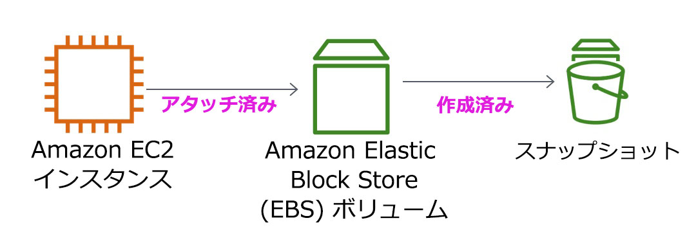

<header>

<link rel="stylesheet" href="https://use.fontawesome.com/releases/v5.5.0/css/all.css" integrity="sha384-B4dIYHKNBt8Bc12p+WXckhzcICo0wtJAoU8YZTY5qE0Id1GSseTk6S+L3BlXeVIU" crossorigin="anonymous">

<!-- Latest compiled and minified CSS -->
<link rel="stylesheet" href="https://maxcdn.bootstrapcdn.com/bootstrap/3.3.7/css/bootstrap.min.css" integrity="sha384-BVYiiSIFeK1dGmJRAkycuHAHRg32OmUcww7on3RYdg4Va+PmSTsz/K68vbdEjh4u" crossorigin="anonymous">

<!-- Optional theme -->
<link rel="stylesheet" href="https://maxcdn.bootstrapcdn.com/bootstrap/3.3.7/css/bootstrap-theme.min.css" integrity="sha384-rHyoN1iRsVXV4nD0JutlnGaslCJuC7uwjduW9SVrLvRYooPp2bWYgmgJQIXwl/Sp" crossorigin="anonymous">

<!-- Latest compiled and minified JavaScript -->
<script src="https://maxcdn.bootstrapcdn.com/bootstrap/3.3.7/js/bootstrap.min.js" integrity="sha384-Tc5IQib027qvyjSMfHjOMaLkfuWVxZxUPnCJA7l2mCWNIpG9mGCD8wGNIcPD7Txa" crossorigin="anonymous"></script>

</header>

<!--include:Logo-->

<style type="text/css">
  body {
      font-family:  "Roboto", "Helvetica", sans-serif;
      font-size: 12pt;
      font-color: Gray;
      line-height: 1.6;
      margin: 50px;
  }
  p {
      list-style-position: inside;
  }
  #ssb_blue {
    background-color: #257ACF;
    font-weight: bold;
    font-size: 90%;
    color: white;
    border-radius: 5px;
    padding-top: 3px;
    padding-bottom: 3px;
    padding-left: 10px;
    padding-right: 10px;
    white-space: nowrap;
  }
  #ssb_voc_grey {
    background-color: #F2F3F4;
    font-weight: normal;
    font-size: 90%;
    color: black;
    border-radius: 3px;
    border: 1px solid gray;
    padding-top: 5px;
    padding-bottom: 5px;
    padding-left: 6px;
    padding-right: 6px;
    white-space: nowrap;
  }
  #ssb_grey {
    background-color: #DEDEDE;
    font-weight: bold;
    font-size: 90%;
    color: #444;
    position: relative;
    top:-1px;
    border-radius: 5px;
    border-width: 1px;
    border-style: solid;
    border-color: #444;
    padding-top: 3px;
    padding-bottom: 3px;
    padding-left: 10px;
    padding-right: 10px;
    white-space: nowrap;
  }
  #ssl_alexa_ocean {
    color: #00a0d2;
    font-weight: bold;
  }
</style>

# ラボ 4 : EBS を使用する

<!-- Note to translators: This is based on SPL-02. Copy the translation from there. Do not re-translate the whole document. -->

**バージョン 5.1.3 (spl2)**

## ラボの概要



このラボでは、Amazon EC2 インスタンスの基礎となる重要なストレージメカニズムである Amazon Elastic Block Store (EBS) に焦点を当てます。Amazon EBS ボリュームを作成してインスタンスにアタッチし、ファイルシステムをボリュームに適用して、スナップショットバックアップを作成する方法について学習します。

## 取り上げるトピック

このラボを完了すると、以下のことができるようになります。

- Amazon EBS ボリュームを作成する
- ボリュームを EC2 インスタンスにアタッチし、マウントする
- ボリュームのスナップショットを作成する
- スナップショットから新しいボリュームを作成する
- 新しいボリュームを EC2 インスタンスにアタッチし、マウントする

## ラボの前提条件

このラボを正常に完了するには、Amazon EC2 の使用方法と Linux サーバー管理について基本的な知識が必要です。Linux コマンドラインツールの使用に慣れている必要もあります。

### AWS のその他のサービス

このラボに必要なサービス以外の AWS のサービスは、このラボへのアクセス中、IAM ポリシーによって無効にされています。さらに、このラボで使用されるサービスの機能はラボに必要なものに限定されており、場合によってはラボの設計の観点から意図的にさらに制限されています。このラボガイドに指定されていないサービスを使用したりアクションを実行したりすると、エラーが発生することがあります。

### Amazon Elastic Block Store とは

**Amazon Elastic Block Store (EBS)** は、Amazon EC2 インスタンスで使用できる永続的ストレージを提供します。Amazon EBS ボリュームはネットワーク接続型であり、インスタンスの存続期間とは無関係に永続化されます。Amazon EBS ボリュームは、可用性と信頼性の高いボリュームであり、Amazon EC2 インスタンスのブートパーティションとして利用したり、標準のブロックデバイスとして、実行中の Amazon EC2 インスタンスにアタッチしたりできます。

ブートパーティションとして使用すると、Amazon EC2 インスタンスを停止した後に再起動できるため、インスタンスの状態を維持しながら、使用したストレージリソースの分のみの料金を支払うようにすることができます。Amazon EBS ボリュームは、ローカルの Amazon EC2 インスタンスストアに比べて、より高い堅牢性を提供します。これは、Amazon EBS ボリュームが、自動的にバックエンド（単一のアベイラビリティーゾーン内）でレプリケーションされるためです。

さらなる堅牢性を望む方のために、Amazon EBS は、特定時点のボリュームの整合性のとれたスナップショットを作成することができます。これらはその後、Amazon Simple Storage Service (Amazon S3) に保存され、複数のアベイラビリティーゾーン間で自動的にレプリケーションされます。これらのスナップショットは、新しい Amazon EBS ボリュームの開始点として使用することができ、長期的堅牢性に向けてデータを保護することができます。これらのスナップショットを、同僚やその他の AWS 開発者と簡単に共有することもできます。

このラボガイドでは、Amazon EBS の基本的な概念について順をおって説明します。ただし、Amazon EBS の概念について簡単な概要しか記載されていないため、詳細については <a href="http://aws.amazon.com/ebs/" target="_blank">Amazon EBS ドキュメント</a>を参照してください。

### Amazon EBS ボリュームの特長

Amazon EBS ボリュームには次の特長があります。

- **永続的ストレージ:** ボリュームの存続時間は、Amazon EC2 インスタンスに依存しません。
- **汎用性:** Amazon EBS ボリュームは、任意のオペレーティングシステムから使用できる未フォーマットの raw ブロックデバイスです。
- **ハイパフォーマンス:** Amazon EBS ボリュームは、ローカルの Amazon EC2 ドライブと同等またはそれ以上のパフォーマンスを示します。
- **高い信頼性:** Amazon EBS ボリュームには、アベイラビリティーゾーン内での冗長性が備わっています。
- **耐障害設計:** Amazon EBS の AFR (年間エラー率) は 0.1%～1% です。
- **可変サイズ:** ボリュームサイズは 1 GB～16 TB の範囲で選択できます。
- **簡単に使用可能:** Amazon EBS ボリュームの作成、アタッチ、バックアップ、復元、削除を簡単に行うことができます。

**所要時間**

このラボは、完了までにおよそ **30 分**かかります。

## AWS マネジメントコンソールにアクセスする

1. この手順の上部にある <span id="ssb_voc_grey">Start Lab</span> をクリックして、ラボを起動します。

   [**Start Lab**] パネルが開き、ラボのステータスが表示されます。

2. **Lab status: ready** というメッセージが表示されるまで待ち、[**X**] をクリックして [**Start Lab**] パネルを閉じます。

3. この手順の上に表示されている <span id="ssb_voc_grey">AWS</span> をクリックします。

   新しいブラウザタブで AWS マネジメントコンソールが開きます。システムによって自動的にログインします。

   **ヒント**: 新しいブラウザタブが開かない場合、通常、ブラウザによってサイトのポップアップウィンドウの表示がブロックされたことを示すバナーまたはアイコンがブラウザの上部に表示されます。バナーまたはアイコンをクリックし、[**ポップアップを許可**] をクリックします。

4. AWS マネジメントコンソールのタブをこの手順の横に配置します。ラボのステップを簡単に参照できるように、両方のブラウザタブを同時に表示することをお勧めします。

&nbsp;
&nbsp;
## タスク 1 : 新しい EBS ボリュームを作成する

このタスクでは、Amazon EBS ボリュームを作成して、新しい Amazon EC2 インスタンスにアタッチします。

5. **AWS マネジメントコンソール**の [**サービス**] で [**EC2**] をクリックします。

6. ナビゲーションペインで [**インスタンス**] をクリックします。

   **Lab** という名前の Amazon EC2 インスタンスが、ラボの起動時に自動的に作成されています。

7. インスタンスの**アベイラビリティーゾーン**を書き留めておきます。この値は、*us-west-2a* のような形式です。

8. 左側のナビゲーションペインで [**ボリューム**] をクリックします。

   Amazon EC2 インスタンスが使用している既存のボリュームが表示されます。このスタンダードボリュームのサイズは 8 GiB のため、次の手順で作成する 1 GiB のボリュームとは簡単に区別できます。

9. <span id="ssb_blue">ボリュームの作成</span> をクリックして次を設定します。

   * **ボリュームタイプ:** **汎用 SSD (gp2)**
   * **サイズ (GiB):** `1`。**注意**: 容量の大きいボリュームの作成が制限されている場合があります。
   * **アベイラビリティーゾーン:** EC2 インスタンスと同じアベイラビリティーゾーンを選択
   * <span id="ssb_grey">タグの追加</span> をクリック
   * タグエディタに、次のとおり入力します。
      * **キー:** `Name`
      * **値:** `My Volume`

10. <span id="ssb_blue">ボリュームの作成</span> をクリックし、次に <span id="ssb_blue">閉じる</span> をクリックします。

   新しいボリュームがリストに表示され、状態が **creating**から **available** に変わります。新しいボリュームを表示するには、 <span class="fas fa-sync"></span> **更新* をクリックする必要がある場合があります。

&nbsp;
&nbsp;
## タスク 2 : インスタンスにボリュームをアタッチする

新しいボリュームを Amazon EC2 インスタンスにアタッチできるようになりました。

11. <i class="fas fa-square" style="color:blue"></i> **My Volume** を選択します。

12. \[**アクション**] ドロップダウンメニューから [**ボリュームのアタッチ**] をクリックします。

13. \[**インスタンス**] フィールドをクリックし、表示されたインスタンス（Lab）を選択します。

   [**デバイス**] フィールドが*/dev/sdf* に設定されていることを確認してください。このデバイス ID は後のタスクで使用します。

14. <span id="ssb_blue">アタッチ</span> をクリックします。

   ボリュームの状態は、**in-use** になっています。

&nbsp;
&nbsp;
## タスク 3 : Amazon EC2 インスタンスに接続する

### <i class="fab fa-windows"></i>Windows ユーザー: SSH を使用して接続する

<i class="fas fa-comment"></i>この手順は Windows ユーザーのみを対象としています。

Mac OS または Linux を使用している場合は、 <a href="#ssh-MACLinux">次のセクションに進んでください</a>。

15. このステップに記載されている 3 つの項目を読んでから、操作を開始してください。[**Details**] パネルを開くと、この手順を確認できなくなります。

   * 現在読んでいる手順の上部にある <span id="ssb_voc_grey">Details</span> ドロップダウンメニューをクリックし、<span id="ssb_voc_grey">Show</span> をクリックします。[**Credentials**] ウィンドウが開きます。

   * [**Download PPK**] をクリックし、**labsuser.ppk** ファイルを保存します。通常、ブラウザによってダウンロードディレクトリに保存されます。

   * [**X**] をクリックして [**Details**] パネルを閉じます。

16. 必要なソフトウェアをダウンロードします。

   * Amazon EC2 インスタンスに SSH で接続するために **PuTTY** を使用します。PuTTY をコンピュータにまだインストールしていない場合は、 <a href="https://the.earth.li/~sgtatham/putty/latest/w64/putty.exe">こちらからダウンロードしてください</a>。

17. **putty.exe** を開きます。

18. PuTTY がタイムアウトしないよう以下のように設定します。

   * [**Connection**] をクリック
   * [**Seconds between keepalives**] を `30` に設定

   これで、PuTTY セッションを長時間確立したままにできます。

19. PuTTY セッションの設定を行います。

   * [**Session**] をクリック

   * **Host Name (または IP アドレス) :** インスタンスの **IPv4 パブリック IP アドレス**をコピーして貼り付けます。これを確認するには、EC2 コンソールに戻り、[**インスタンス**] をクリックします。インスタンスの横にあるチェックボックスをオンにし、[*説明*] タブにある [**IPv4 パブリック IP**] の値をコピーします。

   * PuTTY に戻り、[**Connection**] リストで、<i class="far fa-plus-square"></i> **SSH** を展開します。

   * [**Auth**] をクリック（(展開しない）

   * [**Browse**] をクリック

   * ダウンロードした labsuser.ppk ファイルを参照して選択

   * [**開く**] をクリックして選択

   * [**Open**] をクリック

20. \[**はい**] をクリックしてホストを承認し、接続します。

21. **login as** と表示されたら、`ec2-user` と入力します。

   これにより、EC2 インスタンスに接続されます。

22. <a href="#ssh-after">Windows ユーザー: こちらをクリックして次のタスクに進んでください。</a>

<a id='ssh-MACLinux'></a>
### Mac OS<i class="fab fa-apple"></i> ユーザーおよび Linux <i class="fab fa-linux"></i>ユーザー

この手順は Mac または Linux ユーザーのみを対象としています。Windows を使用している場合は <a href="#ssh-after">次のタスクに進んでください。</a>

23. この手順に記載されているすべての説明を読んでから、操作を開始してください。[**Details**] パネルを開くと、この手順を確認できなくなります。

   * 現在読んでいる手順の上にある <span id="ssb_voc_grey">Details</span> ドロップダウンメニューをクリックし、<span id="ssb_voc_grey">Show</span> をクリックします。[**Credentials**] ウィンドウが開きます。

   * [**Download**] をクリックし、**labsuser.pem** ファイルを保存

   * [**X**] をクリックして [**Details**] パネルを閉じる

24. ターミナルウィンドウを開き、`cd` を実行してディレクトリを labsuser.pem ファイルをダウンロードしたディレクトリに変更します。

   たとえば、Downloads ディレクトリに保存されている場合は、以下のコマンドを実行します。

   ```plain
   cd ~/Downloads
   ```

25. 以下のコマンドを実行して、キーのアクセス許可を読み取り専用に変更します。

   ```plain
   chmod 400 labsuser.pem
   ```

26. AWS マネジメントコンソールに戻り、EC2 サービスで [**インスタンス**] をクリックします。

   **Lab** インスタンスが選択されているはずです。

27. \[**説明**] タブで、**IPv4 Public IP** の値をコピーします。

28. ターミナルウィンドウに戻り、以下のコマンドを実行します（**<public-ip\>** は、コピーした実際のパブリック IP アドレスに置き換えます）。

   ```plain
   ssh -i labsuser.pem ec2-user@<public-ip>
   ```

29. リモート SSH サーバーへの最初の接続を許可するかどうかを確認するメッセージが表示されたら、`yes` と入力します。

   認証にキーペアを使用しているため、パスワードの入力は要求されません。

<a id='ssh-after'></a>


&nbsp;
&nbsp;
## タスク 4 : ファイルシステムを作成して設定する

このタスクでは、新しいボリュームを ext3 ファイルシステムとして、Linux インスタンスの/mnt/data-store マウントポイントに追加します。

<i class="fas fa-info-circle"></i>PuTTY を使用している場合は、PuTTY ウィンドウ内で右クリックすることで、テキストを貼り付けることができます。

30. インスタンスで利用可能なストレージを表示します。

   ```plain
   df -h
   ```

   出力は以下のようになるはずです。

   ```plain
   Filesystem      Size  Used Avail Use% Mounted on
   devtmpfs        488M   60K  488M   1% /dev
   tmpfs           497M     0  497M   0% /dev/shm
   /dev/xvda1      7.8G  982M  6.7G  13% /
   ```

   これは、元の 8 GB ディスクボリュームの状態を示しています。新しいボリュームはまだ表示されていません。

31. 新しいボリュームで ext3 ファイルシステムを作成します。

   ```plain
   sudo mkfs -t ext3 /dev/sdf
   ```

32. 新しいストレージボリュームをマウントするディレクトリを作成します。

   ```plain
   sudo mkdir /mnt/data-store
   ```

33. 新しいボリュームをマウントします。

   ```plain
   sudo mount /dev/sdf /mnt/data-store
   ```

   インスタンス起動時にこのボリュームをマウントするように Linux インスタンスを設定するには、*/etc/fstab* に行を追加する必要があります。

   ```plain
   echo "/dev/sdf   /mnt/data-store ext3 defaults,noatime 1 2" | sudo tee -a /etc/fstab
   ```

34. 設定ファイルを表示して、最後の行の設定を確認します。

   ```plain
   cat /etc/fstab
   ```

35. 利用可能なストレージを再度表示します。

   ```plain
   df -h
   ```

   出力には、先ほど追加した行*/dev/xvdf* が表示されます。

   ```plain
   Filesystem      Size  Used Avail Use% Mounted on
   devtmpfs        488M   60K  488M   1% /dev
   tmpfs           497M     0  497M   0% /dev/shm
   /dev/xvda1      7.8G  982M  6.7G  13% /
   /dev/xvdf       976M  1.3M  924M   1% /mnt/data-store
   ```

36. マウントされたボリュームにファイルを作成して、テキストを追加します。

   ```plain
   sudo sh -c "echo some text has been written > /mnt/data-store/file.txt"
   ```

37. ボリュームにテキストが書き込まれたことを確認します。

   ```plain
   cat /mnt/data-store/file.txt
   ```

&nbsp;
&nbsp;
## タスク 5 : Amazon EBS スナップショットを作成する

このタスクでは、EBS ボリュームのスナップショットを作成します。

Amazon EBS ボリュームから、特定時点の整合性のあるスナップショットを、いつでも任意の数だけ作成できます。Amazon EBS スナップショットは、堅牢性の高い Amazon S3 に保存されます。クローンまたはバックアップの復元のために、スナップショットから新しい Amazon EBS ボリュームを作成することができます。Amazon EBS スナップショットは AWS ユーザー同士での共有や AWS リージョンをまたいだコピーも簡単にできます。

38. **AWS マネジメントコンソール**に戻り [**ボリューム**] をクリックし、<i class="fas fa-square" style="color:blue"></i> **My Volume** を選択します。

39. \[**アクション**] ドロップダウンメニューで [**スナップショットの作成**] をクリックします。

40. <span id="ssb_grey">タグの追加</span> をクリックし、次の内容を設定します。

   * **キー:** `Name`
   * **値:** `My Snapshot`
   * <span id="ssb_blue">スナップショットの作成</span> をクリックし、<span id="ssb_blue">閉じる</span> をクリックします。

   スナップショットは、**スナップショットコンソール**のリストに表示されます。

41. 左側のナビゲーションペインで [**スナップショット**] をクリックします。

   スナップショットが表示されます。状態は **pending** から始まります。スナップショットが作成中であることを意味します。その後、状態は **completed** に変わります。使用されているストレージブロックのみがスナップショットにコピーされるため、空のブロックはスナップショットストレージのスペースを使用しません。

42. リモート SSH セッションで、ボリュームに作成したファイルを削除します。

   ```plain
   sudo rm /mnt/data-store/file.txt
   ```

43. ファイルが削除されたことを確認します。

   ```plain
   ls /mnt/data-store/
   ```

   このファイルは正常に削除されました。

&nbsp;
&nbsp;
## タスク 6 : Amazon EBS スナップショットを復元する

スナップショットに保存されているデータを取得したい場合、スナップショットを新しい EBS ボリュームに**復元**できます。

### スナップショットを使用してボリュームを作成する

44. **AWS マネジメントコンソール**で、<i class="fas fa-square" style="color:blue"></i> **My Snapshot** を選択します。

45. \[**アクション**] ドロップダウンメニューで [**ボリュームの作成**] をクリックします。

46. \[**アベイラビリティーゾーン**] には、先ほど使用したアベイラビリティーゾーンを選択します。

47. <span id="ssb_grey">タグの追加</span> をクリックし、次の内容を設定します。

   * **キー:** `Name`
   * **値:** `Restored Volume`
   * <span id="ssb_blue">ボリュームの作成</span> をクリックします
   * <span id="ssb_blue">閉じる</span> をクリックします。

   スナップショットを新しいボリュームに復元するときに、ボリュームタイプ、サイズ、アベイラビリティーゾーンなどの設定を変更することもできます。

### 復元されたボリュームを EC2 インスタンスにアタッチする

48. 左側のナビゲーションペインで [**ボリューム**] をクリックします。

49. <i class="fas fa-square" style="color:blue"></i> **Restored Volume** を選択します。

50. \[**アクション**] ドロップダウンメニューで [**ボリュームのアタッチ**] をクリックします。

51. \[**インスタンス**] フィールドをクリックし、表示されたインスタンス（Lab）を選択します。

   [**デバイス**] フィールドが*/dev/sdg* に設定されていることを確認してください。このデバイス ID は後のタスクで使用します。

52. <span id="ssb_blue">アタッチ</span> をクリックする

   ボリュームの状態は現在、**in-use** になっています。

### 復元されたボリュームをマウントする

53. 新しいストレージボリュームをマウントするディレクトリを作成します。

   ```plain
   sudo mkdir /mnt/data-store2
   ```

54. 新しいボリュームをマウントします。

   ```plain
   sudo mount /dev/sdg /mnt/data-store2
   ```

55. 先ほど作成したファイルが、マウントしたボリュームに含まれていることを確認します。

   ```plain
   ls /mnt/data-store2/
   ```

   file.txt が表示されるはずです。

&nbsp;
&nbsp;
## まとめ

<i class="far fa-thumbs-up" style="color:blue"></i>お疲れ様でした。以下の作業が完了しました。

- Amazon EBS ボリュームを作成
- ボリュームを EC2 インスタンスにアタッチ
- ボリュームにファイルシステムを作成
- ボリュームにファイルを追加
- ボリュームのスナップショットを作成
- スナップショットから新しいボリュームを作成
- 新しいボリュームを EC2 インスタンスにアタッチし、マウント
- 前に作成したファイルが、新しく作成したボリュームに含まれていることを確認

## ラボの終了

<i class="icon-flag-checkered"></i>お疲れ様でした。これでラボが完了しました。

56. ラボの終了を確認するには、このページの上部にある <span id="ssb_voc_grey">End Lab</span> をクリックし、<span id="ssb_blue">Yes</span> をクリックします。  

   パネルが表示され、**DELETE has initiated...You may close this message box now.** というメッセージが表示されます。

57. 右上隅の [**X**] をクリックしてパネルを閉じます。

## その他のリソース

<a href="http://aws.amazon.com/ebs/" target="_blank">Amazon Elastic Block Store の特徴、機能、料金</a>

<a href="http://aws.amazon.com/training/" target="_blank">AWS トレーニングと認定</a>

フィードバック、ご提案、修正については、<aws-course-feedback@amazon.com> まで E メールにてご連絡ください。
