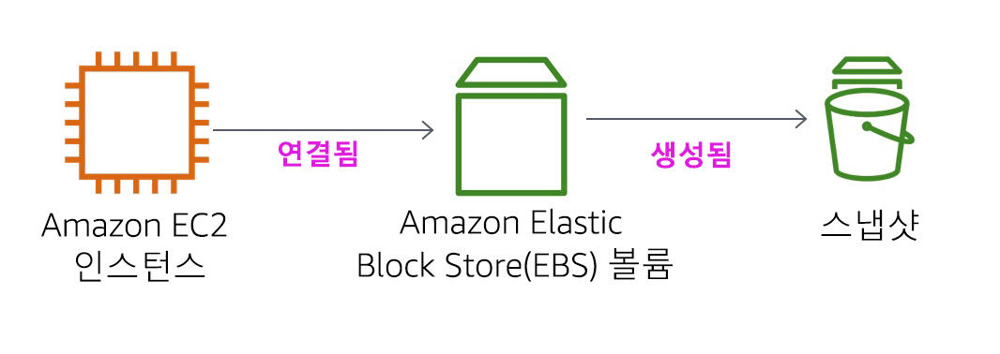

<header>

<link rel="stylesheet" href="https://use.fontawesome.com/releases/v5.5.0/css/all.css" integrity="sha384-B4dIYHKNBt8Bc12p+WXckhzcICo0wtJAoU8YZTY5qE0Id1GSseTk6S+L3BlXeVIU" crossorigin="anonymous">

<!-- Latest compiled and minified CSS -->
<link rel="stylesheet" href="https://maxcdn.bootstrapcdn.com/bootstrap/3.3.7/css/bootstrap.min.css" integrity="sha384-BVYiiSIFeK1dGmJRAkycuHAHRg32OmUcww7on3RYdg4Va+PmSTsz/K68vbdEjh4u" crossorigin="anonymous">

<!-- Optional theme -->
<link rel="stylesheet" href="https://maxcdn.bootstrapcdn.com/bootstrap/3.3.7/css/bootstrap-theme.min.css" integrity="sha384-rHyoN1iRsVXV4nD0JutlnGaslCJuC7uwjduW9SVrLvRYooPp2bWYgmgJQIXwl/Sp" crossorigin="anonymous">

<!-- Latest compiled and minified JavaScript -->
<script src="https://maxcdn.bootstrapcdn.com/bootstrap/3.3.7/js/bootstrap.min.js" integrity="sha384-Tc5IQib027qvyjSMfHjOMaLkfuWVxZxUPnCJA7l2mCWNIpG9mGCD8wGNIcPD7Txa" crossorigin="anonymous"></script>

</header>

<!--include:Logo-->

<style type="text/css">
  body {
      font-family:  "Roboto", "Helvetica", sans-serif;
      font-size: 12pt;
      font-color: Gray;
      line-height: 1.6;
      margin: 50px;
  }
  p {
      list-style-position: inside;
  }
  #ssb_blue {
    background-color: #257ACF;
    font-weight: bold;
    font-size: 90%;
    color: white;
    border-radius: 5px;
    padding-top: 3px;
    padding-bottom: 3px;
    padding-left: 10px;
    padding-right: 10px;
    white-space: nowrap;
  }
  #ssb_voc_grey {
    background-color: #F2F3F4;
    font-weight: normal;
    font-size: 90%;
    color: black;
    border-radius: 3px;
    border: 1px solid gray;
    padding-top: 5px;
    padding-bottom: 5px;
    padding-left: 6px;
    padding-right: 6px;
    white-space: nowrap;
  }
  #ssb_grey {
    background-color: #DEDEDE;
    font-weight: bold;
    font-size: 90%;
    color: #444;
    position: relative;
    top:-1px;
    border-radius: 5px;
    border-width: 1px;
    border-style: solid;
    border-color: #444;
    padding-top: 3px;
    padding-bottom: 3px;
    padding-left: 10px;
    padding-right: 10px;
    white-space: nowrap;
  }
  #ssl_alexa_ocean {
    color: #00a0d2;
    font-weight: bold;
  }
</style>

# 실습 4: EBS 사용하기

<!-- Note to translators: This is based on SPL-02. Copy the translation from there. Do not re-translate the whole document. -->

**버전 5.1.3(spl2)**

## 실습 개요



이 실습에서는 Amazon EC2 인스턴스의 기본 스토리지 메커니즘인 Amazon Elastic Block Store(Amazon EBS)를 중점적으로 다룹니다. 이 실습에서는 Amazon EBS 볼륨을 생성하여 인스턴스에 연결하고 볼륨에 파일 시스템을 적용한 다음 스냅샷 백업을 수행하는 방법을 배웁니다.

## 이 실습에서 다루는 주제

이 실습을 마치면 다음을 수행할 수 있습니다.

- Amazon EBS 볼륨 생성
- 볼륨을 EC2 인스턴스에 연결하고 탑재
- 사용자 볼륨의 스냅샷 생성
- 스냅샷에서 새 볼륨 생성
- 새 볼륨을 EC2 인스턴스에 연결하고 탑재

## 실습 사전 조건

이 실습을 완료하려면 기본적인 Amazon EC2 사용과 기본적인 Linux 서버 관리에 대해 잘 알고 있어야 합니다. Linux 명령줄 도구를 익숙하게 사용할 수 있어야 합니다.

### 다른 AWS 서비스

IAM 정책에 따라 본 실습에 액세스하는 시간에는 실습에 필요한 서비스 외에 다른 AWS 서비스는 비활성화됩니다. 또한 본 실습에서 사용하는 서비스의 기능은 실습에서 필요한 수준으로 제한되며, 일부의 경우에는 실습 설계의 의도에 따라 추가로 제한될 수 있습니다. 다른 서비스에 액세스하거나 실습 안내서에서 제공하는 것 외의 작업을 수행하는 경우 오류가 발생할 수 있습니다.

### Amazon Elastic Block Store란?

**Amazon Elastic Block Store(Amazon EBS)** 는 Amazon EC2 인스턴스를 위한 영구 스토리지를 제공합니다. Amazon EBS 볼륨은 네트워크에 연결되며, 인스턴스의 수명과 상관없이 지속됩니다. Amazon EBS 볼륨은 Amazon EC2 인스턴스의 부팅 파티션으로 사용하거나 실행 중인 Amazon EC2 인스턴스에 표준 블록 디바이스로 연결할 수 있는 가용성과 안정성이 뛰어난 볼륨입니다.

부팅 파티션으로 사용될 경우 Amazon EC2 인스턴스를 중지했다가 나중에 다시 시작할 수 있으므로 사용한 스토리지 리소스에 대해서만 비용을 지불하면서 인스턴스 상태를 유지할 수 있습니다. Amazon EBS 볼륨은 단일 가용 영역 내의 백엔드에 자동으로 복제되므로 로컬 Amazon EC2 인스턴스 스토어에 비해 크게 향상된 내구성을 제공합니다.

더 뛰어난 내구성을 원하는 사용자를 위해 Amazon EBS는 일관된 지정 시간 볼륨 스냅샷을 만들 수 있는 기능을 제공합니다. 생성된 스냅샷은 Amazon Simple Storage Service(Amazon S3)에 저장되어 여러 가용 영역 전체에 자동으로 복제됩니다. 이러한 스냅샷은 새로운 Amazon EBS 볼륨의 시작 지점으로 사용할 수 있으며 데이터를 장기간에 걸쳐 안정적으로 보호할 수 있습니다. 또한 이러한 스냅샷을 동료 및 다른 AWS 개발자와 손쉽게 공유할 수 있습니다.

이 실습 안내서에서는 Amazon EBS의 기본 개념을 단계별로 설명합니다. 그러나 여기서는 Amazon EBS 개념에 대한 간략한 개요만 제공합니다. 자세한 내용은 <a href="http://aws.amazon.com/ebs/" target="_blank">Amazon EBS 설명서</a>를 참조하십시오.

### Amazon EBS 볼륨의 기능

Amazon EBS 볼륨의 기능은 다음과 같습니다.

- **영구 스토리지:** 볼륨 수명은 특정 Amazon EC2 인스턴스와 독립적입니다.
- **범용:** Amazon EBS 볼륨은 모든 운영 체제에서 사용할 수 있는 형식이 지정되지 않은 원시 블록 디바이스입니다.
- **고성능:** Amazon EBS 볼륨은 로컬 Amazon EC2 드라이브와 같거나 더 우수한 성능을 제공합니다.
- **높은 안정성:** Amazon EBS 볼륨은 가용 영역 내에서 기본적으로 이중화를 제공합니다.
- **뛰어난 복원력:** Amazon EBS의 AFR(연간 실패율)은 0.1%에서 1% 사이입니다.
- **가변 크기:** 볼륨 크기는 1GB에서 16TB입니다.
- **사용 편의성:** Amazon EBS 볼륨을 쉽게 생성하고 연결, 백업, 복원 및 삭제할 수 있습니다.

**소요 시간**
이 실습은 완료까지 약 **30분**이 소요됩니다.

## AWS Management Console 액세스

1. 지침의 맨 위에서 <span id="ssb_voc_grey">Start Lab</span>을 클릭하여 실습을 시작합니다.

   Start Lab 패널이 열리고 실습 상태가 표시됩니다.

2. “**Lab status: ready**” 메시지가 표시되면 **X**를 클릭하여 Start Lab 패널을 닫습니다.

3. 지침의 맨 위에서 <span id="ssb_voc_grey">AWS</span>를 클릭합니다.

   그러면 새 브라우저 탭에서 AWS Management Console이 열립니다. 자동으로 로그인됩니다.

   **팁**: 새 브라우저 탭이 열리지 않는 경우 일반적으로 브라우저에서 팝업 창을 열 수 없음을 나타내는 배너 또는 아이콘이 브라우저 상단에 표시됩니다. 배너 또는 아이콘을 클릭하고 Allow pop ups를 선택합니다.

4. 이러한 지침이 나란히 표시되도록 AWS Management Console 탭을 정렬합니다. 두 브라우저 탭이 동시에 표시되어 실습 단계를 보다 쉽게 수행할 수 있게 됩니다.

&nbsp;
&nbsp;
## 과제 1: 새 EBS 볼륨 생성

이 과제에서는 Amazon EBS 볼륨을 생성하고 새 Amazon EC2 인스턴스에 연결합니다.

5. **AWS Management Console**의 **Services** 메뉴에서 **EC2**를 클릭합니다.

6. 왼쪽 탐색 창에서 **Instances**를 클릭합니다.

   실습을 위해 **Lab**이라는 이름의 Amazon EC2 인스턴스가 이미 시작되어 있습니다.

7. 인스턴스의 **Availability Zone**을 확인합니다. *us-west-2a*와 유사한 항목이 표시됩니다.

8. 왼쪽 탐색 창에서 **Volumes**를 클릭합니다.

   Amazon EC2 인스턴스에서 사용 중인 기존 볼륨을 볼 수 있습니다. 이 볼륨의 크기는 8GiB이므로 다음에 만들 볼륨(1GiB 크기)과 쉽게 구별할 수 있습니다.

9. <span id="ssb_blue">Create Volume</span>을 클릭하고 다음을 구성합니다.

   * **Volume Type**: *General Purpose SSD (gp2)*
   * **Size (GiB)**: `1`. **참고**: 대용량 볼륨의 생성이 제한될 수 있습니다.
   * **Availability Zone**: EC2 인스턴스와 동일한 가용 영역을 선택합니다.
   * <span id="ssb_grey">Add Tag</span>를 클릭합니다.
   * 태그 편집기에서 다음을 입력합니다.
      * **Key**: `Name`
      * **Value**: `My Volume`

10. <span id="ssb_blue">Create Volume</span>을 클릭하고 <span id="ssb_blue">Close</span>를 클릭합니다.

   새 볼륨이 목록에 표시되고 *creating* 상태에서 *available* 상태로 전환됩니다. 새 볼륨을 보려면 **새로 고침** <span class="fas fa-sync"></span>을 클릭해야 할 수 있습니다.

&nbsp;
&nbsp;
## 과제 2: 볼륨을 인스턴스에 연결

이제 Amazon EC2 인스턴스에 새 볼륨을 연결할 수 있습니다.

11. <i class="fas fa-square" style="color:blue"></i> **My Volume**을 선택합니다.

12. **Actions** 메뉴에서 **Attach Volume**을 클릭합니다.

13. **Instance** 필드를 클릭하고 표시되는 인스턴스(Lab)를 선택합니다.

   **Device** 필드는 */dev/sdf*로 설정되어 있습니다. 이후 과제에서 이 디바이스 식별자를 사용합니다.

14. <span id="ssb_blue">Attach</span>를 클릭합니다.
   이제 볼륨 상태는 *in-use*입니다.

&nbsp;
&nbsp;
## 과제 3: Amazon EC2 인스턴스에 연결

### <i class="fab fa-windows"></i> Windows 사용자: SSH를 사용하여 연결

<i class="fas fa-comment"></i> 이 지침은 Windows 사용자에게만 적용됩니다.

macOS 또는 Linux를 사용하는 경우 <a href="#ssh-MACLinux">다음 섹션으로 건너뛰십시오</a>.

15. 작업을 완료하기 전에 이 단계에 포함된 3개의 주요 항목을 읽어보십시오. Details 패널을 연 후에는 이러한 지침을 볼 수 없습니다.

   * 현재 읽고 있는 지침 위에 있는 <span id="ssb_voc_grey">Details</span> 드롭다운 메뉴를 클릭한 다음 <span id="ssb_voc_grey">Show</span>를 클릭합니다. Credentials 창이 열립니다.

   * **Download PPK** 버튼을 클릭하고 **labsuser.ppk** 파일을 저장합니다. 브라우저에서 이 파일은 일반적으로 Downloads 디렉터리에 저장됩니다.

   * **X**를 클릭하여 Details 패널을 닫습니다.

16. 필요한 소프트웨어를 다운로드합니다.

   * **PuTTY**를 사용하여 SSH로 Amazon EC2 인스턴스에 연결합니다. 컴퓨터에 PuTTY가 설치되어 있지 않은 경우 <a href="https://the.earth.li/~sgtatham/putty/latest/w64/putty.exe">여기에서 다운로드</a>하십시오.

17. **PuTTY.exe**를 엽니다.

18. timeout이 발생하지 않도록 PuTTY를 구성합니다.

   * **Connection**을 클릭합니다.
   * **Seconds between keepalives**를 `30`으로 설정합니다.

   이렇게 하면 PuTTY 세션을 더 오래 열어 둘 수 있습니다.

19. PuTTY 세션을 구성합니다.

   * **Session**을 클릭합니다.

   * **Host Name (or IP address)**: 인스턴스의 **IPv4 Public IP address**를 복사하여 붙여 넣습니다. 이 주소를 찾으려면 EC2 콘솔로 돌아가서 **Instances**를 클릭합니다. 인스턴스 옆의 확인란을 선택하고 *Description* 탭에서 **IPv4 Public IP** 값을 복사합니다.

   * PuTTy로 돌아간 후 **Connection** 목록에서 <i class="far fa-plus-square"></i> **SSH**를 확장합니다.

   * **Auth**를 클릭합니다(확장하지 말 것).

   * **Browse**를 클릭합니다.

   * 다운로드한 labsuser.ppk 파일을 찾아서 선택합니다.

   * **Open**을 클릭하여 선택합니다.

   * **Open**을 클릭합니다.

20. 호스트를 신뢰하고 호스트에 연결하려면 **Yes**를 클릭합니다.

21. **login as** 메시지가 나타나면 `ec2-user`를 입력합니다.

   그러면 EC2 인스턴스에 연결됩니다.

22. <a href="#ssh-after">Windows 사용자: 다음 과제로 건너뛰려면 여기를 클릭하십시오.</a>

<a id='ssh-MACLinux'></a>
### macOS <i class="fab fa-apple"></i> 및 Linux <i class="fab fa-linux"></i> 사용자

이 지침은 Mac/Linux 사용자에게만 적용됩니다. Windows 사용자인 경우 <a href="#ssh-after">다음 과제로 건너뛰십시오.</a>

23. 작업을 완료하기 전에 이 단계에 포함된 모든 지침을 읽어보십시오. Details 패널을 연 후에는 이러한 지침을 볼 수 없습니다.

   * 현재 읽고 있는 지침 위에 있는 <span id="ssb_voc_grey">Details</span> 드롭다운 메뉴를 클릭한 다음 <span id="ssb_voc_grey">Show</span>를 클릭합니다. Credentials 창이 열립니다.

   * **Download** 버튼을 클릭하고 **labsuser.pem** 파일을 저장합니다.

   * **X**를 클릭하여 Details 패널을 닫습니다.

24. 터미널 창을 열고 `cd`로 디렉터리를 labsuser.pem 파일이 다운로드된 디렉터리로 변경합니다.

   예를 들어 Downloads 디렉터리에 저장된 경우 다음 명령을 실행합니다.

   ```plain
   cd ~/Downloads
   ```

25. 다음 명령을 실행하여 키에 대한 권한을 읽기 전용으로 변경합니다.

   ```plain
   chmod 400 labsuser.pem
   ```

26. AWS Management Console로 돌아간 후 EC2 서비스에서 **Instances**를 클릭합니다.

   **Lab** 인스턴스를 선택해야 합니다.

27. *Description* 탭에서 **IPv4 Public IP** 값을 복사합니다.

28. 터미널 창으로 돌아가서 다음 명령을 실행합니다(**<public-ip\>**를 복사한 실제 퍼블릭 IP 주소로 바꿈).

   ```plain
   ssh -i labsuser.pem ec2-user@<public-ip>
   ```

29. 이 원격 SSH 서버에 대한 첫 번째 연결을 허용할 것인지 묻는 메시지가 나타나면 `yes`를 입력합니다.

   인증에 키 페어를 사용 중이므로 암호를 묻는 메시지는 나타나지 않습니다.

<a id='ssh-after'></a>


&nbsp;
&nbsp;
## 과제 4: 파일 시스템 생성 및 구성

이 과제에서는 Linux 인스턴스에서 /mnt/data-store 마운트 지점에 새 볼륨을 ext3 파일 시스템으로 추가합니다.

<i class="fas fa-info-circle"></i> PuTTY를 사용하는 경우 PuTTY 창에서 마우스 오른쪽 버튼을 클릭하여 텍스트를 붙여 넣을 수 있습니다.

30. 인스턴스에서 사용 가능한 스토리지를 확인합니다.

   ```plain
   df -h
   ```

   아래와 유사한 출력 화면이 표시됩니다.

   ```plain
   Filesystem      Size  Used Avail Use% Mounted on
   devtmpfs        488M   60K  488M   1% /dev
   tmpfs           497M     0  497M   0% /dev/shm
   /dev/xvda1      7.8G  982M  6.7G  13% /
   ```

   여기에는 8GB의 원래 디스크 볼륨이 표시되어 있습니다. 새 볼륨은 아직 표시되지 않았습니다.

31. 새 볼륨에 ext3 파일 시스템을 생성합니다.

   ```plain
   sudo mkfs -t ext3 /dev/sdf
   ```

32. 새로운 스토리지 볼륨을 탑재할 디렉터리를 생성합니다.

   ```plain
   sudo mkdir /mnt/data-store
   ```

33. 새 볼륨을 탑재합니다.

   ```plain
   sudo mount /dev/sdf /mnt/data-store
   ```

   인스턴스가 시작될 때마다 이 볼륨을 탑재하도록 Linux 인스턴스를 구성하려면 */etc/fstab*에 행을 추가해야 합니다.

   ```plain
   echo "/dev/sdf   /mnt/data-store ext3 defaults,noatime 1 2" | sudo tee -a /etc/fstab
   ```

34. 구성 파일에서 마지막 행의 설정을 확인합니다.

   ```plain
   cat /etc/fstab
   ```

35. 사용 가능한 스토리지를 다시 확인합니다.

   ```plain
   df -h
   ```

   이제 출력에 */dev/xvdf*라는 추가 행이 포함됩니다.

   ```plain
   Filesystem      Size  Used Avail Use% Mounted on
   devtmpfs        488M   60K  488M   1% /dev
   tmpfs           497M     0  497M   0% /dev/shm
   /dev/xvda1      7.8G  982M  6.7G  13% /
   /dev/xvdf       976M  1.3M  924M   1% /mnt/data-store
   ```

36. 탑재된 볼륨에서 파일을 생성하고 여기에 일부 텍스트를 추가합니다.

   ```plain
   sudo sh -c "echo some text has been written > /mnt/data-store/file.txt"
   ```

37. 텍스트가 볼륨에 기록되었는지 확인합니다.

   ```plain
   cat /mnt/data-store/file.txt
   ```

&nbsp;
&nbsp;
## 과제 5: Amazon EBS 스냅샷 생성

이 과제에서는 EBS 볼륨의 스냅샷을 생성합니다.

Amazon EBS 볼륨에서 특정 시점에 대한 일관된 스냅샷을 원하는 수만큼 생성할 수 있습니다. Amazon EBS 스냅샷은 Amazon S3에 저장되어 높은 내구성을 제공합니다. 새로운 Amazon EBS 볼륨은 백업 복제 또는 복원을 위해 스냅샷에서 생성할 수 있습니다. 또한 Amazon EBS 스냅샷을 AWS 사용자 간에 공유하거나 AWS 리전에서 복사할 수 있습니다.

38. **AWS Management Console**에서 **Volumes**를 클릭하고 <i class="fas fa-square" style="color:blue"></i> **My Volume**을 선택합니다.

39. **Actions** 메뉴에서 **Create Snapshot**을 클릭합니다.

40. <span id="ssb_grey">Add Tag</span>를 클릭하고 다음을 구성합니다.

   * **Key**: `Name`
   * **Value**: `My Snapshot`
   * <span id="ssb_blue">Create Snapshot</span>을 클릭한 다음 <span id="ssb_blue">Close</span>를 클릭합니다.

   **Snapshots** 콘솔에 스냅샷이 나열됩니다.

41. 왼쪽 탐색 창에서 **Snapshots**를 클릭합니다.

   스냅샷이 표시됩니다. *pending* 상태로 시작되는데 이 상태는 스냅샷을 생성하는 중임을 나타냅니다. 그런 다음 *completed* 상태로 변경됩니다. 사용된 스토리지 블록만 스냅샷에 복사되므로 빈 블록은 스냅샷 스토리지 공간을 차지하지 않습니다.

42. 원격 SSH 세션에서 볼륨에서 생성한 파일을 삭제합니다.

   ```plain
   sudo rm /mnt/data-store/file.txt
   ```

43. 파일이 삭제되었는지 확인합니다.

   ```plain
   ls /mnt/data-store/
   ```

   파일이 삭제되었습니다.

&nbsp;
&nbsp;
## 과제 6: Amazon EBS 스냅샷 복원

스냅샷에 저장된 데이터를 검색하려는 경우 스냅샷을 새 EBS 볼륨으로 **복원**할 수 있습니다.

### 스냅샷을 사용하여 볼륨 생성

44. **AWS Management Console**에서 <i class="fas fa-square" style="color:blue"></i> **My Snapshot**을 선택합니다.

45. **Actions** 메뉴에서 **Create Volume**을 클릭합니다.

46. **Availability Zone**에서 이전에 사용한 것과 동일한 가용 영역을 선택합니다.

47. <span id="ssb_grey">Add Tag</span>를 클릭하고 다음을 구성합니다.

   * **Key**: `Name`
   * **Value**: `Restored Volume`
   * <span id="ssb_blue">Create Volume</span>을 클릭합니다.
   * <span id="ssb_blue">Close</span>를 클릭합니다.

   새 볼륨으로 스냅샷을 복원하는 경우 볼륨 유형, 크기 또는 가용 영역을 변경하는 등 구성을 수정할 수도 있습니다.

### 복원된 볼륨을 EC2 인스턴스에 연결

48. 왼쪽 탐색 창에서 **Volumes**를 클릭합니다.

49. <i class="fas fa-square" style="color:blue"></i> **Restored Volume**을 선택합니다.

50. **Actions** 메뉴에서 **Attach Volume**을 클릭합니다.

51. **Instance** 필드를 클릭하고 표시되는 인스턴스(Lab)를 선택합니다.

   **Device** 필드는 */dev/sdg*로 설정되어 있습니다. 이후 과제에서 이 디바이스 식별자를 사용합니다.

52. <span id="ssb_blue">Attach</span>를 클릭합니다.

   이제 볼륨 상태는 *in-use*입니다.

### 복원된 볼륨 탑재

53. 새로운 스토리지 볼륨을 탑재할 디렉터리를 생성합니다.

   ```plain
   sudo mkdir /mnt/data-store2
   ```

54. 새 볼륨을 탑재합니다.

   ```plain
   sudo mount /dev/sdg /mnt/data-store2
   ```

55. 앞서 생성한 파일이 탑재한 볼륨에 있는지 확인합니다.

   ```plain
   ls /mnt/data-store2/
   ```

   file.txt가 표시됩니다.

&nbsp;
&nbsp;
## 결론

<i class="far fa-thumbs-up" style="color:blue"></i> 축하합니다! 다음 작업이 성공적으로 완료되었습니다.

- Amazon EBS 볼륨 생성
- EC2 인스턴스에 볼륨 연결
- 볼륨에 파일 시스템 생성
- 볼륨에 파일 추가
- 볼륨의 스냅샷 생성
- 스냅샷에서 새 볼륨 생성
- 새 볼륨을 EC2 인스턴스에 연결하고 탑재
- 이전에 생성한 파일이 새로 생성된 볼륨에 있는지 확인

## 실습 완료

<i class="icon-flag-checkered"></i> 축하합니다! 실습을 마쳤습니다.

56. 이 페이지의 상단에서 <span id="ssb_voc_grey">End Lab</span>을 클릭하고 <span id="ssb_blue">Yes</span>를 클릭하여 실습 종료를 확인합니다.  

   "DELETE has been initiated... You may close this message box now"라는 내용의 패널이 표시됩니다.

57. 오른쪽 상단 모서리에 있는 **X**를 클릭하여 패널을 닫습니다.

## 추가 리소스

<a href="http://aws.amazon.com/ebs/" target="_blank">Amazon Elastic Block Store 특징, 기능 및 요금</a>

<a href="http://aws.amazon.com/training/" target="_blank">AWS Training and Certification</a>

피드백 또는 제안 사항이 있거나 수정이 필요한 경우 다음 주소로 이메일을 보내 주십시오. <aws-course-feedback@amazon.com>
