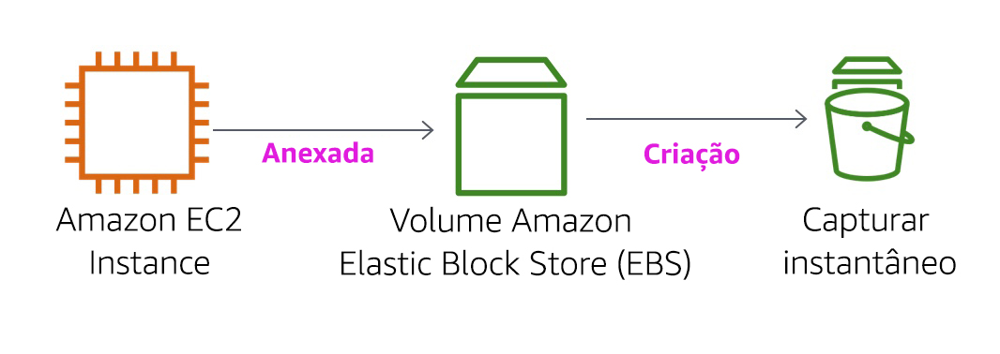

<header>

<link rel="stylesheet" href="https://use.fontawesome.com/releases/v5.5.0/css/all.css" integrity="sha384-B4dIYHKNBt8Bc12p+WXckhzcICo0wtJAoU8YZTY5qE0Id1GSseTk6S+L3BlXeVIU" crossorigin="anonymous">

<!-- Latest compiled and minified CSS -->
<link rel="stylesheet" href="https://maxcdn.bootstrapcdn.com/bootstrap/3.3.7/css/bootstrap.min.css" integrity="sha384-BVYiiSIFeK1dGmJRAkycuHAHRg32OmUcww7on3RYdg4Va+PmSTsz/K68vbdEjh4u" crossorigin="anonymous">

<!-- Optional theme -->
<link rel="stylesheet" href="https://maxcdn.bootstrapcdn.com/bootstrap/3.3.7/css/bootstrap-theme.min.css" integrity="sha384-rHyoN1iRsVXV4nD0JutlnGaslCJuC7uwjduW9SVrLvRYooPp2bWYgmgJQIXwl/Sp" crossorigin="anonymous">

<!-- Latest compiled and minified JavaScript -->
<script src="https://maxcdn.bootstrapcdn.com/bootstrap/3.3.7/js/bootstrap.min.js" integrity="sha384-Tc5IQib027qvyjSMfHjOMaLkfuWVxZxUPnCJA7l2mCWNIpG9mGCD8wGNIcPD7Txa" crossorigin="anonymous"></script>

</header>

<!--include:Logo-->

<style type="text/css">
  body {
      font-family:  "Roboto", "Helvetica", sans-serif;
      font-size: 12pt;
      font-color: Gray;
      line-height: 1.6;
      margin: 50px;
  }
  p {
      list-style-position: inside;
  }
  #ssb_blue {
    background-color: #257ACF;
    font-weight: bold;
    font-size: 90%;
    color: white;
    border-radius: 5px;
    padding-top: 3px;
    padding-bottom: 3px;
    padding-left: 10px;
    padding-right: 10px;
    white-space: nowrap;
  }
  #ssb_voc_grey {
    background-color: #F2F3F4;
    font-weight: normal;
    font-size: 90%;
    color: black;
    border-radius: 3px;
    border: 1px solid gray;
    padding-top: 5px;
    padding-bottom: 5px;
    padding-left: 6px;
    padding-right: 6px;
    white-space: nowrap;
  }
  #ssb_grey {
    background-color: #DEDEDE;
    font-weight: bold;
    font-size: 90%;
    color: #444;
    position: relative;
    top:-1px;
    border-radius: 5px;
    border-width: 1px;
    border-style: solid;
    border-color: #444;
    padding-top: 3px;
    padding-bottom: 3px;
    padding-left: 10px;
    padding-right: 10px;
    white-space: nowrap;
  }
  #ssl_alexa_ocean {
    color: #00a0d2;
    font-weight: bold;
  }
</style>

# Laboratório 4: Como trabalhar com o EBS

<!-- Note to translators: This is based on SPL-02. Copy the translation from there. Do not re-translate the whole document. -->

**Versão 5.1.3 (spl2)**

## Visão geral do laboratório



O foco deste laboratório é o Amazon Elastic Block Store (Amazon EBS), um importante mecanismo de armazenamento subjacente para instâncias Amazon EC2. Neste laboratório, você aprenderá a criar um volume Amazon EBS, associá-lo a uma instância, aplicar um sistema de arquivos ao volume e fazer um backup de snapshot.

## Tópicos abordados

Ao final deste laboratório, você será capaz de:

- Criar um volume Amazon EBS
- Associar e montar o volume em uma instância EC2
- Criar um snapshot do volume
- Criar um novo volume com base no seu snapshot
- Associar e montar o novo volume em sua instância EC2

## Pré-requisitos do laboratório

Para concluir este laboratório com êxito, você deve estar familiarizado com o uso básico do Amazon EC2 e com a administração básica do servidor Linux. Você deve estar acostumado a usar as ferramentas da linha de comando do Linux.

### Outros serviços da AWS

Os outros serviços da AWS que não são necessários para este laboratório são desabilitados pela política do IAM durante seu tempo de acesso ao laboratório. Além disso, os recursos dos serviços usados neste laboratório são limitados ao que é exigido pelo laboratório e, em alguns casos, são ainda mais limitados como um aspecto intencional do projeto do laboratório. Se você acessar outros serviços ou executar ações diferentes das que fazem parte deste guia de laboratório, haverá erros.

### O que é Amazon Elastic Block Store?

O **Amazon Elastic Block Store (Amazon EBS)** oferece armazenamento persistente para instâncias Amazon EC2. Os volumes do Amazon EBS são vinculados à rede e persistem de maneira independente à vida útil de uma instância. Os volumes do Amazon EBS são volumes altamente disponíveis e extremamente confiáveis que podem ser aproveitados como uma partição de inicialização das instâncias do Amazon EC2 ou associados a uma instância em execução do Amazon EC2 como um dispositivo de blocos padrão.

Quando utilizadas como uma partição de inicialização, as instâncias do Amazon EC2 podem ser interrompidas e posteriormente reiniciadas, permitindo que você pague somente pelos recursos de armazenamento utilizados, mantendo o estado de sua instância. Os volumes do Amazon EBS oferecem melhor durabilidade em comparação aos armazenamentos locais de instâncias do Amazon EC2, porque os volumes do Amazon EBS são automaticamente replicados no back-end (em uma única zona de disponibilidade).

Para aqueles que desejam ainda maior durabilidade, o Amazon EBS fornece a capacidade de criar snapshots de momentos específicos de seus volumes, sendo armazenados no Amazon Simple Storage Service (Amazon S3) e automaticamente duplicados pelas várias zonas de disponibilidade. Esses snapshots podem ser usados como ponto inicial para novos volumes do Amazon EBS e podem proteger seus dados para uma durabilidade a longo prazo. Você pode também, facilmente, compartilhar esses snapshots com os colegas de trabalho e com outros colaboradores da AWS.

Este guia de laboratório explica os conceitos básicos do Amazon EBS detalhadamente. No entanto, ele pode incluir apenas uma breve visão geral dos conceitos do Amazon EBS. Para obter mais informações, consulte a <a href="http://aws.amazon.com/ebs/" target="_blank">Documentação do Amazon EBS</a>.

### Recursos de volume Amazon EBS

Os volumes do Amazon EBS contam com os seguintes recursos:

- **Armazenamento persistente:** a vida útil do volume é independente de qualquer instância específica do Amazon EC2.
- **Uso geral:** os volumes do Amazon EBS são dispositivos de blocos brutos e não formatados que podem ser usados em qualquer sistema operacional.
- **Alta performance:** os volumes do Amazon EBS são iguais ou melhores que as unidades locais do Amazon EC2.
- **Alta confiabilidade:** os volumes do Amazon EBS têm redundância integrada dentro de uma zona de disponibilidade.
- **Projetado para resiliência:** a AFR (taxa anual de falhas) do Amazon EBS está entre 0,1% e 1%.
- **Tamanho variável:** os tamanhos de volume variam de 1 GB a 16 TB.
- **Fácil de usar:** os volumes do Amazon EBS podem ser facilmente criados, associados, incluídos em backup, restaurados e excluídos.

**Duração**
Este laboratório levará aproximadamente **30 minutos** para ser concluído.

## Como acessar o Console de Gerenciamento da AWS

1. Na parte superior destas instruções, clique em <span id="ssb_voc_grey">Start Lab</span> (Iniciar laboratório) para iniciar o laboratório.

   Um painel Start Lab (Iniciar laboratório) é aberto exibindo o status do laboratório.

2. Aguarde até ver a mensagem "**Lab status: ready**" (Status do laboratório: pronto) e clique no **X** para fechar o painel Start Lab (Iniciar laboratório).

3. Na parte superior destas instruções, clique em <span id="ssb_voc_grey">AWS</span>.

   Isso abrirá o Console de Gerenciamento da AWS em uma nova guia do navegador. O sistema fará o seu login automaticamente.

   **Dica**: se uma nova guia do navegador não abrir, normalmente haverá um banner ou um ícone na parte superior do navegador indicando que o navegador está impedindo que o site abra janelas pop-up. Clique no banner ou ícone e escolha "Allow pop ups" (Permitir pop-ups).

4. Organize a guia do Console de Gerenciamento da AWS para que ela seja exibida com estas instruções. Em um cenário ideal, você poderá ver as duas guias do navegador ao mesmo tempo, para facilitar o acompanhamento das etapas do laboratório.

&nbsp;
&nbsp;
## Tarefa 1: Criar um novo volume EBS

Nesta tarefa, você criará e associará um volume Amazon EBS a uma nova instância Amazon EC2.

5. No **Console de Gerenciamento da AWS**, no menu **Services** (Serviços), clique em **EC2**.

6. No painel de navegação esquerdo, clique em **Instances** (Instâncias).

   Uma instância Amazon EC2 chamada **Lab** já foi executada para seu laboratório.

7. Observe a **zona de disponibilidade** da instância. Ela será semelhante a *us-west-2a*.

8. No painel de navegação esquerdo, clique em **Volumes**.

   Você verá um volume existente que a instância Amazon EC2 está usando. Esse volume tem um tamanho de 8 GiB, o que facilita a distinção do volume que você criará em seguida, que será de 1 GiB.

9. Clique em <span id="ssb_blue">Create Volume</span> (Criar volume) e configure:

   * **Volume Type:** (Tipo de volume) *General Purpose SSD (gp2)* (SSD de uso geral (gp2))
   * **Size (GiB):** (Tamanho) `1`. **OBSERVAÇÃO**: você pode estar impedido de criar volumes grandes.
   * **Availability Zone:** (Zona de disponibilidade) selecione a mesma zona de disponibilidade da sua instância EC2.
   * Clique em <span id="ssb_grey">Add Tag</span> (Adicionar tag).
   * No Editor de tags, insira:
      * **Key** (Chave): `Name` (Nome)
      * **Value:** (Valor) `My Volume`

10. Clique em <span id="ssb_blue">Create Volume</span> (Criar volume) e em <span id="ssb_blue">Close</span> (Fechar)

   Seu novo volume aparecerá na lista, e o estado dele mudará de *creating* (em criação) para *available* (disponível). Talvez você tenha de clicar em **refresh** <span class="fas fa-sync"></span> (atualizar) para ver o novo volume.

&nbsp;
&nbsp;
## Tarefa 2: Associar o volume a uma instância

Agora você pode associar seu novo volume à instância Amazon EC2.

11. Selecione <i class="fas fa-square" style="color:blue"></i> **My Volume**.

12. No menu **Actions** (Ações), clique em **Attach Volume** (Associar volume).

13. Clique no campo **Instance** (Instância) e, em seguida, selecione a instância exibida (Lab).

    Observe que o campo **Device** (Dispositivo) está definido como */dev/sdf*. Você usará esse identificador de dispositivo em uma tarefa posterior.

14. Click <span id="ssb_blue">Attach</span> (Associar).
    O estado do volume agora é *in-use* (em uso).

&nbsp;
&nbsp;
## Tarefa 3: Conectar-se à sua instância Amazon EC2

### <i class="fab fa-windows"></i> Usuários do Windows: como usar o SSH para se conectar

<i class="fas fa-comment"></i> Estas instruções são apenas para usuários do Windows.

Se você estiver usando macOS ou Linux, <a href="#ssh-MACLinux">vá para a próxima seção</a>.

15. Leia os três marcadores nesta etapa antes de começar a executar as ações, porque você não poderá visualizar estas instruções quando o painel Details (Detalhes) estiver aberto.

    * Clique no menu suspenso <span id="ssb_voc_grey">Details</span> (Detalhes) acima das instruções que você está lendo no momento e clique em <span id="ssb_voc_grey">Show</span> (Mostrar). Uma janela Credentials (Credenciais) será aberta.

    * Clique no botão **Download PPK** (Fazer download do PPK) e salve o arquivo **labsuser.ppk**. Normalmente, seu navegador o salva no diretório Downloads.

    * Em seguida, clique no **X** para sair do painel Details (Detalhes).

16. Faça download do software necessário.

    * Você usará o **PuTTY** para se conectar às instâncias Amazon EC2 com SSH. Se você não tiver o PuTTY instalado no seu computador, <a href="https://the.earth.li/~sgtatham/putty/latest/w64/putty.exe">faça download dele aqui</a>.

17. Abra o **putty.exe**

18. Configure o PuTTY para não atingir o tempo limite:

    * Clique em **Connection** (Conexão)
    * Defina **Seconds between keepalives** (Segundos entre os keepalives) como `30`

    Isso permite que manter a sessão do PuTTY aberta por mais tempo.

19. Configure sua sessão do PuTTY:

    * Clique em **Session** (Sessão)

    * **Host Name (or IP address)** (Nome do host ou endereço IP): copie e cole o **IPv4 Public IP address** (Endereço IP público IPv4) da instância. Para encontrá-lo, retorne ao console do EC2 e clique em **Instances** (Instâncias). Marque a caixa ao lado da instância e, na guia *Description* (Descrição), copie o valor **IPv4 Public IP** (IP público IPv4).

    * De volta ao PuTTy, na lista **Connection** (Conexão), expanda <i class="far fa-plus-square"></i> **SSH**

    * Clique em **Auth** (Autenticação) (não expanda)

    * Clique em **Browse** (Procurar)

    * Procure e selecione o arquivo labsuser.ppk do qual você fez download

    * Clique em **Open** (Abrir) para selecioná-lo

    * Clique em **Open** (Abrir)

20. Clique em **Yes** (Sim) para confiar no host e conectar-se a ele.

21. Quando for solicitado **login as** (fazer login como), insira `ec2-user`

    Isso conectará você à instância EC2.

22. <a href="#ssh-after">Usuários do Windows: clique aqui para avançar para a próxima tarefa.</a>

<a id='ssh-MACLinux'></a>
### Usuários do macOS <i class="fab fa-apple"></i> e Linux <i class="fab fa-linux"></i>

Estas instruções são apenas para usuários do Mac/Linux. Se você for um usuário do Windows, <a href="#ssh-after">avance para a próxima tarefa.</a>

23. Leia todas as instruções nesta única etapa antes de começar a executar as ações, porque você não poderá vê-las quando o painel Details (Detalhes) estiver aberto.

    * Clique no menu suspenso <span id="ssb_voc_grey">Details</span> (Detalhes) acima das instruções que você está lendo no momento e clique em <span id="ssb_voc_grey">Show</span> (Mostrar). Uma janela Credentials (Credenciais) será aberta.

    * Clique no botão **Download** (Fazer download) e salve o arquivo **labsuser.pem**.

    * Em seguida, clique no **X** para sair do painel Details (Detalhes).

24. Abra uma janela do terminal e altere o diretório `cd` para o diretório no qual foi feito download do arquivo labsuser.pem.

    Por exemplo, execute este comando, se ele tiver sido salvo no diretório Downloads:

    ```plain
    cd ~/Downloads
    ```

25. Execute o comando abaixo para alterar as permissões na chave para somente leitura:

    ```plain
    chmod 400 labsuser.pem
    ```

26. Retorne ao Console de Gerenciamento da AWS e, no serviço do EC2, clique em **Instances** (Instâncias).

    A instância **Lab** deve estar selecionada.

27. Na guia *Description* (Descrição), copie o valor **IPv4 Public IP** (IP público IPv4).

28. Retorne à janela do terminal e execute este comando (substitua **<public-ip\>** pelo endereço IP público real que você copiou):

    ```plain
    ssh -i labsuser.pem ec2-user@<public-ip>
    ```

29. Digite `yes` quando solicitado para permitir a primeira conexão com este servidor SSH remoto.

    Como você está usando um par de chaves para autenticação, não será necessário fornecer uma senha.

    <a id='ssh-after'></a>


&nbsp;
&nbsp;
## Tarefa 4: Criar e configurar seu sistema de arquivos

Nesta tarefa, você adicionará o novo volume a uma instância Linux como um sistema de arquivos ext3 no ponto de montagem /mnt/data-store.

<i class="fas fa-info-circle"></i> Se você usa o PuTTY, pode clicar com o botão direito do mouse na janela do PuTTY para colar texto.

30. Visualize o armazenamento disponível em sua instância:

    ```plain
    df -h
    ```

    Você deve ver uma saída semelhante a esta:

    ```plain
    Filesystem      Size  Used Avail Use% Mounted on
    devtmpfs        488M   60K  488M   1% /dev
    tmpfs           497M     0  497M   0% /dev/shm
    /dev/xvda1      7.8G  982M  6.7G  13% /
    ```

    Ela mostra o volume de disco original de 8 GB. Seu novo volume ainda não aparece.

31. Crie um sistema de arquivos ext3 no novo volume:

    ```plain
    sudo mkfs -t ext3 /dev/sdf
    ```

32. Crie um diretório para montar o novo volume de armazenamento:

    ```plain
    sudo mkdir /mnt/data-store
    ```

33. Monte o novo volume:

    ```plain
    sudo mount /dev/sdf /mnt/data-store
    ```

    Para configurar a instância Linux para montar esse volume sempre que for iniciada, você precisará adicionar uma linha a */etc/fstab*.

    ```plain
    echo "/dev/sdf   /mnt/data-store ext3 defaults,noatime 1 2" | sudo tee -a /etc/fstab
    ```

34. Visualize o arquivo de configuração para verificar a configuração na última linha:

    ```plain
    cat /etc/fstab
    ```

35. Visualize o armazenamento disponível novamente:

    ```plain
    df -h
    ```

    Agora a saída incluirá a linha adicional - */dev/xvdf*:

    ```plain
    Filesystem      Size  Used Avail Use% Mounted on
    devtmpfs        488M   60K  488M   1% /dev
    tmpfs           497M     0  497M   0% /dev/shm
    /dev/xvda1      7.8G  982M  6.7G  13% /
    /dev/xvdf       976M  1.3M  924M   1% /mnt/data-store
    ```

36. No volume montado, crie um arquivo e adicione um texto a ele.

    ```plain
    sudo sh -c "echo some text has been written > /mnt/data-store/file.txt"
    ```

37. Verifique se o texto foi gravado em seu volume.

    ```plain
    cat /mnt/data-store/file.txt
    ```

&nbsp;
&nbsp;
## Tarefa 5: Criar um snapshot do Amazon EBS

Nesta tarefa, você criará um snapshot do seu volume EBS.

Você pode criar qualquer número de snapshots pontuais e consistentes dos volumes do Amazon EBS a qualquer momento. Os snapshots do Amazon EBS são armazenados no Amazon S3 com alta durabilidade. Novos volumes do Amazon EBS podem ser criados com base em snapshots para clonagem ou restauração de backups. Os snapshots do Amazon EBS também podem ser facilmente compartilhados entre usuários da AWS ou copiados para regiões da AWS.

38. No **Console de Gerenciamento da AWS**, clique em **Volumes** e selecione <i class="fas fa-square" style="color:blue"></i> **My Volume**.

39. No menu **Actions** (Ações), clique em **Create Snapshot** (Criar snapshot).

40. Clique em <span id="ssb_grey">Add Tag</span> (Adicionar tag) e configure:

    * **Key** (Chave): `Name` (Nome)
    * **Value:** (Valor) `My Snapshot`
    * Clique em <span id="ssb_blue">Create Snapshot</span> (Criar snapshot) e em <span id="ssb_blue">Close</span> (Fechar)

    Seu snapshot será listado no console de **Snapshots**.

41. No painel de navegação esquerdo, clique em **Snapshots**.

    Seu snapshot será exibido. Ele começará com um estado *pending* (pendente), o que significa que o snapshot está sendo criado. Em seguida, ele será alterado para o estado *completed* (concluído). Somente os blocos de armazenamento usados são copiados para os snapshots, portanto, os blocos vazios não ocupam espaço de armazenamento do snapshot.

42. Na sessão SSH remota, exclua o arquivo que você criou no volume.

    ```plain
    sudo rm /mnt/data-store/file.txt
    ```

43. Verifique se o arquivo foi excluído.

    ```plain
    ls /mnt/data-store/
    ```

    Seu arquivo foi excluído.

&nbsp;
&nbsp;
## Tarefa 6: Restaurar o snapshot do Amazon EBS

Se você quiser recuperar os dados armazenados em um snapshot, poderá usar o comando **Restore** (Restaurar) para restaurar o snapshot em um novo volume EBS.

### Criar um volume por meio do seu snapshot

44. No **Console de Gerenciamento da AWS**, selecione <i class="fas fa-square" style="color:blue"></i> **My Snapshot**.

45. No menu **Actions** (Ações), clique em **Create Volume** (Criar volume).

46. Em **Availability Zone** (Zona de disponibilidade), selecione a mesma zona de disponibilidade usada anteriormente.

47. Clique em <span id="ssb_grey">Add Tag</span> (Adicionar tag) e configure:

    * **Key** (Chave): `Name` (Nome)
    * **Value:** (Valor) `Restored Volume` (Volume restaurado)
    * Clique em <span id="ssb_blue">Create Volume</span> (Criar volume).
    * Clique em <span id="ssb_blue">Close</span> (Fechar)

    Ao restaurar um snapshot para um novo volume, você também pode modificar a configuração, como alterar o tipo de volume, o tamanho ou a zona de disponibilidade.

### Associar o volume restaurado à sua instância EC2

48. No painel de navegação esquerdo, clique em **Volumes**.

49. Selecione <i class="fas fa-square" style="color:blue"></i> **Restored Volume** (Volume restaurado).

50. No menu **Actions** (Ações), clique em **Attach Volume** (Associar volume).

51. Clique no campo **Instance** (Instância) e, em seguida, selecione a instância exibida (Lab).

    Observe que o campo **Device** (Dispositivo) está definido como */dev/sdg*. Você usará esse identificador de dispositivo em uma tarefa posterior.

52. Clique em <span id="ssb_blue">Attach</span> (Associar).

    O estado do volume agora é *in-use* (em uso).

### Montar o volume restaurado

53. Crie um diretório para montar o novo volume de armazenamento:

    ```plain
    sudo mkdir /mnt/data-store2
    ```

54. Monte o novo volume:

    ```plain
    sudo mount /dev/sdg /mnt/data-store2
    ```

55. Verifique se o volume montado tem o arquivo que você criou anteriormente.

    ```plain
    ls /mnt/data-store2/
    ```

    Você deve ver um arquivo .txt.

&nbsp;
&nbsp;
## Conclusão

<i class="far fa-thumbs-up" style="color:blue"></i> Parabéns! Agora você:

- Criou um volume Amazon EBS
- Associou o volume a uma instância EC2
- Criou um sistema de arquivos no volume
- Adicionou um arquivo ao volume
- Criou um snapshot do seu volume
- Criou um novo volume com base no snapshot
- Associou e montou o novo volume na sua instância EC2
- Verificou se o arquivo que você criou anteriormente estava no volume recém-criado

## Laboratório concluído

<i class="icon-flag-checkered"></i> Parabéns! Você concluiu o laboratório.

56. Clique em <span id="ssb_voc_grey">End Lab</span> (Encerrar laboratório) na parte superior desta página e, em seguida, clique em <span id="ssb_blue">Yes</span> (Sim) para confirmar que você deseja encerrar o laboratório.  

    Um painel será exibido com a mensagem: "DELETE has be initiated... You may close this message box now." (A EXCLUSÃO foi iniciada... Você pode fechar esta caixa de mensagem agora.).

57. Clique no **X** no canto superior direito para fechar o painel.

## Recursos adicionais

<a href="http://aws.amazon.com/ebs/" target="_blank">Recursos, funções e definições de preço do Amazon Elastic Block Store</a>

<a href="http://aws.amazon.com/training/" target="_blank">AWS Training and Certification</a>

Envie feedback, sugestões ou correções por e-mail para: <aws-course-feedback@amazon.com>
