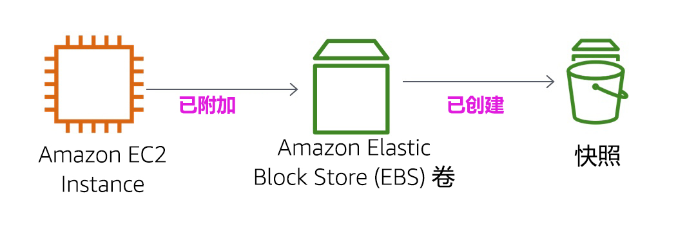

<header>

<link rel="stylesheet" href="https://use.fontawesome.com/releases/v5.5.0/css/all.css" integrity="sha384-B4dIYHKNBt8Bc12p+WXckhzcICo0wtJAoU8YZTY5qE0Id1GSseTk6S+L3BlXeVIU" crossorigin="anonymous">

<!-- Latest compiled and minified CSS -->
<link rel="stylesheet" href="https://maxcdn.bootstrapcdn.com/bootstrap/3.3.7/css/bootstrap.min.css" integrity="sha384-BVYiiSIFeK1dGmJRAkycuHAHRg32OmUcww7on3RYdg4Va+PmSTsz/K68vbdEjh4u" crossorigin="anonymous">

<!-- Optional theme -->
<link rel="stylesheet" href="https://maxcdn.bootstrapcdn.com/bootstrap/3.3.7/css/bootstrap-theme.min.css" integrity="sha384-rHyoN1iRsVXV4nD0JutlnGaslCJuC7uwjduW9SVrLvRYooPp2bWYgmgJQIXwl/Sp" crossorigin="anonymous">

<!-- Latest compiled and minified JavaScript -->
<script src="https://maxcdn.bootstrapcdn.com/bootstrap/3.3.7/js/bootstrap.min.js" integrity="sha384-Tc5IQib027qvyjSMfHjOMaLkfuWVxZxUPnCJA7l2mCWNIpG9mGCD8wGNIcPD7Txa" crossorigin="anonymous"></script>

</header>

<!--include:Logo-->

<style type="text/css">
  body {
      font-family:  "Roboto", "Helvetica", sans-serif;
      font-size: 12pt;
      font-color: Gray;
      line-height: 1.6;
      margin: 50px;
  }
  p {
      list-style-position: inside;
  }
  #ssb_blue {
    background-color: #257ACF;
    font-weight: bold;
    font-size: 90%;
    color: white;
    border-radius: 5px;
    padding-top: 3px;
    padding-bottom: 3px;
    padding-left: 10px;
    padding-right: 10px;
    white-space: nowrap;
  }
  #ssb_voc_grey {
    background-color: #F2F3F4;
    font-weight: normal;
    font-size: 90%;
    color: black;
    border-radius: 3px;
    border: 1px solid gray;
    padding-top: 5px;
    padding-bottom: 5px;
    padding-left: 6px;
    padding-right: 6px;
    white-space: nowrap;
  }
  #ssb_grey {
    background-color: #DEDEDE;
    font-weight: bold;
    font-size: 90%;
    color: #444;
    position: relative;
    top:-1px;
    border-radius: 5px;
    border-width: 1px;
    border-style: solid;
    border-color: #444;
    padding-top: 3px;
    padding-bottom: 3px;
    padding-left: 10px;
    padding-right: 10px;
    white-space: nowrap;
  }
  #ssl_alexa_ocean {
    color: #00a0d2;
    font-weight: bold;
  }
</style>

# 实验 4：使用 EBS

<!-- Note to translators: This is based on SPL-02. Copy the translation from there. Do not re-translate the whole document. -->

**版本 5.1.3 (spl2)**

## 实验概览



本实验着重介绍 Amazon Elastic Block Store (Amazon EBS)，这是一种适用于 Amazon EC2 实例的重要底层存储机制。在本实验中，您将学习如何创建 Amazon EBS 卷、将其附加到实例、向卷应用文件系统，然后进行快照备份。

## 涵盖的主题

本实验结束时，您将能够：

- 创建 Amazon EBS 卷
- 向 EC2 实例附加和挂载卷
- 创建卷的快照
- 从快照创建新卷
- 向 EC2 实例附加和挂载新卷

## 实验先决条件

要想成功完成本实验，您应熟悉有关使用 Amazon EC2 和管理 Linux 服务器的基础知识。您应能熟练使用 Linux 命令行工具。

### 其他 AWS 服务

在您访问本实验期间，IAM 策略将禁用本实验不需要的其他 AWS 服务。此外，本实验中只会使用所需的服务功能，并且在某些情况下，甚至会根据实验设计特意进一步限制这些功能。在访问其他服务或执行本实验指南中未提供的操作时，预计会出现错误。

### 什么是 Amazon Elastic Block Store？

**Amazon Elastic Block Store (Amazon EBS)** 为 Amazon EC2 实例提供持久性存储。Amazon EBS 卷是附加到网络的，其存续时间不受实例生命周期限制。Amazon EBS 卷是可用性和可靠性都非常高的存储卷，可用作 Amazon EC2 实例的启动分区，或作为标准块储存设备附加到正在运行的 Amazon EC2 实例。

当用作启动分区时，Amazon EC2 实例可在停止后重新启动，因此您可以仅为维护实例状态时使用的存储资源付费。Amazon EBS 卷比本地 Amazon EC2 实例存储的持久性要高得多，因为 Amazon EBS 会在后台自动复制（在单个可用区中）。

希望进一步提高持久性的客户可以使用 Amazon EBS 为卷创建一致性时间点快照，这些快照随后将存储在 Amazon Simple Storage Service (Amazon S3) 中，并在多个可用区中自动复制。这些快照可用作新 Amazon EBS 卷的起点，并能确保数据的长期持久性。您也可以与同事和其他 AWS 开发人员轻松分享这些快照。

本实验指南将逐步介绍 Amazon EBS 的基本概念，但只会进行简单的概述。有关更多信息，请参阅 <a href="http://aws.amazon.com/ebs/" target="_blank">Amazon EBS 文档</a>。

### Amazon EBS 卷的功能

Amazon EBS 卷提供以下功能：

- **持久性存储**：卷的生命周期与任何特定 Amazon EC2 实例无关。
- **一般用途**：Amazon EBS 卷是未格式化的原始块储存设备，可通过任何操作系统使用。
- **高性能**：Amazon EBS 卷相当于或优于本地 Amazon EC2 驱动器。
- **高可靠性**：Amazon EBS 卷在可用区内具有内建冗余性。
- **设计有弹性**：Amazon EBS 的年故障率 (AFR) 在 0.1% 到 1% 之间。
- **可变大小**：卷的大小范围在 1GB 到 16TB 之间。
- **易于使用**：Amazon EBS 卷可轻松创建、附加、备份、还原和删除。

**时长**
完成本实验大约需要 **30 分钟**。

## 访问 AWS 管理控制台

1. 在这些说明的顶部，单击 <span id="ssb_voc_grey">Start Lab</span>（启动实验）来启动您的实验。

   “Start Lab”（启动实验）面板随即会打开，其中显示了实验状态。

2. 请耐心等待，直到您看到“**Lab status: ready**”（实验状态：就绪）消息，然后单击 **X**，关闭“Start Lab”（启动实验）面板。

3. 在这些说明顶部，单击 <span id="ssb_voc_grey">AWS</span>

   在您执行此操作后，AWS 管理控制台将会在一个新的浏览器标签页中打开。您将自动登录系统。

   **提示**：如果未打开新的浏览器选项卡，则您的浏览器顶部通常会出现一个横幅或图标，表明您的浏览器阻止该网站打开弹出窗口。单击横幅或图标，然后选择“Allow pop ups”（允许弹出窗口）。

4. 排列 AWS 管理控制台选项卡，使其与这些说明一起显示。理想情况下，您将能够同时看到这两个浏览器选项卡，以便更轻松地执行实验步骤。

&nbsp;
&nbsp;
## 任务 1：创建新的 EBS 卷

在本任务中，您将创建 Amazon EBS 卷并将其附加到新的 Amazon EC2 实例。

5. 在 **AWS 管理控制台**的 **Services**（服务）菜单上，单击 **EC2**。

6. 在左侧导航窗格中，单击 **Instances**（实例）。

   已为实验启动名为 **Lab** 的 Amazon EC2 实例。

7. 注意实例的 **Availability Zone**（可用区）。该值类似于 *us-west-2a*。

8. 在左侧导航窗格中，单击 **Volumes**（卷）。

   您将看到 Amazon EC2 实例正在使用的现有卷。此卷的大小为 8GiB，这使其很容易与您接下来创建的卷（大小将为 1GiB）区分开来。

9. 单击 <span id="ssb_blue">Create Volume</span>（创建卷），然后进行以下配置：

   * **Volume Type**（卷类型）：*General Purpose SSD (gp2)*（通用型 SSD (gp2)）
   * **Size (GiB)**（大小 (GiB)）：`1`。**注意**：您可能无法创建大型卷。
   * **Availability Zone**（可用区）：选择您的 EC2 实例所在的可用区。
   * 单击 <span id="ssb_grey">Add Tag</span>（添加标签）
   * 在标签编辑器中，输入以下内容：
      * **Key**（键）：`Name`（名称）
      * **Value**（值）：`My Volume`（我的卷）

10. 单击 <span id="ssb_blue">Create Volume</span>（创建卷），然后单击 <span id="ssb_blue">Close</span>（关闭）

   您的新卷将显示在列表中，并且状态将从 *creating*（正在创建）变为 *available*（可用）。您可能需要单击 **refresh**（刷新）<span class="fas fa-sync"></span>才能看到您的新卷。

&nbsp;
&nbsp;
## 任务 2：将卷附加到实例

现在，您可以将新卷附加到 Amazon EC2 实例。

11. 选择 <i class="fas fa-square" style="color:blue"></i> **My Volume**（我的卷）。

12. 在 **Actions**（操作）菜单中，单击 **Attach Volume**（附加卷）。

13. 单击 **Instance**（实例）字段，然后选择显示的实例 (Lab)。

   请注意：**Device**（设备）字段已设置为 */dev/sdf*。您将在稍后的任务中使用此设备标识符。

14. 单击 <span id="ssb_blue">Attach</span>（附加）
   卷状态现在为 *in-use*（使用中）。

&nbsp;
&nbsp;
## 任务 3：连接到 Amazon EC2 实例

### <i class="fab fa-windows"></i> Windows 用户：使用 SSH 连接

<i class="fas fa-comment"></i> 这些说明只适用于 Windows 用户。

如果您使用的是 macOS 或 Linux，<a href="#ssh-MACLinux">请跳至下一部分</a>。

15. 在开始完成操作之前，请仔细阅读本步骤中的三个要点，因为当“Details”（详细信息）面板处于打开状态时，您将无法查看这些说明。

   * 单击您当前正在阅读的这些说明上方的 <span id="ssb_voc_grey">Details</span>（详细信息）下拉菜单，然后单击 <span id="ssb_voc_grey">Show</span>（显示）。此时将打开“Credentials”（凭证）窗口。

   * 单击 **Download PPK**（下载 PPK）按钮并保存 **labsuser.ppk** 文件。通常，浏览器会将其保存到“Downloads”（下载）目录。

   * 然后单击 **X**，退出“Details”（详细信息）面板。

16. 下载所需的软件。

   * 您将使用 **PuTTY** 通过 SSH 连接到 Amazon EC2 实例。如果您的计算机上没有安装 PuTTY， 请<a href="https://the.earth.li/~sgtatham/putty/latest/w64/putty.exe">在此处下载</a>。

17. 打开 **putty.exe**

18. 将 PuTTY 配置为不超时：

   * 单击 **Connection**（连接）
   * 将 **Seconds between keepalives**（keepalive 之间的秒数）设置为 `30`

   这样，您就可以保持 PuTTY 会话打开更长时间。

19. 配置 PuTTY 会话：

   * 单击 **Session**（会话）

   * **Host Name (or IP address)**（主机名（或 IP 地址））：复制并粘贴实例的 **IPv4 Public IP address**（IPv4 公有 IP 地址）。要查找该地址，请返回 EC2 控制台，然后单击 **Instances**（实例）。选中实例旁边的复选框，然后在 *Description*（描述）选项卡中复制 **IPv4 Public IP**（IPv4 公有 IP）值。

   * 返回 PuTTy，在 **Connection**（连接）列表中，展开 <i class="far fa-plus-square"></i> **SSH**

   * 单击 **Auth**（身份验证）（不要展开）

   * 单击 **Browse**（浏览）

   * 找到并选择已下载的 labsuser.ppk 文件

   * 单击 **Open**（打开）将其选中

   * 单击 **Open**（打开）

20. 单击 **Yes**（是）以信任主机并连接到该主机。

21. 在系统提示 **login as**（登录身份）时，输入 `ec2-user`

   执行此操作会将您连接到 EC2 实例。

22. <a href="#ssh-after">Windows 用户：单击此处向前跳至下一个任务。</a>

<a id='ssh-MACLinux'></a>
### macOS <i class="fab fa-apple"></i> 和 Linux <i class="fab fa-linux"></i> 用户

这些说明仅适用于 Mac/Linux 用户。如果您是 Windows 用户， <a href="#ssh-after">请向前跳至下一个任务。</a>

23. 在开始完成操作之前，请通读本步骤中的所有说明，因为当“Details”（详细信息）面板处于打开状态时，您将无法查看这些说明。

   * 单击您当前正在阅读的这些说明上方的 <span id="ssb_voc_grey">Details</span>（详细信息）下拉菜单，然后单击 <span id="ssb_voc_grey">Show</span>（显示）。此时将打开“Credentials”（凭证）窗口。

   * 单击 **Download**（下载）按钮并保存 **labsuser.pem** 文件。

   * 然后单击 **X**，退出“Details”（详细信息）面板。

24. 打开一个终端窗口，并将 `cd` 目录更改为下载的 labsuser.pem 文件所在的目录。

   例如，如果它被保存到您的“Downloads”（下载）目录，请运行以下命令：

   ```plain
   cd ~/Downloads
   ```

25. 通过运行以下命令，将密钥的权限更改为只读：

   ```plain
   chmod 400 labsuser.pem
   ```

26. 返回 AWS 管理控制台，并在 EC2 服务中单击 **Instances**（实例）。

   应选择 **Lab** 实例。

27. 在 *Description*（描述）选项卡中，复制 **IPv4 Public IP**（IPv4 公有 IP）值。

28. 返回终端窗口并运行以下命令（使用您复制的确切公有 IP 地址替换 **<public-ip\>**）：

   ```plain
   ssh -i labsuser.pem ec2-user@<public-ip>
   ```

29. 当系统提示允许首次连接此远程 SSH 服务器时，键入 `yes`（是）。

   由于您使用密钥对进行身份验证，因此系统不会提示您输入密码。

<a id='ssh-after'></a>


&nbsp;
&nbsp;
## 任务 4：创建并配置文件系统

在本任务中，您将在 /mnt/data-store 挂载点下将新卷作为 ext3 文件系统添加到 Linux 实例中。

<i class="fas fa-info-circle"></i> 如果您使用的是 PuTTY，则可以通过右键单击 PuTTY 窗口粘贴文本。

30. 查看实例上可用的存储：

   ```plain
   df -h
   ```

   您应该会看到类似于以下内容的输出结果：

   ```plain
   Filesystem      Size  Used Avail Use% Mounted on
   devtmpfs        488M   60K  488M   1% /dev
   tmpfs           497M     0  497M   0% /dev/shm
   /dev/xvda1      7.8G  982M  6.7G  13% /
   ```

   这显示的是原始 8GB 磁盘卷。新卷尚未显示。

31. 在新卷上创建 ext3 文件系统：

   ```plain
   sudo mkfs -t ext3 /dev/sdf
   ```

32. 创建目录以挂载新存储卷：

   ```plain
   sudo mkdir /mnt/data-store
   ```

33. 挂载新卷：

   ```plain
   sudo mount /dev/sdf /mnt/data-store
   ```

   要将 Linux 实例配置为在启动时挂载此卷，您需要在 */etc/fstab* 中增加一行。

   ```plain
   echo "/dev/sdf   /mnt/data-store ext3 defaults,noatime 1 2" | sudo tee -a /etc/fstab
   ```

34. 查看配置文件以了解最后一行的设置：

   ```plain
   cat /etc/fstab
   ```

35. 再次查看可用存储：

   ```plain
   df -h
   ```

   输出结果现在将额外包含一行 – */dev/xvdf*：

   ```plain
   Filesystem      Size  Used Avail Use% Mounted on
   devtmpfs        488M   60K  488M   1% /dev
   tmpfs           497M     0  497M   0% /dev/shm
   /dev/xvda1      7.8G  982M  6.7G  13% /
   /dev/xvdf       976M  1.3M  924M   1% /mnt/data-store
   ```

36. 在挂载的卷上，创建文件并向其添加一些文本。

   ```plain
   sudo sh -c "echo some text has been written > /mnt/data-store/file.txt"
   ```

37. 验证文本是否已写入卷中。

   ```plain
   cat /mnt/data-store/file.txt
   ```

&nbsp;
&nbsp;
## 任务 5：创建 Amazon EBS 快照

在本任务中，您将创建 EBS 卷的快照。

您可以通过 Amazon EBS 卷随时创建任意数量的一致性时间点快照。Amazon EBS 快照存储在 Amazon S3 中，具有高持久性。您可以通过快照创建新的 Amazon EBS 卷，用于克隆或还原备份。您还能在 AWS 用户之间轻松共享 Amazon EBS 快照，或在 AWS 区域之间复制快照。

38. 在 **AWS 管理控制台**中，单击 **Volumes**（卷）并选择 <i class="fas fa-square" style="color:blue"></i> **My Volume**（我的卷）。

39. 在 **Actions**（操作）菜单中，单击 **Create Snapshot**（创建快照）。

40. 单击 <span id="ssb_grey">Add Tag</span>（添加标签），然后进行以下配置：

   * **Key**（键）：`Name`（名称）
   * **Value**（值）：`My Snapshot`（我的快照）
   * 单击 <span id="ssb_blue">Create Snapshot</span>（创建快照），然后单击 <span id="ssb_blue">Close</span>（关闭）

   快照将显示在 **Snapshots**（快照）控制台中。

41. 在左侧导航窗格中，单击 **Snapshots**（快照）。

   此时将显示您的快照。状态最初是 *pending*（等待中），这意味着正在创建快照。然后，状态将变为 *completed*（已完成）。只有用过的存储块才会复制到快照，因此空存储块不会占用任何快照存储空间。

42. 在远程 SSH 会话中，删除在卷上创建的文件。

   ```plain
   sudo rm /mnt/data-store/file.txt
   ```

43. 验证文件是否已删除。

   ```plain
   ls /mnt/data-store/
   ```

   文件已删除。

&nbsp;
&nbsp;
## 任务 6：还原 Amazon EBS 快照

如果您想要检索存储在快照中的数据，可以将快照**还原**到新 EBS 卷。

### 使用快照创建卷

44. 在 **AWS 管理控制台**中，选择 <i class="fas fa-square" style="color:blue"></i> **My Snapshot**（我的快照）。

45. 在 **Actions**（操作）菜单中，单击 **Create Volume**（创建卷）。

46. 对于 **Availability Zone**（可用区），请选择您之前使用的可用区。

47. 单击 <span id="ssb_grey">Add Tag</span>（添加标签），然后进行以下配置：

   * **Key**（键）：`Name`（名称）
   * **Value**（值）：`Restored Volume`（还原的卷）
   * 单击 <span id="ssb_blue">Create Volume</span>（创建卷）
   * 单击 <span id="ssb_blue">Close</span>（关闭）

   将快照还原到新卷时，您还可以修改配置，如更改卷类型、大小或可用区。

### 将还原的卷附加到 EC2 实例

48. 在左侧导航窗格中，单击 **Volumes**（卷）。

49. 选择 <i class="fas fa-square" style="color:blue"></i> **Restored Volume**（还原的卷）。

50. 在 **Actions**（操作）菜单中，单击 **Attach Volume**（附加卷）。

51. 单击 **Instance**（实例）字段，然后选择显示的实例 (Lab)。

   请注意：**Device**（设备）字段已设置为 */dev/sdg*。您将在稍后的任务中使用此设备标识符。

52. 单击 <span id="ssb_blue">Attach</span>（附加）

   现在，卷的状态为 *in-use*（使用中）。

### 挂载还原的卷

53. 创建目录以挂载新存储卷：

   ```plain
   sudo mkdir /mnt/data-store2
   ```

54. 挂载新卷：

   ```plain
   sudo mount /dev/sdg /mnt/data-store2
   ```

55. 验证您挂载的卷是否有您之前创建的文件。

   ```plain
   ls /mnt/data-store2/
   ```

   您应该会看到 file.txt。

&nbsp;
&nbsp;
## 结论

<i class="far fa-thumbs-up" style="color:blue"></i> 祝贺您！现在，您已成功完成以下任务：

- 创建了 Amazon EBS 卷
- 将卷附加到 EC2 实例
- 在卷上创建文件系统
- 将文件添加到卷
- 创建卷的快照
- 从快照创建新卷
- 向 EC2 实例附加和挂载新卷
- 验证您之前创建的文件是否位于新创建的卷上

## 实验完成

<i class="icon-flag-checkered"></i> 祝贺您！您已完成本实验。

56. 单击此页面顶部的 <span id="ssb_voc_grey">End Lab</span>（结束实验），然后单击 <span id="ssb_blue">Yes</span>（是）确认您要结束实验。  

   此时将显示一个面板，指示“DELETE has been initiated...You may close this message box now.”（删除操作已启动...您现在可以关闭此消息框。）

57. 单击右上角的 **X**，关闭面板。

## 其他资源

<a href="http://aws.amazon.com/ebs/" target="_blank">Amazon Elastic Block Store 的功能和定价</a>

<a href="http://aws.amazon.com/training/" target="_blank">AWS Training and Certification</a>

如有反馈、建议或更正意见，请发送电子邮件至：<aws-course-feedback@amazon.com>
