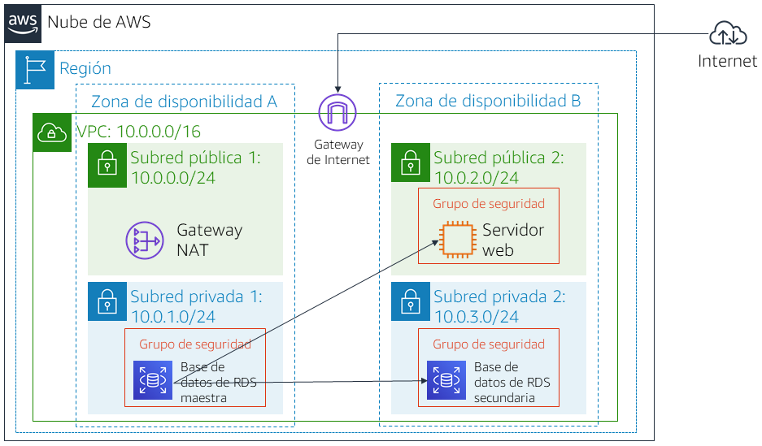

# Laboratorio 5: Creación de un servidor de base de datos e interacción con la base de datos a través de una aplicación

<!-- Note to translators: This is based on Technical Essentials Lab 2. Copy the translation from there. Do not re-translate the whole document. -->

&nbsp;&nbsp;

**Versión 4.6.6 (TESS2)**

Este laboratorio se diseñó para reforzar la noción de aprovechar las instancias de base de datos administradas por AWS para satisfacer las necesidades de bases de datos relacionales.

***Amazon Relational Database Service*** (Amazon RDS) facilita las tareas de configuración, operación y escalado de una base de datos relacional en la nube. Proporciona una capacidad rentable y de tamaño modificable, al mismo tiempo que permite gestionar las tareas de administración de base de datos que requieren mucho tiempo, lo que permite centrarse en las aplicaciones y el negocio. Amazon RDS le ofrece seis motores de base de datos familiares entre los que elegir: Amazon Aurora, Oracle, Microsoft SQL Server, PostgreSQL, MySQL y MariaDB.

&nbsp;

**Objetivos**

Después de completar este laboratorio, podrá hacer lo siguiente:

- Lanzar una instancia de base de datos de Amazon RDS con alta disponibilidad
- Configurar la instancia de base de datos para permitir conexiones desde su servidor web
- Abrir una aplicación web e interactuar con su base de datos

&nbsp;

**Duración**

La duración estimada de este laboratorio es de **30 minutos** aproximadamente.

&nbsp;

**Situación**

Comenzará con la siguiente infraestructura:

&nbsp;&nbsp;

Al final del laboratorio, la infraestructura será la siguiente:

&nbsp;

&nbsp;&nbsp;
___
## Acceso a la consola de administración de AWS

1. En la parte superior de estas instrucciones, haga clic en Start Lab (Iniciar laboratorio) para lanzar su laboratorio.

   Se abrirá el panel “Start Lab” (Iniciar laboratorio), donde se muestra el estado del laboratorio.

2. Espere hasta que aparezca el mensaje “**Lab status: ready**” (Estado del laboratorio: listo) y, luego, haga clic en la **X** para cerrar el panel “Start Lab (Iniciar laboratorio)”.

3. En la parte superior de estas instrucciones, haga clic en AWS.

   La consola de administración de AWS se abrirá en una nueva pestaña del navegador. El sistema iniciará su sesión automáticamente.

   **Sugerencia**: Si no se abre una pestaña nueva del navegador, debería aparecer un banner o un icono en la parte superior de este, el cual indique que el navegador no permite que se abran ventanas emergentes en el sitio. Haga clic en el banner o en el icono, y elija “Allow pop ups” (Permitir ventanas emergentes).

4. Ubique la pestaña de la consola de administración de AWS en un lugar donde aparezca al lado de estas instrucciones. Se abrirá el panel “Start Lab” (Iniciar laboratorio), donde se muestra el estado del laboratorio.

&nbsp;
___
## Tarea 1: crear un grupo de seguridad para la instancia de base de datos de RDS

En esta tarea, creará un grupo de seguridad para permitir que su servidor web acceda a la instancia de base de datos de RDS. El grupo de seguridad se utilizará al lanzar la instancia de base de datos.

5. En la **consola de administración de AWS**, encontrará el menú Services (Servicios), <i class="fas fa-angle-down"></i> donde debe hacer clic en **VPC**.

6. En el panel de navegación izquierdo, haga clic en **Security Groups** (Grupos de seguridad).

7. Haga clic en Create security group (Crear grupo de seguridad) y, a continuación, configure lo siguiente:

   - **Security group name** (Nombre del grupo de seguridad): `DB Security Group` (Grupo de seguridad de base de datos)
   - **Description (Descripción):** `Permit access from Web Security Group (Permitir el acceso desde el grupo de seguridad web)`
   - **VPC:** _VPC de laboratorio_

   Ahora, agregará una regla al grupo de seguridad para permitir las solicitudes de base de datos entrantes.

8. En el panel **Inbound rules** (Reglas de entrada), seleccione Add rule (Agregar regla)

   Actualmente, el grupo de seguridad no tiene reglas. Agregará una regla para permitir el acceso desde el _grupo de seguridad web_.

9. Configure los siguientes ajustes:

   - **Type** (Tipo): _MySQL/Aurora (3306)_
   - **CIDR, IP, Security Group or Prefix List** (CIDR, IP, grupo de seguridad o lista de prefijos): escriba `sg` y luego seleccione _Web Security Group (Grupo de seguridad web)_.

   Así se configura el grupo de seguridad de base de datos para permitir el tráfico entrante en el puerto 3306 desde cualquier instancia EC2 asociada al _Grupo de seguridad web_.

10. Elija Create security group (Crear grupo de seguridad)

   Utilizará este grupo de seguridad al lanzar la base de datos de Amazon RDS.

&nbsp;
___
## Tarea 2: crear un grupo de subredes de base de datos

En esta tarea, creará un _grupo de subredes de base de datos_ que se emplea a fin de informar a RDS acerca de qué subredes se pueden utilizar para la base de datos. Cada grupo de subredes de base de datos requiere subredes en al menos dos zonas de disponibilidad.

11. En el menú Servicios<i class="fas fa-angle-down"></i>, haga clic en **RDS**.

12. En el panel de navegación izquierdo, haga clic en **Grupos de subredes**.

   <i class="fas fa-exclamation-triangle"></i> Si el panel de navegación no está visible, haga clic en el icono del menú <i class="fas fa-bars"></i> en la esquina superior izquierda.

13. Haga clic en Create DB Subnet Group (Crear grupo de subredes de base de datos) y, a continuación, configure lo siguiente:

   - **Nombre:** `grupo de subredes de base de datos`
   - **Descripción: ** `grupo de subredes de base de datos`
   - **VPC:** _VPC de laboratorio_

14. Desplácese hacia abajo hasta la sección **Agregar subredes**.

15. Expanda la lista de valores en **Zonas de disponibilidad** y seleccione las dos primeras zonas: **us-east-1a** y **us-east-1b**.

16. Expanda la lista de valores en **Subredes** y seleccione las que están asociadas con los rangos de CIDR **10.0.1.0/24** y **10.0.3.0/24**.

   Estas subredes deberían mostrarse ahora en la tabla de **subredes seleccionadas**.

17. Haga clic en Create (Crear)

   Utilizará este grupo de subredes de base de datos en la creación de la base de datos de la siguiente tarea.

&nbsp;
___
## Tarea 3: crear una instancia de base de datos de Amazon RDS

En esta tarea, deberá configurar y lanzar una instancia de base de datos Multi-AZ de Amazon RDS for MySQL.

Las implementaciones ***Multi-AZ*** de Amazon RDS proporcionan mejoras en la disponibilidad y la durabilidad de las instancias de base de datos, lo que las hace adecuadas para las cargas de trabajo de bases de datos de producción. Cuando aprovisiona una instancia Multi-AZ de base de datos, Amazon RDS crea automáticamente una instancia de base de datos principal y, de forma sincronizada, replica los datos a una instancia en espera en una zona de disponibilidad diferente.

18. En el panel de navegación de la izquierda, haga clic en **Databases** (Bases de datos).

19. Haga clic en Create database (Crear base de datos).

   <i class="fas fa-exclamation-triangle"></i> Si ve el mensaje **Switch to the new database creation flow** (Cambiar al nuevo flujo de creación de bases de datos) en la parte superior de la pantalla, haga clic en él.

20. Seleccione <i class="far fa-dot-circle"></i> **MySQL**.

21. En **Settings** (Configuración), configure lo siguiente:

   - **DB instance identifier** (Identificador de instancias de bases de datos): `lab-db`
   - **Master username** (Nombre de usuario maestro): `main` (principal)
   - **Master password** (Contraseña maestra): `lab-password`
   - **Confirm password** (Confirmar contraseña): `lab-password`

22. En **DB instance size** (Tamaño de la instancia de base de datos), configure lo siguiente:

   - Seleccione <i class="far fa-dot-circle"></i> **Burstable classes** (includes t classes) (Clases ampliables [incluye las clases t]).
   - Seleccione _db.t3.micro_

23. En **Storage** (Almacenamiento), configure lo siguiente:

   - **Storage type** (Tipo de almacenamiento): _General Purpose (SSD)_ (Uso general [SSD])
   - **Allocated storage (Almacenamiento asignado):** _20_

24. En **Connectivity** (Conectividad), configure lo siguiente:

   - **Virtual Private Cloud (VPC):** _Lab VPC_

25. En **Grupos de seguridad de VPC existentes**, en la lista desplegable:

   - Elegir _grupos de seguridad de base de datos_.
   - Anule la selección _predeterminada_.

26. Ampliar <i class="fas fa-caret-right"></i> **Additional configuration** (Configuración adicional) y, a continuación, configure lo siguiente:

   - **Initial database name:** (Nombre de base de datos inicial): `lab`
   - Desactive **Enable automatic backups** (Habilitar copias de seguridad automáticas).
   - Desactive **Enable Enhanced monitoring** (Habilitar monitoreo mejorado).

   <i class="fas fa-comment"></i> Esto desactivará las copias de seguridad, lo que no suele recomendarse, pero permitirá una implementación más rápida de la base de datos para este laboratorio.

27. Haga clic en Create database (Crear base de datos).

   Ahora se lanzará la base de datos.

   <i class="fas fa-comment"></i> Si recibe un error con el mensaje “not authorized to perform: iam:CreateRole” (No cuenta con la autorización para realizar la acción iam:CreateRole), asegúrese de haber desactivado _Enable Enhanced monitoring_ (Habilitar monitoreo mejorado) en el paso anterior.

28. Haga clic en **lab-db** (haga clic en el propio enlace).

   Espere **aproximadamente 4 minutos** para que se habilite la disponibilidad de la base de datos. El proceso de implementación implica la implementación de una base de datos en dos zonas de disponibilidad diferentes.

   <i class="fas fa-info-circle"></i> Mientras espera, debería revisar las [Preguntas frecuentes sobre Amazon RDS](https://aws.amazon.com/rds/faqs/) o bien, tomar un café.

29. Espere hasta que **Info** (Información) cambie por **Modifying** (Modificando) o **Available** (Disponible).

30. Desplácese hacia abajo hasta la sección **Connectivity & security** (Conectividad y seguridad) y copie el campo **Endpoint** (Punto de enlace).

   Se verá similar a lo siguiente: _lab-db.cggq8lhnxvnv.us-west-2.rds.amazonaws.com_

31. Pegue el valor de “Endpoint” (Punto de enlace) en un editor de texto. Lo utilizará posteriormente en el laboratorio.

&nbsp;
___
## Tarea 4: interactuar con la base de datos

En esta tarea, abrirá una aplicación web que se ejecuta en el servidor web y la configurará para utilizar la base de datos.

32. Para copiar la dirección IP del **servidor web**, haga clic en el menú desplegable Details (Detalles) que se encuentra en la parte superior de estas instrucciones y, a continuación, haga clic en Show (Mostrar).

33. Abra una pestaña del navegador web nueva, pegue la dirección IP del _servidor web_ y presione “Enter” (Intro).

   Se visualizará la aplicación web, que mostrará información acerca de la instancia EC2.

34. Haga clic en el enlace de **RDS** situado en la parte superior de la página.

   Ahora, configurará la aplicación para que se conecte a la base de datos.

35. Configure los siguientes ajustes:

   - **Endpoint** (Punto de enlace): pegue el punto de enlace que copió anteriormente en un editor de texto.
   - **Database (Base de datos):** `lab`
   - **Username (Nombre de usuario):** `main`
   - **Password (Contraseña):** `lab-password`
   - Haga clic en **Submit** (Enviar).

   Se visualizará un mensaje en el cual se explica que la aplicación está ejecutando un comando para copiar información en la base de datos. Después de algunos segundos, verá una **libreta de direcciones** en la aplicación.

   La aplicación de la libreta de direcciones utiliza la base de datos de RDS para almacenar información.

36. Agregue, edite y elimine contactos para probar la aplicación web.

   Los datos se conservan en la base de datos y se replican automáticamente en la segunda zona de disponibilidad.

&nbsp;
___
## Fin del laboratorio

<i class="icon-flag-checkered"></i> ¡Felicitaciones! Ha completado el laboratorio.

37. Haga clic en End Lab (Finalizar laboratorio) en la parte superior de esta página y, a continuación, en Yes (Sí) para confirmar que desea finalizar el laboratorio.

   Aparecerá un panel en el que se indica: “DELETE has been initiated… You may close this message box now”. (Se ha iniciado la ELIMINACIÓN… Ya puede cerrar este cuadro de mensajes).

38. Haga clic en la **X** de la esquina superior derecha para cerrar el panel.

Envíenos sus comentarios, sugerencias o correcciones por email a *aws-course-feedback@amazon.com*

&nbsp;
___
### Atribuciones

**Arranque v3.3.5 - [http://getbootstrap.com](http://getbootstrap.com "http://getbootstrap.com**/")

La licencia de MIT

Copyright (c) 2011-2016 Twitter, Inc.

Mediante este documento se concede permiso, libre de cargos, a cualquier persona que obtenga una copia de este software y sus archivos de documentación asociados (el “Software”) para utilizar el Software sin ningún tipo de restricción, incluidos sin limitación los derecho de uso, copia, modificación, combinación, publicación, distribución, obtención de sublicencias o venta de copias del Software, así como autorizar a ello a quienes va dirigido el Software, sujetos a las siguientes condiciones:

El anterior aviso de copyright y este permiso se deberán incluir en todas las copias o en partes considerables del Software.

EL SOFTWARE SE SUMINISTRA “TAL CUAL”, SIN GARANTÍAS DE NINGÚN TIPO, NI EXPLÍCITAS NI IMPLÍCITAS, INCLUIDAS, ENTRE OTRAS, LAS GARANTÍAS DE COMERCIABILIDAD, ADECUACIÓN A UN FIN ESPECÍFICO Y NO INCUMPLIMIENTO. NI LOS AUTORES NI LOS TITULARES DEL COPYRIGHT SE HARÁN RESPONSABLES EN NINGÚN MOMENTO DE RECLAMACIONES, DAÑOS O CUALQUIER OTRA OBLIGACIÓN, YA SEA EN UNA ACCIÓN CONTRACTUAL, FRAUDULENTA O CUALQUIER OTRA, QUE PROVENGA DE, FUERA DE O EN CONEXIÓN CON EL SOFTWARE O EL USO DE ESTE U OTROS TRATOS EN EL SOFTWARE.
