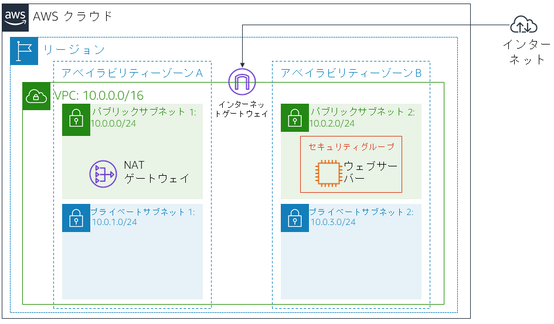
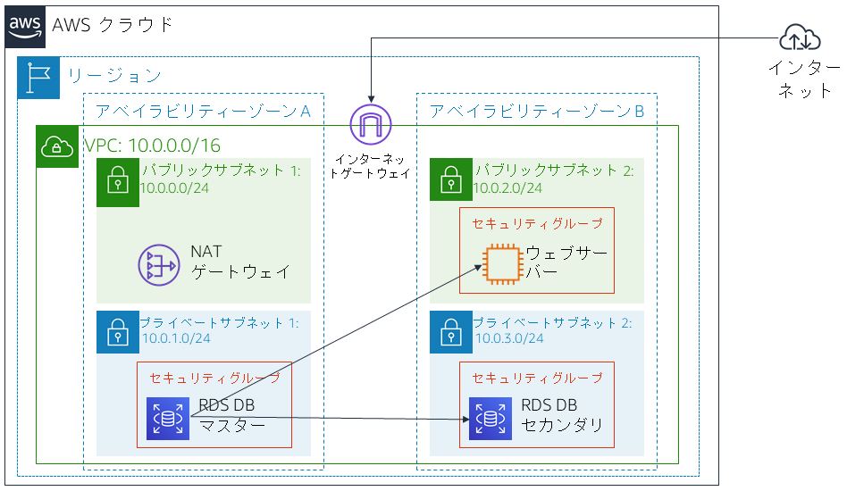

# ラボ 5: データベースサーバーを構築し、アプリケーションを使用してデータベースを操作する

<!-- Note to translators: This is based on Technical Essentials Lab 2. Copy the translation from there. Do not re-translate the whole document. -->

&nbsp;&nbsp;

**バージョン 4.6.6 (TESS2)**

このラボは、リレーショナルデータベースのニーズを満たすために、AWS マネージドデータベースインスタンスを活用するという概念を補強するために作成されました。

***Amazon Relational Database Service*** (Amazon RDS) を使用すると、クラウド内でリレーショナルデータベースを簡単にセットアップ、運用、スケールできます。Amazon RDS では、コスト効率に優れたキャパシティーを自由にサイズ変更しながら利用できます。また、時間のかかるデータベース管理タスクが自動で実行されるため、ユーザーはアプリケーションやビジネスに専念できるようになります。Amazon RDS では、Amazon Aurora、Oracle、Microsoft SQL Server、PostgreSQL、MySQL、MariaDB の 6 種類の一般的なデータベースエンジンから選択して利用できます。

&nbsp;

**目標**

このラボを完了すると、以下のことができるようになります。

- 高可用性の Amazon RDS DB インスタンスを作成する
- データベースインスタンスを設定して、ウェブサーバーからの接続を許可する
- ウェブアプリケーションを開いて、データベースを操作する

&nbsp;

**所要時間**

このラボは、完了までにおよそ** 30 分**かかります。

&nbsp;

**シナリオ**

ラボの開始時点では、インフラストラクチャが以下の状態になっています。

&nbsp;&nbsp;

ラボが終了した時点で、インフラストラクチャは以下の状態になります。

&nbsp;

&nbsp;&nbsp;
___
## AWS マネジメントコンソールにアクセスする

1. この手順の上部にある Start Lab ラボを開始 をクリックして、ラボを起動します。

   [**Start Lab**] パネルが開き、ラボのステータスが表示されます。

2. **Lab status: ready** というメッセージが表示されるまで待ち、[**X**] をクリックして [**Start Lab**] パネルを閉じます。

3. この手順の上部にある AWS をクリックします。

   新しいブラウザタブで AWS マネジメントコンソールが開きます。システムによって自動的にログインします。

   **ヒント**: 新しいブラウザタブが開かない場合、通常、ブラウザによってサイトのポップアップウィンドウの表示がブロックされたことを示すバナーまたはアイコンがブラウザの上部に表示されます。バナーまたはアイコンをクリックし、[**ポップアップを許可**] をクリックします。

4. AWS マネジメントコンソールのタブをこの手順の横に配置します。ラボのステップを簡単に参照できるように、両方のブラウザタブを同時に表示することをお勧めします。

&nbsp;
___
## タスク 1: RDS DB インスタンスのセキュリティグループを作成する

このタスクでは、ウェブサーバーから RDS DB インスタンスにアクセスできるようにセキュリティグループを作成します。セキュリティグループは、データベースインスタンスを起動するときに使用します。

5. **AWS マネジメントコンソール**の サービス <i class="fas fa-angle-down"></i> メニューから [**VPC**] をクリックします。

6. 左側のナビゲーションペインで [**セキュリティグループ**] をクリックします。

7. セキュリティグループを作成 をクリックし、以下のように設定します。

   - **セキュリティグループ名:** `DB Security Group`
   - **説明:** `Permit access from Web Security Group`
   - **VPC:** **Lab VPC**

   次に、インバウンドデータベースリクエストを許可するルールをセキュリティグループに追加します。

8. \[**インバウンドルール**] ペインで ルールを追加 をクリックします

   現在、このセキュリティグループにはルールがありません。**Web Security Group** からのアクセスを許可するルールを追加します。

9. 以下のように設定します。

   - **タイプ:** **MYSQL/Aurora**
   - **ソース:** `sg` と入力して **Web Security Group** を選択

   **Web Security Group** に関連付けられている EC2 インスタンスからのインバウンドトラフィックをポート 3306 で許可するデータベースセキュリティグループが設定されます。

10. セキュリティグループを作成 をクリックします。

   このセキュリティグループは、Amazon RDS データベースを作成するときに使用します。

&nbsp;
___
## タスク 2: DB サブネットグループを作成する

このタスクでは、**DB サブネットグループ**を作成して、RDS のデータベースで使用できるサブネットを指定します。各 DB サブネットグループには、2 つ以上のアベイラビリティーゾーンにサブネットが必要です。

11. サービス <i class="fas fa-angle-down"></i> で [**RDS**] をクリックします。

12. ナビゲーションペインで [**サブネットグループ**] をクリックします。

   <i class="fas fa-exclamation-triangle"></i>ナビゲーションペインが表示されていない場合は、左上隅の<i class="fas fa-bars"></i> **メニュー** アイコンをクリックします。

13. DB サブネットグループを作成 をクリックし、以下のように設定します。

   - **名前:** `DB-Subnet-Group`
   - **説明:** `DB Subnet Group`
   - **VPC:** **Lab VPC**

14. \[**サブネットを追加**] のセクションまで下方向にスクロールします。

15. \[**アベイラビリティーゾーン**] ドロップダウンの一覧から最初の 2 つのゾーン (**us-east-1a** と **us-east-1b**) を選択します。

16. \[**サブネット**] ドロップダウンの一覧から **10.0.1.0/24** および **10.0.3.0/24** の CIDR 範囲に関連付けられているサブネットを選択します。

   これで、これらのサブネットが [**選択したサブネット**] の表に表示されます。

17. 作成 をクリックします。

   この DB サブネットグループは、次のタスクでデータベースを作成するときに使用します。

&nbsp;
___
## タスク 3: Amazon RDS DB インスタンスを作成する

このタスクでは、マルチ AZ の Amazon RDS for MySQL データベースインスタンスを設定し、起動します。

Amazon RDS の***マルチ AZ*** 配置を使用すると、データベース (DB) インスタンスの可用性と耐久性が向上します。これにより、DB インスタンスをプロダクションデータベースのワークロードに無理なく適合させることができます。マルチ AZ DB インスタンスをプロビジョニングすると、Amazon RDS はプライマリ DB インスタンスを自動的に作成すると同時に、異なるアベイラビリティーゾーン (AZ) にあるスタンバイインスタンスにデータをレプリケートします。

18. 左側のナビゲーションペインで [**データベース**] をクリックします。

19. データベースの作成 をクリックします。

   <i class="fas fa-exclamation-triangle"></i> 画面上部に [**Switch to the new database creation flow **] が表示された場合、それをクリックしてください。

20. <i class="far fa-dot-circle"></i> **MySQL** をクリックします。

21. \[**設定**] で以下のように設定します。

   - **DB インスタンス識別子:** `lab-db`
   - **マスターユーザー名:** `main`
   - **マスターパスワード:** `lab-password`
   - **パスワードを確認:** `lab-password`

22. \[**DB インスタンスサイズ**] で以下のように設定します。

   - <i class="far fa-dot-circle"></i> **バースト可能クラス (t クラウスを含む)** を選択
   - **db.t3.micro** を選択

23. \[**ストレージ**] で以下のように設定します。

   - **ストレージタイプ:** **汎用 (SSD)**
   - **ストレージ割り当て:** **20**

24. \[**接続**] で以下のように設定します。

   - **Virtual Private Cloud (VPC):** **Lab VPC**

25. \[**既存の VPC セキュリティグループ**] で、ドロップダウンの一覧から以下を選択します。

   - **DB Security Group (DB セキュリティグループ)**
   - **default** を削除

26. <i class="fas fa-caret-right"></i> **追加設定** を展開し、以下のように設定します。

   - **最初のデータベース名:** `lab`
   - [**自動バックアップの有効化**] チェックボックスをオフ
   - [**拡張モニタリングの有効化**] チェックボックスをオフ

   <i class="fas fa-comment"></i>これにより、バックアップがオフになります。通常は推奨されませんが、このラボではデータベースを迅速にデプロイするためこのオプションを選択します。

27. データベースの作成 をクリックします。

   これでデータベースが作成されます。

   <i class="fas fa-comment"></i>「not authorized to perform: iam:CreateRole」というエラーが表示された場合は、前のステップで [**拡張モニタリングの有効化**] チェックボックスがオフになっていることを確認します。

28. **lab-db** をクリックします (リンク自体をクリックします)。

   **4 分ほど**待つと、データベースが利用可能になります。デプロイプロセスでは、2 つの異なるアベイラビリティーゾーンにデータベースがデプロイされます。

   <i class="fas fa-info-circle"></i>データベースが利用可能になるまでの間、[Amazon RDS のよくある質問](https://aws.amazon.com/rds/faqs/)をご覧いただくか、コーヒーでも飲みながらお待ちください。

29. \[**ステータス**] が [**変更中**] または [**利用可能**] に変わるまで待ちます。

30. \[**接続とセキュリティ**] セクションまでスクロールし、[**エンドポイント**] フィールドの値をコピーします。

   この値は **lab-db.cggq8lhnxvnv.us-west-2.rds.amazonaws.com** のような形式で表示されます。

31. エンドポイントの値をテキストエディタに貼り付けます。この値はラボで後ほど使用します。

&nbsp;
___
## タスク 4: データベースを操作する

このタスクでは、ウェブサーバーで実行されているウェブアプリケーションを開き、データベースを使用するように設定します。

32. **WebServer** の IP アドレスをコピーするため、この手順の上にある Details をクリックして Show をクリックします。

33. ウェブブラウザで新しいタブを開き、コピーした**WebServer** の IP アドレスを貼り付けて **Enter** キーを押します。

   ウェブアプリケーションが開き、EC2 インスタンスに関する情報が表示されます。

34. ページの上部に表示されている [**RDS**] リンクをクリックします。

   次に、データベースに接続するようアプリケーションを設定します。

35. 以下のように設定します。

   - **Endpoint:** 先ほどテキストエディタにコピーしたエンドポイントの値を貼り付ける
   - **Database:** `lab`
   - **Username:** `main`
   - **Password:** `lab-password`
   - [**Submit**] をクリック

   アプリケーションで、情報をデータベースにコピーするコマンドが実行されていることを示すメッセージが表示されます。数秒後、アプリケーションに**アドレス帳**が表示されます。

   このアドレス帳アプリケーションでは、情報の保存に RDS データベースを使用しています。

36. 連絡先の追加、編集、削除を行ってウェブアプリケーションをテストします。

   データがデータベースに保管され、2 番目のアベイラビリティーゾーンに自動的にレプリケートされます。

&nbsp;
___
## ラボの終了

<i class="icon-flag-checkered"></i>お疲れ様でした。これでラボが完了しました。

37. ラボの終了を確認するには、このページの上部にある End Lab をクリックし、Yes をクリックします。

   パネルが表示され、**DELETE has initiated...You may close this message box now.** というメッセージが表示されます。

38. 右上隅の [**X**] をクリックしてパネルを閉じます。

フィードバック、ご提案、修正については、*aws-course-feedback@amazon.com* まで E メールにてご連絡ください。

&nbsp;
___
### 出典

**Bootstrap v3.3.5 - [http://getbootstrap.com](http://getbootstrap.com "http://getbootstrap.com")/**

MIT License (MIT)

Copyright (c) 2011-2016 Twitter, Inc.

本ソフトウェアおよび関連ドキュメントのファイル（以下「ソフトウェア」）のコピーを取得するすべての人に対し、ソフトウェアを無制限に扱うことを無償で許可します。これには、本ソフトウェアの複製を使用、コピー、変更、結合、掲載、配布、サブライセンス、販売する権利、およびソフトウェアを提供する相手に同じことを許可する権利も含まれます。ただし、

前記の著作権表示および本許諾表示を、本ソフトウェアのすべてのコピーまたは重要な部分に記載することを条件とします。

本ソフトウェアは「現状有姿」で提供され、明示または黙示を問わず、商品性、特定目的への適合性、非侵害性の保証を含む、いかなる種類の保証も伴いません。本ソフトウェアの使用またはその他の取り扱いによって、あるいはこれに関連して生じたいかなる要求、損害、またはその他の法的責任については、契約や不法行為などのいかなる場合においても、著者または著作権所有者はその責任を負いません。
