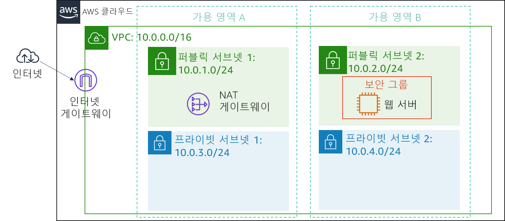
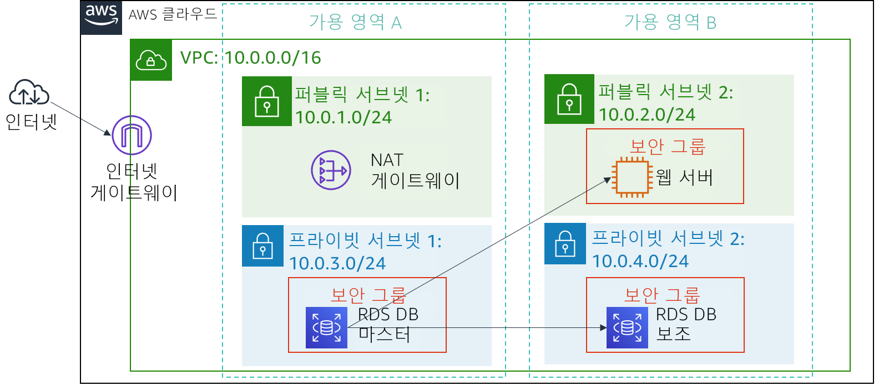

# 실습 5: 앱을 사용하여 DB 서버 구축 및 DB와 상호 작용

<!-- Note to translators: This is based on Technical Essentials Lab 2. Copy the translation from there. Do not re-translate the whole document. -->

&nbsp;&nbsp;

**버전 4.6.6(TESS2)**

이 실습은 AWS 관리형 데이터베이스 인스턴스를 활용하여 관계형 데이터베이스 요구 사항을 해결하는 개념을 보강하도록 설계되었습니다.

***Amazon Relational Database Service***(Amazon RDS)를 사용하면 클라우드에서 관계형 데이터베이스를 더욱 간편하게 설정, 운영 및 확장할 수 있습니다. 시간 소모적인 데이터베이스 관리 작업을 관리하는 한편, 효율적인 비용으로 크기 조정이 가능한 용량을 제공하므로 고객은 애플리케이션과 비즈니스에 집중할 수 있습니다. Amazon RDS에서는 Amazon Aurora, Oracle, Microsoft SQL Server, PostgreSQL, MySQL, MariaDB와 같은 익숙한 6개 데이터베이스 엔진 중에서 선택할 수 있습니다.

&nbsp;

**목표**

본 실습을 완료하면 다음을 할 수 있습니다.

- 고가용성을 갖춘 Amazon RDS DB 인스턴스 시작
- 웹 서버의 연결을 허용하도록 DB 인스턴스 구성
- 웹 애플리케이션을 열고 데이터베이스와 상호 작용

&nbsp;

**소요 시간**

이 실습은 완료까지 약 **30분**이 소요됩니다.

&nbsp;

**시나리오**

다음 인프라로 시작합니다.

&nbsp;&nbsp;

이 실습을 마친 후 인프라는 다음과 같습니다.

&nbsp;

&nbsp;&nbsp;
___
## AWS Management Console 액세스

1. 지침의 맨 위에서 Start Lab을 클릭하여 실습을 시작합니다.

   Start Lab 패널이 열리고 실습 상태가 표시됩니다.

2. “**Lab status: ready**” 메시지가 표시되면 **X**를 클릭하여 Start Lab 패널을 닫습니다.

3. 지침의 맨 위에서 AWS를 클릭합니다.

   그러면 새 브라우저 탭에서 AWS Management Console이 열립니다. 시스템에서 자동으로 로그인합니다.

   **팁**: 새 브라우저 탭이 열리지 않는 경우 일반적으로 브라우저에서 팝업 창을 열 수 없음을 나타내는 배너 또는 아이콘이 브라우저 상단에 표시됩니다. 배너 또는 아이콘을 클릭하고 Allow pop ups를 선택합니다.

4. 이러한 지침이 나란히 표시되도록 AWS Management Console 탭을 정렬합니다. 두 브라우저 탭이 동시에 표시되어 실습 단계를 보다 쉽게 수행할 수 있게 됩니다.

&nbsp;
___
## 과제 1: RDS DB 인스턴스에 대한 보안 그룹 생성

이 과제에서는 RDS DB 인스턴스에 대한 웹 서버 액세스를 허용하는 보안 그룹을 생성합니다. 이 보안 그룹은 데이터베이스 인스턴스를 시작할 때 사용됩니다.

5. **AWS Management Console**의 Services <i class="fas fa-angle-down"></i> 메뉴에서 **VPC**를 클릭합니다.

6. 왼쪽 탐색 창에서 **Security Groups**을 클릭합니다.

7. Create security group을 클릭하고 다음을 구성합니다.

   - **Security group name**: `DB Security Group`
   - **Description**: `Permit access from Web Security Group`
   - **VPC**: _Lab VPC_

   이제 보안 그룹에 인바운드 데이터베이스 요청을 허용하는 규칙을 추가합니다.

8. **Inbound rules** 창에서 Add rule을 선택합니다.

   현재 보안 그룹에는 규칙이 없습니다. _Web Security Group_의 액세스를 허용하는 규칙을 추가합니다.

9. 다음 설정을 구성합니다.

   - **Type**: _MySQL/Aurora (3306)_
   - **CIDR, IP, Security Group or Prefix List**: `sg`를 입력하고 _Web Security Group_을 선택합니다.

   _Web Security Group_에 연결된 모든 EC2 인스턴스의 포트 3306 기반 인바운드 트래픽을 허용하는 데이터베이스 보안 그룹이 구성됩니다.

10. Create security group을 선택합니다.

   Amazon RDS 데이터베이스를 시작할 때 이 보안 그룹을 사용합니다.

&nbsp;
___
## 과제 2: DB 서브넷 그룹 생성

이 과제에서는 데이터베이스에 사용할 수 있는 서브넷을 RDS에 알리는 데 사용되는 _DB 서브넷 그룹_을 생성합니다. 각 DB 서브넷 그룹의 서브넷은 2개 이상의 가용 영역에 있어야 합니다.

11. Services <i class="fas fa-angle-down"></i> 메뉴에서 **RDS**를 클릭합니다.

12. 왼쪽 탐색 창에서 [**서브넷 그룹**]을 클릭합니다.

   <i class="fas fa-exclamation-triangle"></i> 탐색 창이 보이지 않으면 왼쪽 상단의 <i class="fas fa-bars"></i> 메뉴 아이콘을 클릭합니다.

13. [DB 서브넷 그룹 생성]을 클릭하고 다음을 구성합니다.

   - **이름:** `DB-Subnet-Group`
   - **설명:** `DB 서브넷 그룹`
   - **VPC:** _Lab VPC_

14. [**서브넷 추가**] 섹션까지 아래로 스크롤합니다.

15. [**가용 영역**] 아래에서 값 목록을 확장하고 처음 두 개 영역인 [**us-east-1a**]와 [**us-east-1b**]를 선택합니다.

16. [**서브넷**] 아래에서 값 목록을 확장하고 CIDR 범위 **10.0.1.0/24** 및 **10.0.3.0/24**에 연결된 서브넷을 선택합니다.

   이제 이러한 서브넷이 [선택한 서브넷] 테이블에 표시됩니다.

17. [생성]을 클릭합니다.

   다음 과제에서 데이터베이스를 생성할 때 이 DB 서브넷 그룹을 사용합니다.

&nbsp;
___
## 과제 3: Amazon RDS DB 인스턴스 생성

이 과제에서는 다중 AZ Amazon RDS for MySQL 데이터베이스 인스턴스를 구성하고 시작합니다.

Amazon RDS ***다중 AZ*** 배포는 DB(데이터베이스) 인스턴스의 가용성 및 내구성을 높여주므로 프로덕션 데이터베이스 워크로드에 적합합니다. 다중 AZ DB 인스턴스를 프로비저닝하는 경우 Amazon RDS는 기본 DB 인스턴스를 자동으로 생성하고, 다른 AZ(가용 영역)에 있는 대기 인스턴스에 데이터를 동기식으로 복제합니다.

18. 왼쪽 탐색 창에서 **Databases**를 클릭합니다.

19. Create database를 클릭합니다.

   <i class="fas fa-exclamation-triangle"></i> 화면 상단에 **Switch to the new database creation flow**가 표시되면.

20. <i class="far fa-dot-circle"></i> **MySQL**클릭합니다.

21. **Settings**에서 다음을 구성합니다.

   - **DB instance identifier**: `lab-db`
   - **Master username:** `master`
   - **Master password**: `lab-password`
   - **Confirm password:** `lab-password`

22. **DB instance size**에서 다음을 구성합니다.

   - <i class="far fa-dot-circle"></i> **Burstable classes(includes t classes)**를 선택합니다.
   - _db.t3.micro_를 선택합니다.

23. **Storage**에서 다음을 구성합니다.

   - **Storage type**: _General Purpose (SSD)_
   - **Allocated storage**: _20_

24. **Connectivity**에서 다음을 구성합니다.

   - **Virtual private cloud (VPC):** _Lab VPC_

25. **기존 VPC 보안 그룹**의 드롭다운 목록에서 다음을 수행합니다.

   - _DB Security Group_을 선택합니다.
   - _default_를 선택 취소합니다.

26. <i class="fas fa-caret-right"></i> **Additional configuration**를 확장하고 다음을 구성합니다.

   - **Initial database name**: `lab`
   - **Enable automatic backups**를 선택 취소합니다.
   - **Enable Enhanced monitoring** 선택을 취소합니다.

   <i class="fas fa-comment"></i> 이렇게 하면 백업이 비활성화됩니다. 이는 일반적으로 권장되지 않지만 이 실습에서는 데이터베이스 빠르게 배포하기 위해 이러한 설정을 사용합니다.

27. Create database를 클릭합니다.

   이제 데이터베이스가 시작됩니다.

   <i class="fas fa-comment"></i> "not authorized to perform: iam:CreateRole"이라는 오류가 표시되는 경우 이전 단계에서 _Enable Enhanced monitoring_을 선택 취소했는지 확인하십시오.

28. **lab-db**를 클릭합니다(링크 자체 클릭).

   이제 데이터베이스를 사용할 수 있을 때까지 **약 4분** 동안 기다려야 합니다. 이 배포 프로세스는 2개의 다른 가용 영역에 데이터베이스를 배포합니다.

   <i class="fas fa-info-circle"></i> 기다리는 동안 [Amazon RDS FAQ](https://aws.amazon.com/rds/faqs/)를 검토하거나 잠시 쉬는 시간을 가지십시오.

29. **Info**가 **Modifying** 또는 **Available**로 변경될 때까지 기다립니다.

30. 아래로 스크롤하여 **Connectivity & security** 섹션으로 이동하고 **Endpoint** 필드를 복사합니다.

   이 필드는 다음과 유사합니다. _lab-db.cggq8lhnxvnv.us-west-2.rds.amazonaws.com_

31. 엔드포인트 값을 텍스트 편집기에 붙여 넣습니다. 나중에 실습에서 이 값을 사용하게 됩니다.

&nbsp;
___
## 과제 4: 데이터베이스와 상호 작용

이 과제에서는 웹 서버에서 실행 중인 웹 애플리케이션을 열고 데이터베이스를 사용하도록 구성합니다.

32. **WebServer** IP 주소를 복사하려면 이러한 지침 위에 있는 Details 드롭다운 메뉴를 클릭하고 Show를 클릭합니다.

33. 새 웹 브라우저 탭을 열어 _WebServer_ IP 주소를 붙여 넣고 Enter 키를 누릅니다.

   EC2 인스턴스에 대한 정보를 표시하는 웹 애플리케이션이 나타납니다.

34. 페이지 상단에서 **RDS** 링크를 클릭합니다.

   이제 데이터베이스에 연결하도록 애플리케이션을 구성합니다.

35. 다음 설정을 구성합니다.

   - **Endpoint**: 앞에서 복사한 엔드포인트를 텍스트 편집기에 붙여 넣습니다.
   - **Database:** `lab`
   - **Username:** `main`
   - **Password:** `lab-password`
   - **Submit**을 클릭합니다.

   애플리케이션이 데이터베이스에 정보를 복사하는 명령을 실행 중임을 나타내는 메시지가 나타납니다. 몇 초 후 애플리케이션이 **Address Book**을 표시합니다.

   Address Book 애플리케이션은 RDS 데이터베이스에 저장된 정보를 사용하고 있습니다.

36. 연락처를 추가, 편집 및 제거하여 웹 애플리케이션을 테스트합니다.

   데이터가 데이터베이스에 유지되고 두 번째 가용 영역에 자동으로 복제됩니다.

&nbsp;
___
## 실습 완료

<i class="icon-flag-checkered"></i> 축하합니다! 실습을 마쳤습니다.

37. 이 페이지의 상단에서 End Lab을 클릭하고 Yes를 클릭하여 실습 종료를 확인합니다.

   "DELETE has been initiated... You may close this message box now"라는 내용의 패널이 표시됩니다.

38. 오른쪽 상단 모서리에 있는 **X**를 클릭하여 패널을 닫습니다.

피드백 또는 제안 사항이 있거나 수정이 필요한 내용이 있는 경우 *aws-course-feedback@amazon.com*으로 이메일을 보내 주십시오.

&nbsp;
___
### 출처

**Bootstrap v3.3.5 - [http://getbootstrap.com](http://getbootstrap.com "http://getbootstrap.com")/**

MIT 라이선스(MIT)

Copyright (c) 2011-2016 Twitter, Inc.

사용, 복사, 수정, 병합할 수 있는 권한을 포함하되 이에 국한되지 않고 소프트웨어를 취급하기 위해 이 소프트웨어 및 관련 문서 파일(이하 "소프트웨어")의 사본을 얻는 모든 사람에게 사용 권한이 무료로 부여되며 다음 조건에 따라 소프트웨어의 사본을 게시, 배포, 재라이센스 및/또는 판매할 수 있고 소프트웨어를 제공받는 사람에게 허용할 수 있습니다.

위의 저작권 고지 및 이 허가 고지는 소프트웨어의 모든 사본 또는 상당 부분에 포함되어야 합니다.

소프트웨어는 상품성, 특정 목적에의 적합성 및 비침해에 대한 보증을 포함하지만 이에 국한되지 않고 묵시적이든 명시적이든 어떠한 종류의 보증 없이 "있는 그대로" 제공됩니다. 저자 또는 저작권 보유자는 어떠한 경우에도 소프트웨어 또는 소프트웨어의 기타 사용과 관련하여 발생했거나 계약 위반, 기타로 인해 발생하는 청구 또는 기타 책임에 대해 책임을 지지 않습니다.
