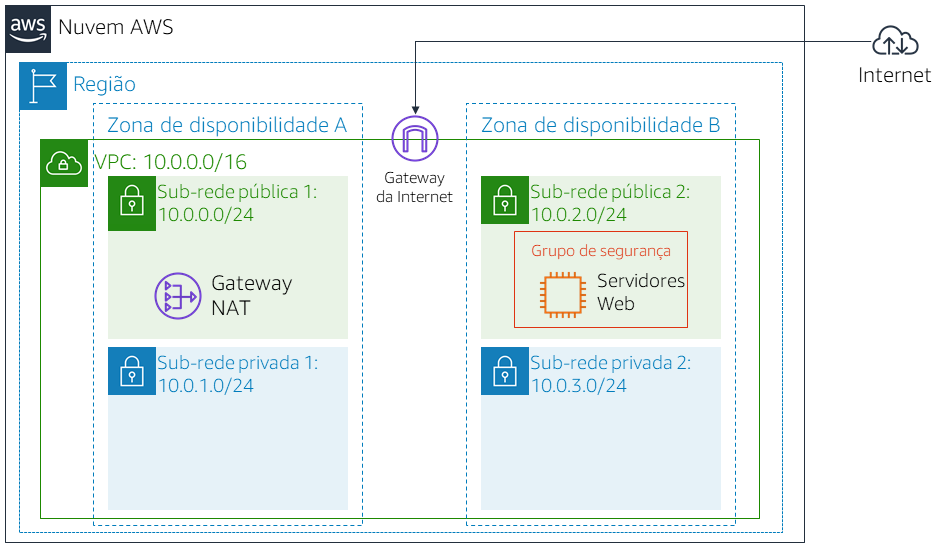
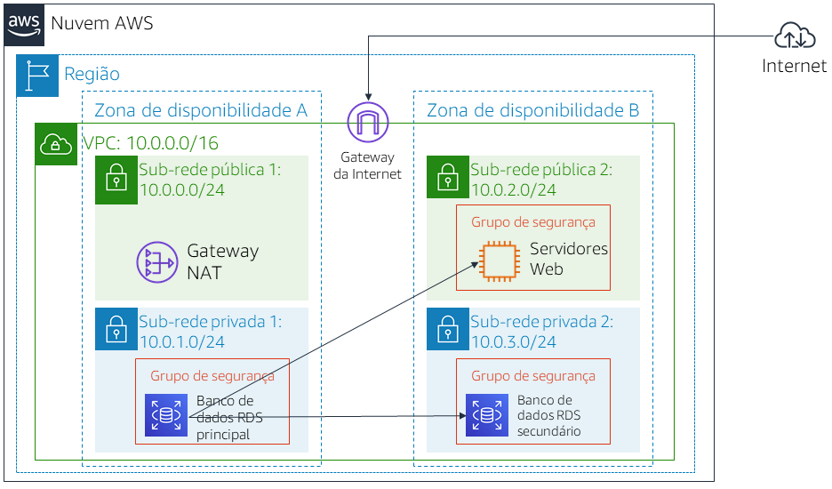

# Laboratório 5: criar um servidor de banco de dados e interagir com o banco de dados usando um aplicativo

<!-- Note to translators: This is based on Technical Essentials Lab 2. Copy the translation from there. Do not re-translate the whole document. -->

&nbsp;&nbsp;

**Versão 4.6.6 (TESS2)**

Este laboratório foi criado para reforçar o conceito de utilização de uma instância de banco de dados gerenciado pela AWS para atender as necessidades de banco de dados relacional.

O ***Amazon Relational Database Service*** (Amazon RDS) facilita configurar, operar e escalar um banco de dados relacional na nuvem. Ele oferece capacidade econômica e redimensionável enquanto gerencia tarefas demoradas de administração de banco de dados, permitindo que você se concentre nas suas aplicações e nos seus negócios. O Amazon RDS fornece seis opções de mecanismos de banco de dados familiares: Amazon Aurora, Oracle, Microsoft SQL Server, PostgreSQL, MySQL e MariaDB.

&nbsp;

**Objetivos**

Depois de concluir este laboratório, você será capaz de:

- Executar uma instância de banco de dados do Amazon RDS com alta disponibilidade.
- Configurar a instância de banco de dados para permitir conexões do seu servidor web.
- Abrir um aplicativo web e interagir com seu banco de dados.

&nbsp;

**Duração**

Este laboratório tem duração aproximada de **30 minutos**.

&nbsp;

**Cenário**

Você começa com a seguinte infraestrutura:

&nbsp;&nbsp;

No final do laboratório, essa é a infraestrutura:

&nbsp;

&nbsp;&nbsp;
___
## Acessar o Console de Gerenciamento da AWS

1. Na parte superior destas instruções, clique em Start Lab (Iniciar laboratório) para iniciar o laboratório.

   Um painel Start Lab (Iniciar laboratório) é aberto exibindo o status do laboratório.

2. Aguarde até que a mensagem “**Lab status: ready** (Status do laboratório: pronto)” seja exibida e clique no **X** para fechar o painel Start Lab (Iniciar laboratório).

3. Na parte superior destas instruções, clique em AWS

   Isso abrirá o Console de Gerenciamento da AWS em uma nova guia do navegador. O sistema fará o seu login automaticamente.

   **Dica**: se uma nova guia do navegador não for aberta normalmente, um banner ou um ícone na parte superior do navegador indicará que o navegador está impedindo que o site abra janelas pop-up. Clique no banner ou ícone e escolha "Allow pop ups" (Permitir pop-ups).

4. Organize a guia do Console de Gerenciamento da AWS para que ela seja exibida com estas instruções. Em um cenário ideal, você poderá ver as duas guias do navegador ao mesmo tempo, para facilitar o acompanhamento das etapas do laboratório.

&nbsp;
___
## Tarefa 1: Criar um grupo de segurança para a instância de banco de dados do RDS

Nesta tarefa, você criará um grupo de segurança para permitir que seu servidor web acesse a instância de banco de dados do RDS. O grupo de segurança será usado quando você executar a instância de banco de dados.

5. No **Console de Gerenciamento da AWS**, no menu Services<i class="fas fa-angle-down"></i> (Serviços), clique em **VPC**.

6. No painel de navegação esquerdo, clique em **Security Groups** (Grupos de segurança).

7. Clique em Create security group (Criar grupo de segurança) e configure:

   - **Security group name** (Nome do grupo de segurança): `DB Security Group (Grupo de segurança de banco de dados)`
   - **Description** (Descrição): `Permit access from Web Security Group (Permitir acesso do grupo de segurança da Web)`
   - **VPC**: _Lab VPC (VPC de laboratório)_

   Agora você adicionará uma regra ao grupo de segurança para permitir solicitações de entrada do banco de dados.

8. No painel **Inbound rules** (Regras de entrada), selecione Add rule (Adicionar regra).

   No momento, o grupo de segurança não tem regras. Você adicionará uma regra para permitir acesso pelo _Web Security Group (Grupo de segurança da Web)_.

9. Defina as seguintes configurações:

   - **Type (Tipo):** _MySQL/Aurora (3306)_
   - **CIDR, IP, Security Group or Prefix List (CIDR, IP, grupo de segurança ou lista de prefixos)**: digite `sg` e selecione _Web Security Group (Grupo de segurança da Web)_

   Isso configura o grupo de segurança de banco de dados para permitir tráfego de entrada na porta 3306 de qualquer instância do EC2 associada ao _Web Security Group (Grupo de segurança da Web)_.

10. Selecione Create security group (Criar grupo de segurança).

   Você usará esse grupo de segurança ao executar o banco de dados do Amazon RDS.

&nbsp;
___
## Tarefa 2: Criar um grupo de sub-redes de banco de dados

Nesta tarefa, você criará um _grupo de sub-redes de banco de dados_, que é usado para informar ao RDS quais sub-redes podem ser usadas com o banco de dados. Cada grupo de sub-redes de banco de dados requer sub-redes em pelo menos duas zonas de disponibilidade.

11. No menu Services<i class="fas fa-angle-down"></i> (Serviços), clique em **RDS**.

12. No painel de navegação esquerdo, clique em **Grupos de sub-redes**.

   <i class="fas fa-exclamation-triangle"></i> Se o painel de navegação não estiver visível, clique no ícone de menu <i class="fas fa-bars"></i> no canto superior esquerdo.

13. Clique em Create DB Subnet Group (Criar grupo de sub-redes de banco de dados) e configure:

   - **Name** (Nome): `DB-Subnet-Group`
   - **Description** (Descrição): `Grupo de sub-redes de banco de dados`
   - **VPC:** _Lab VPC (VPC de laboratório)_

14. Role para baixo até a seção **Adicionar sub-redes**.

15. Expanda a lista de valores em **Zonas de disponibilidade** e selecione as duas primeiras zonas: **us-east-1a** e **us-east-1b**.

16. Expanda a lista de valores em **Sub-redes** e selecione as sub-redes associadas aos intervalos de CIDR **10.0.1.0/24** e **10.0.3.0/24**.

   Essas sub-redes devem agora ser mostradas na tabela **Sub-redes selecionadas**.

17. Clique em Create (Criar).

   Você usará esse grupo de sub-redes de banco de dados ao criar o banco de dados na próxima tarefa.

&nbsp;
___
## Tarefa 3: Criar uma instância de banco de dados do Amazon RDS

Nesta tarefa, você configurará e executará uma instância de banco de dados Multi-AZ do Amazon RDS for MySQL.

As implantações ***Multi-AZ*** do Amazon RDS proporcionam disponibilidade e durabilidade melhores para instâncias de banco de dados, o que as torna a solução ideal para cargas de trabalho de banco de dados de produção. Quando você provisiona uma instância de banco de dados Multi-AZ, o Amazon RDS cria automaticamente uma instância de banco de dados principal e replica os dados de maneira síncrona para uma instância de espera em uma zona de disponibilidade (AZ) diferente.

18. No painel de navegação esquerdo, clique em **Databases** (Bancos de dados).

19. Clique em Create database (Criar banco de dados).

   <i class="fas fa-exclamation-triangle"></i> Se aparecer **Switch to the new database creation flow** (Alternar para o novo fluxo de criação de banco de dados) na parte superior da tela, clique nele.

20. Selecione <i class="far fa-dot-circle"></i> **MySQL**.

21. Em **Settings** (Configurações), configure:

   - **DB instance identifier** (Identificador de instância de banco de dados): `lab-db`
   - **Master username** (Nome de usuário mestre): `main (principal)`
   - **Master password** (Senha mestre): `lab-password`
   - **Confirm password** (Confirmar senha): `lab-password`

22. Em **DB instance size** (Tamanho da instância de banco de dados), configure:

   - Selecione <i class="far fa-dot-circle"></i> **Burstable classes (includes t classes) **(Classes com capacidade de intermitência (incluem classes t)).
   - Selecione _db.t3.micro_

23. Em **Storage** (Armazenamento), configure:

   - **Storage type** (Tipo de armazenamento): _General Purpose (SSD) (Uso geral (SSD))_
   - **Allocated storage** (Armazenamento alocado): _20_

24. Em **Connectivity** (Conectividade), configure:

   - **Virtual Private Cloud (VPC)**: _Lab VPC (VPC de laboratório)_

25. Em **Existing VPC security groups** (Grupos de segurança da VPC existentes), no menu suspenso:

   - Selecione _DB Security Group (Grupo de segurança de banco de dados)_.
   - Desmarque a seleção _default (padrão)_.

26. Expanda <i class="fas fa-caret-right"></i> **Additional configuration** (Configuração adicional) e configure:

   - **Initial database name** (Nome do banco de dados inicial): `lab`
   - Desmarque **Enable automatic backups** (Habilitar backups automáticos).
   - Desmarque **Enable Enhanced monitoring** (Habilitar monitoramento aprimorado).

   <i class="fas fa-comment"></i> Isso desativará os backups, o que normalmente não é recomendado, mas agilizará a implantação do banco de dados para este laboratório.

27. Clique em Create database (Criar banco de dados).

   Seu banco de dados agora será executado.

   <i class="fas fa-comment"></i> Se você receber um erro que menciona "not authorized to perform: iam:CreateRole" (não autorizado a executar: iam:CreateRole), desmarque _Enable Enhanced monitoring (Habilitar monitoramento aprimorado)_ na etapa anterior.

28. Clique em **lab-db** (clique no próprio link).

   Agora você precisará aguardar **aproximadamente 4 minutos** para que o banco de dados esteja disponível. O processo está implantando um banco de dados em duas zonas de disponibilidade diferentes.

   <i class="fas fa-info-circle"></i> Enquanto aguarda, você pode revisar as [Perguntas frequentes sobre o Amazon RDS](https://aws.amazon.com/rds/faqs/) ou tomar um café.

29. Aguarde até **Info** (Informações) mudar para **Modifying** (Modificando) ou **Available** (Disponível).

30. Role para baixo até a seção **Connectivity & security** (Conectividade e segurança) e copie o campo **Endpoint**.

   Ele será semelhante a: _lab-db.cggq8lhnxvnv.us-west-2.rds.amazonaws.com_

31. Cole o valor do endpoint em um editor de texto. Você o usará mais tarde no laboratório.

&nbsp;
___
## Tarefa 4: Interagir com seu banco de dados

Nesta tarefa, você abrirá uma aplicação Web em execução no servidor da Web e o configurará para usar o banco de dados.

32. Para copiar o endereço IP de **WebServer**, clique no menu suspenso Details (Detalhes) acima destas instruções e, em seguida, clique em Show (Mostrar).

33. Abra uma nova guia do navegador Web, cole o endereço IP de _WebServer_ e pressione Enter.

   A aplicação Web será exibida com informações sobre a instância do EC2.

34. Clique no link **RDS** na parte superior da página.

   Agora, você configurará a aplicação para se conectar ao banco de dados.

35. Defina as seguintes configurações:

   - **Endpoint**: cole o endpoint que você copiou em um editor de texto anteriormente
   - **Database** (Banco de dados): `lab`
   - **Username** (Nome de usuário): `main`
   - **Password** (Senha): `lab-password`
   - Clique em **Submit** (Enviar)

   Uma mensagem será exibida explicando que a aplicação está executando um comando para copiar informações para o banco de dados. Após alguns segundos, a aplicação exibirá um **Address Book** (Catálogo de endereços).

   A aplicação Address Book (Catálogo de endereços) está usando o banco de dados do RDS para armazenar informações.

36. Adicione, edite e remova contatos para testar o aplicativo web.

   Os dados estão sendo mantidos no banco de dados e são replicados automaticamente para a segunda zona de disponibilidade.

&nbsp;
___
## Laboratório concluído

<i class="icon-flag-checkered"></i> Parabéns! Você concluiu o laboratório.

37. Clique em End Lab (Encerrar laboratório) na parte superior desta página e, em seguida, clique em Yes (Sim) para confirmar que você deseja encerrar o laboratório.

   Um painel será exibido com a mensagem: "DELETE has be initiated... You may close this message box now." (a EXCLUSÃO foi iniciada... Você pode fechar esta caixa de mensagem agora).

38. Clique no **X** no canto superior direito para fechar o painel.

Envie um e-mail com feedback, sugestões ou correções para: *aws-course-feedback@amazon.com*

&nbsp;
___
### Atribuições

**Bootstrap v3.3.5 - [http://getbootstrap.com](http://getbootstrap.com "http://getbootstrap.com")/**

A licença do MIT (MIT)

Copyright (c) 2011-2016 Twitter, Inc.

É concedida permissão, gratuitamente, a qualquer pessoa que obtenha uma cópia deste software e dos arquivos de documentação associados (o “Software”), para lidar com o Software sem restrições, incluindo, sem limitação, os direitos de usar, copiar, modificar, mesclar, publicar, distribuir, sublicenciar e/ou vender cópias do Software, além de permitir que as pessoas para as quais o Software é fornecido façam isso, contanto que as seguintes condições sejam atendidas:

O aviso de direitos autorais acima e este aviso de permissão devem ser incluídos em todas as cópias ou partes substanciais do Software.

O SOFTWARE É FORNECIDO “NO ESTADO EM QUE SE ENCONTRA”, SEM GARANTIA DE NENHUM TIPO, EXPRESSA OU IMPLÍCITA, INCLUINDO, ENTRE OUTRAS, GARANTIAS DE COMERCIALIZAÇÃO, ADEQUAÇÃO A UM PROPÓSITO ESPECÍFICO E NÃO VIOLAÇÃO. EM NENHUMA CIRCUNSTÂNCIA, OS AUTORES OU DETENTORES DE DIREITOS AUTORAIS DEVEM SER RESPONSABILIZADOS POR QUALQUER ALEGAÇÃO, DANO OU OUTRA OBRIGAÇÃO, SEJA EM CASO DE AÇÃO CONTRATUAL OU OUTRO ATO ILÍCITO PROVENIENTE DE OU ASSOCIADO AO SOFTWARE, AO USO OU A OUTROS PROCEDIMENTOS NO SOFTWARE.
