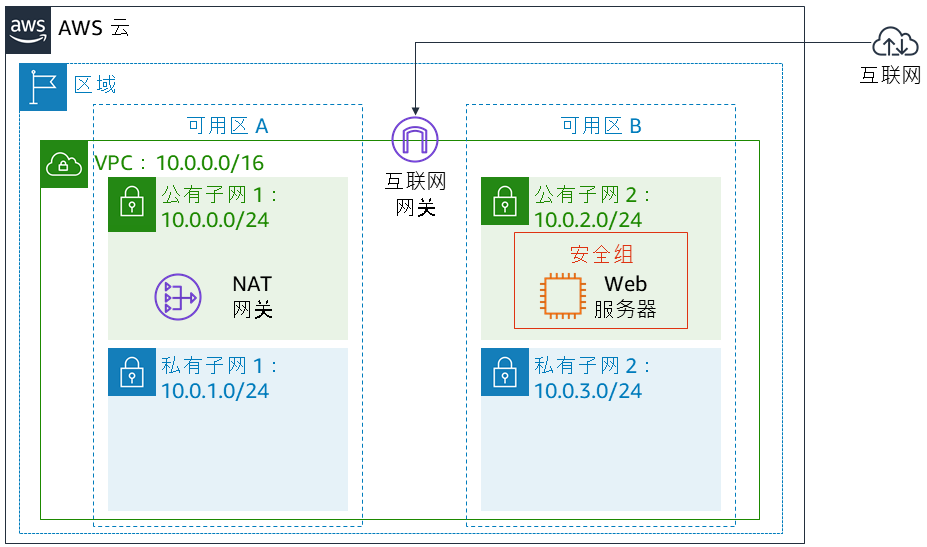
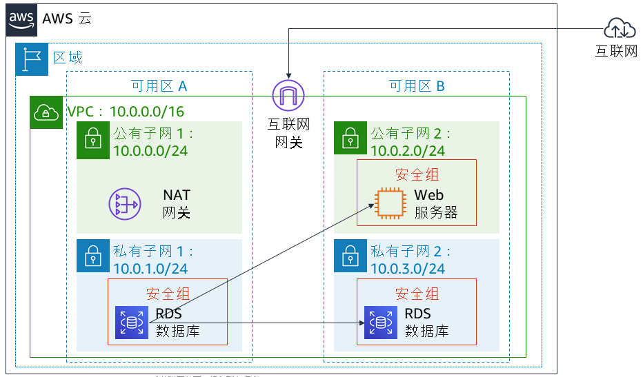

# 实验 5：构建数据库服务器并使用应用程序与数据库交互

<!-- Note to translators: This is based on Technical Essentials Lab 2. Copy the translation from there. Do not re-translate the whole document. -->

&nbsp;&nbsp;

**版本 4.6.6 (TESS2)**

本实验旨在强化利用 AWS 托管数据库实例解决关系数据库需求这一概念。

***Amazon Relational Database Service*** (Amazon RDS) 让您能够在云中轻松设置、操作和扩展关系数据库。它在承担耗时的数据库管理任务的同时，又可提供经济高效的可调容量，使您能够腾出时间专注于应用程序和业务。Amazon RDS 有六种常见的数据库引擎供您选择，包括：Amazon Aurora、Oracle、Microsoft SQL Server、PostgreSQL、MySQL 和 MariaDB。

&nbsp;

**目标**

完成本实验后，您可以：

- 启动高度可用的 Amazon RDS 数据库实例。
- 配置数据库实例以允许来自 Web 服务器的连接。
- 打开 Web 应用程序并与数据库交互。

&nbsp;

**持续时间**

本实验大约需要 **30 分钟**。

&nbsp;

**场景**

您将从以下基础设施开始：

&nbsp;&nbsp;

实验结束时的基础设施如下：

&nbsp;

&nbsp;&nbsp;
___
## 访问 AWS 管理控制台

1. 在这些说明的顶部，单击 Start Lab（启动实验）启动您的实验。

   “Start Lab”（启动实验）面板随即会打开，其中显示了实验状态。

2. 请耐心等待，直到您看到“**Lab status: ready**”（实验状态：就绪）消息，然后单击 **X** 关闭“Start Lab”（启动实验）面板。

3. 在这些说明的顶部，单击 AWS

   在您执行此操作后，AWS 管理控制台将会在一个新的浏览器标签页中打开。您将自动登录系统。

   **提示：**如果未打开新的浏览器选项卡，则您的浏览器顶部通常会出现一个横幅或图标，表明您的浏览器阻止该网站打开弹出窗口。单击横幅或图标，然后选择“Allow pop ups”（允许弹出窗口）。

4. 排列 AWS 管理控制台选项卡，使其与这些说明一起显示。理想情况下，您将能够同时看到这两个浏览器选项卡，以便更轻松地执行实验步骤。

&nbsp;
___
## 任务 1：为 RDS 数据库实例创建安全组

在此任务中，您将创建一个安全组，以支持 Web 服务器访问您的 RDS 数据库实例。您将在启动数据库实例时使用此安全组。

5. 在 **AWS 管理控制台**的 Services<i class="fas fa-angle-down"></i>（服务）菜单上，单击 **VPC**。

6. 在左侧导航窗格中，单击 **Security Groups**（安全组）。

7. 单击 Create security group（创建安全组），然后进行以下配置：

   - **Security group name**（安全组名称）：`DB Security Group`（数据库安全组）
   - **Description**（描述）：`Permit access from Web Security Group`（允许从 Web 安全组访问）
   - **VPC**：_Lab VPC_

   现在，您将向安全组添加规则以允许入站数据库请求。

8. 在 **Inbound rules**（入站规则）窗格中，选择 Add rule（添加规则）

   此安全组当前没有规则。您将添加一个规则以允许从 _Web 安全组_访问。

9. 配置以下设置：

   - **Type**（类型）：_MySQL/Aurora (3306)_
   - **CIDR, IP, Security Group or Prefix List**（CIDR、IP、安全组或前缀列表）：键入 `sg`，然后选择 _Web Security Group_（Web 安全组）。

   此操作将对数据库安全组进行配置，以允许 3306 端口上的入站流量，这些流量来自与 _Web 安全组_关联的任何 EC2 实例。

10. 选择 Create security group（创建安全组）。

   您将在启动 Amazon RDS 数据库时使用此全组。

&nbsp;
___
## 任务 2：创建数据库子网组

在此任务中，您将创建一个_数据库子网组_，用于告知 RDS 哪些子网可用于数据库。每个数据库子网组需要至少位于两个可用区中的子网。

11. 在 Services<i class="fas fa-angle-down"></i>（服务）菜单上，单击 **RDS**。

12. 在左侧导航窗格中，单击 **Subnet groups**（子网组）。

   <i class="fas fa-exclamation-triangle"></i>如果导航窗格未显示，请单击左上角的 <i class="fas fa-bars"></i> 菜单图标。

13. 单击 Create DB Subnet Group（创建数据库子网组），然后进行以下配置：

   - **Name**（名称）：`DB-Subnet-Group`
   - **Description**（描述）：`DB Subnet Group`（数据库子网组）
   - **VPC**：_Lab VPC_

14. 下翻至 **Add Subnets**（添加子网）部分。

15. 展开 **Availability Zones**（可用区）下的值列表，然后选择前两个可用区：**us-east-1a** 和 **us-east-1b**。

16. 展开 **Subnets**（子网）下的值列表，然后选择与 CIDR 范围 **10.0.1.0/24** 和 **10.0.3.0/24** 关联的子网。

   此时这些子网应会在**Subnets selected**（已选定的子网）表中显示。

17. 单击 Create（创建）

   在下个任务中创建数据库时，您将使用此数据库子网组。

&nbsp;
___
## 任务 3：创建 Amazon RDS 数据库实例

在此任务中，您将配置并启动一个多可用区 Amazon RDS for MySQL 数据库实例。

Amazon RDS ***多可用区***部署为数据库 (DB) 实例提供更高可用性和持久性，使其成为了生产数据库工作负载的理想之选。当您预置多可用区数据库实例时，Amazon RDS 会自动创建一个主数据库实例，并将数据同步复制到其他可用区 (AZ) 的备用实例中。

18. 在左侧导航窗格中，单击 **Databases**（数据库）。

19. 单击 Create database（创建数据库）

   <i class="fas fa-exclamation-triangle"></i>如果您在屏幕顶部看到 **Switch to the new database creation flow**（切换到新的数据库创建流程），请单击它。

20. 选择 <i class="far fa-dot-circle"></i> **MySQL**。

21. 在 **Settings**（设置）下，进行以下配置：

   - **DB instance identifier（数据库实例标识符）**：`lab-db`
   - **Master username**（主用户名）：`main`
   - **Master password**（主密码）：`lab-password`
   - **Confirm password**（确认密码）：`lab-password`

22. 在 **DB instance size**（数据库实例大小）下，进行以下配置：

   - 选择 <i class="far fa-dot-circle"></i> **Burstable classes (includes t classes)**（可突增类（包括 t 类））
   - 选择 _db.t3.micro_

23. 在 **Storage**（存储）下，进行以下配置：

   - **Storage type**（存储类型）：_General Purpose (SSD)_（通用型 (SSD)）
   - **Allocated storage**（分配的存储）：_20_

24. 在 **Connectivity**（连接）下，进行以下配置：

   - **Virtual Private Cloud (VPC):** _Lab VPC_

25. 在 **Existing VPC security groups**（现有 VPC 安全组）下，从下拉列表中：

   - 选择_数据库安全组_。
   - 取消选择 _default_（默认）。

26. 展开 <i class="fas fa-caret-right"></i> **Additional configuration**（其他配置），然后进行以下配置：

   - **Initial database name**（初始数据库名称）：`lab`
   - 取消选中 **Enable automatic backups**（启用自动备份）。
   - 取消选中 **Enable Enhanced monitoring**（启用增强监控）

   <i class="fas fa-comment"></i>此操作将关闭备份，通常不建议这样做，但在本实验中这样做可以更快地部署数据库。

27. 单击 Create database（创建数据库）

   您的数据库将立即启动。

   <i class="fas fa-comment"></i>如果您收到错误消息，提示您“not authorized to perform: iam:CreateRole”（无权执行： iam:CreateRole），请确保在上一步骤中取消选中 _Enable Enhanced monitoring_（启用增强监控）。

28. 单击 **lab-db**（单击链接本身）。

   现在，您需要等待**大约 4 分钟**，数据库才可使用。该部署过程是在两个不同的可用区中部署数据库。

   <i class="fas fa-info-circle"></i>在等待时，您可以查看 [Amazon RDS 常见问题](https://aws.amazon.com/rds/faqs/)或喝杯咖啡。

29. 请耐心等待，直到 **Info**（信息）更改为 **Modifying**（正在修改）或 **Available**（可用）。

30. 向下滚动到 **Connectivity & security**（连接和安全）部分，并复制 **Endpoint**（终端节点）字段。

   该值类似于：_lab-db.cggq8lhnxvnv.us-west-2.rds.amazonaws.com_

31. 将终端节点的值粘贴到文本编辑器。您稍后将在实验中用到它。

&nbsp;
___
## 任务 4：与数据库交互

在此任务中，您将打开在 Web 服务器上运行的 Web 应用程序，并配置它以使用数据库。

32. 要复制 **WebServer** IP 地址，请单击这些说明上方的 Details（详细信息）下拉菜单，然后单击 Show（显示）。

33. 打开一个新的 Web 浏览器选项卡、粘贴该 _WebServer_ IP 地址，然后按 Enter 键。

   此时将显示 Web 应用程序，其中显示有关 EC2 实例的信息。

34. 单击页面顶部的 **RDS** 链接。

   现在，您将配置应用程序，以连接到您的数据库。

35. 配置以下设置：

   - **Endpoint（终端节点）**：将您之前复制的终端节点粘贴到文本编辑器
   - **Database（数据库）**：`lab`
   - **Username**（用户名）：`main`
   - **Password**（密码）：`lab-password`
   - 单击 **Submit**（提交）

   此时将显示一条消息，说明应用程序正在执行将信息复制到数据库的命令。几秒钟后，应用程序将显示一个**地址簿**。

   “地址簿”应用程序将使用 RDS 数据库来存储信息。

36. 通过添加、编辑和删除联系人来测试 Web 应用程序。

   数据将持久保存在数据库中，并自动复制到第二个可用区。

&nbsp;
___
## 实验完成

<i class="icon-flag-checkered"></i>恭喜！您已完成本实验。

37. 单击此页面顶部的 End Lab（结束实验），然后单击 Yes（是）确认您要结束实验。

   此时将显示一个面板，指示“DELETE has been initiated...You may close this message box now.”（删除操作已启动...您现在可以关闭此消息框。）

38. 单击右上角的 **X** 关闭面板。

如有反馈、建议或更正，请发送电子邮件至：*aws-course-feedback@amazon.com*

&nbsp;
___
### 署名

**Bootstrap v3.3.5 - [http://getbootstrap.com](http://getbootstrap.com "http://getbootstrap.com")/**

MIT 许可证 (MIT)

版权所有 (c) 2011-2016 Twitter, Inc.

特此免费授予任何人获得本软件及相关文档文件（“软件”）的副本，以无限制地处理本软件，包括但不限于使用、复制、修改、合并、发布、分发、再许可和/或销售本软件的副本，并允许具有本软件上述权利的人员遵守以下条件：

上述版权声明和本许可声明应包含在本软件的所有副本或主要部分中。

此软件按“原样”提供，无任何明示或暗示的保证，包括但不限于有关适销性、针对特定目的的适用性和不侵权的保证。任何情况下，作者或版权所有者都不应承担任何索赔、损害赔偿或其他责任，无论是因软件或使用或其他软件处理引起的或与其相关的合同行为、侵权行为或其他行为。
